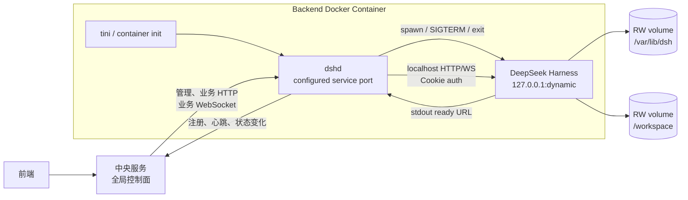
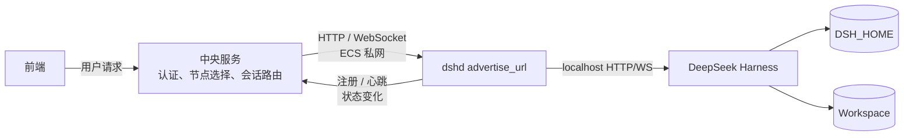
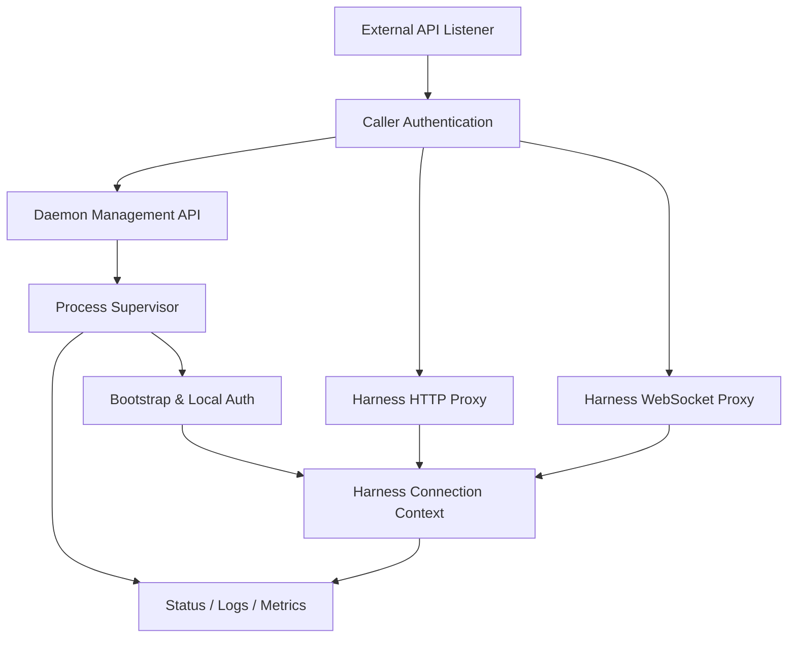
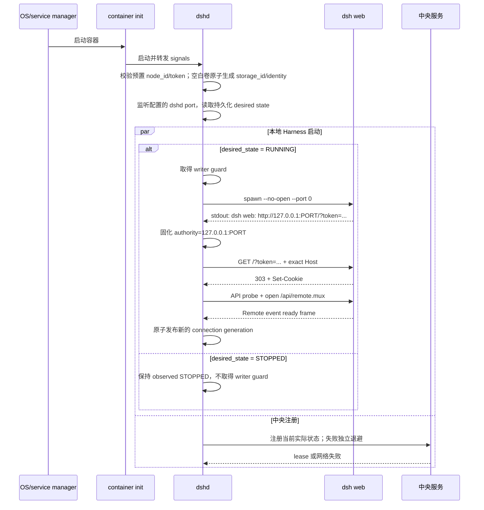
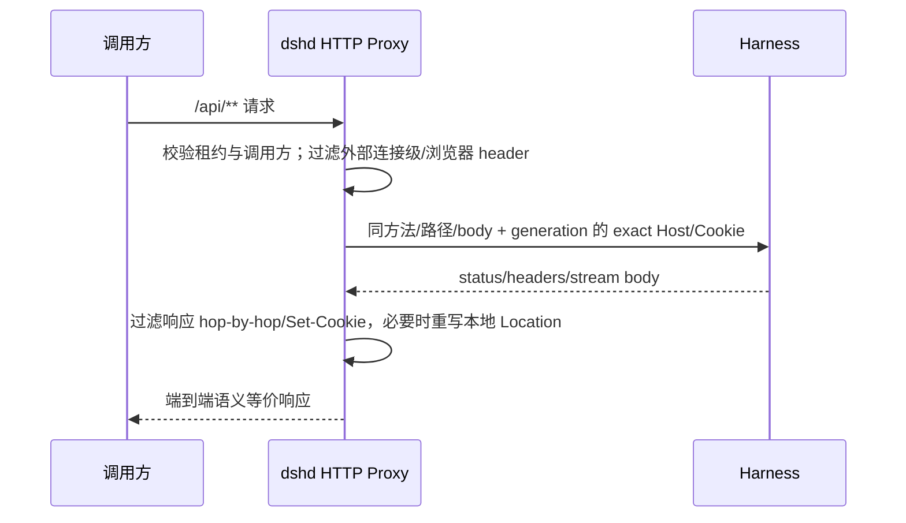
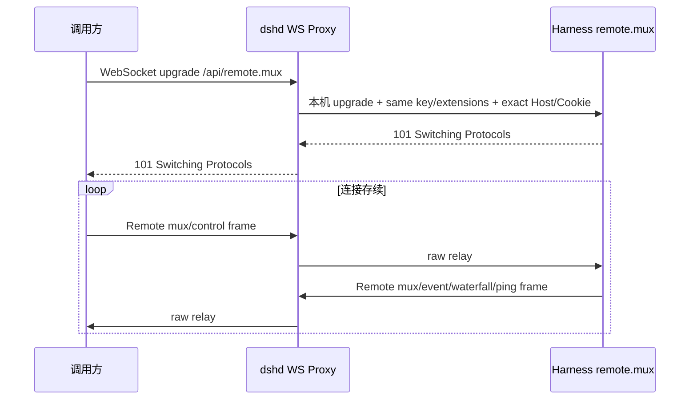
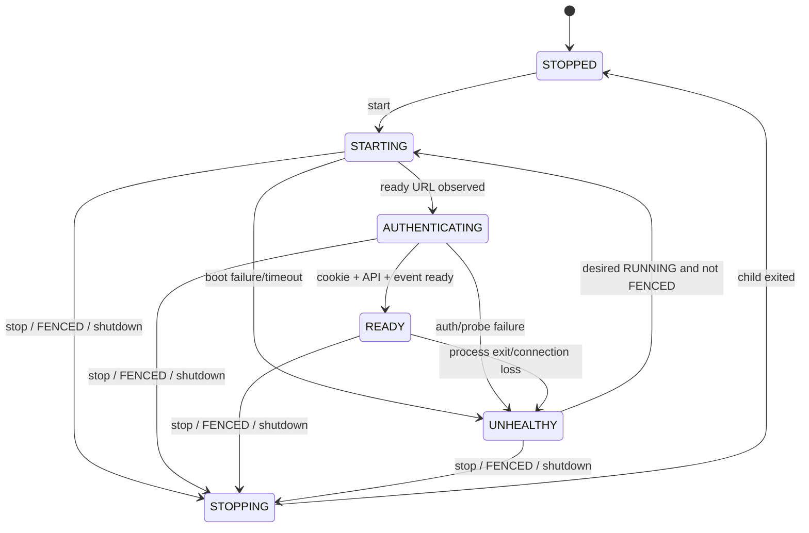
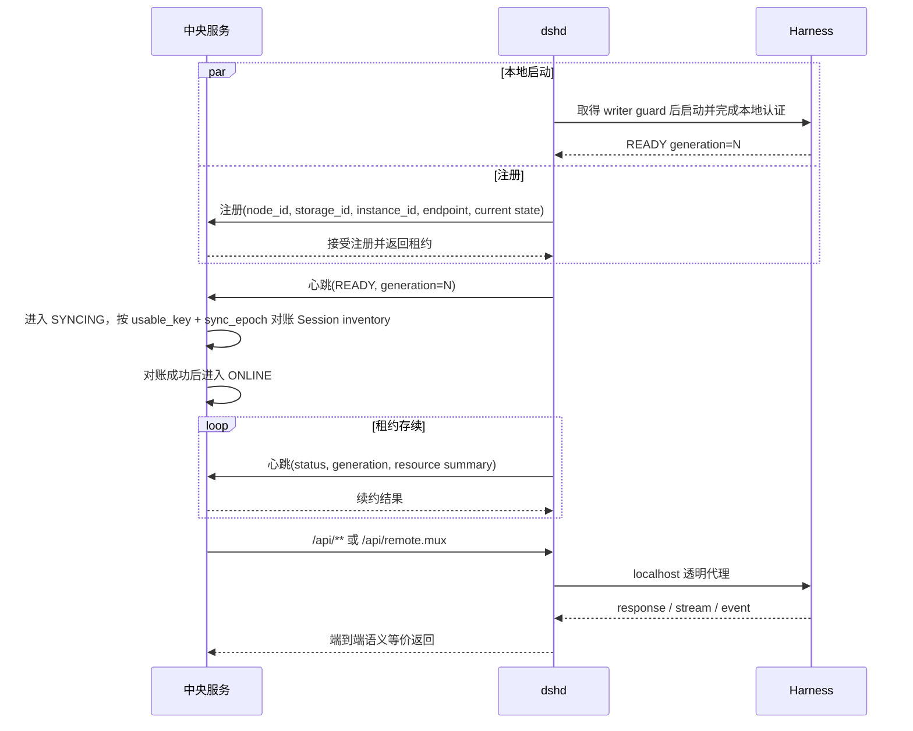

# 修订记录

| 版本 | 日期 | 作者 | 修订内容 | 依据 |
| --- | --- | --- | --- | --- |
| v0.1 | 2026-08-29 | Agent | 明确分布式后端单节点的总体架构、模块职责、运行模式、边界与约束；将 Node Agent 定名为 Harness Node Daemon（`dshd`）。 | 用户确认、[PRD-01][TECH-01][TECH-02] |
| v0.2 | 2026-08-29 | Agent | 固化 Docker 镜像发布方式、单容器进程边界、目录与 volume、非 root 权限和端口开放设计。 | 用户确认、[PRD-01][OPS-01] |
| v0.3 | 2026-08-29 | Agent | 明确中央服务与后端服务的唯一控制边界、连接方向、注册心跳、业务代理、数据所有权和故障语义。 | 用户确认、[PRD-01][OPS-02] |
| v0.4 | 2026-08-29 | Agent | 固化中央服务与 dshd 的 MVP 接口规范、每节点 Bearer 身份、租约 fencing 和管理 operation 模型。 | 用户确认、[TECH-07][OPS-03] |
| v0.5 | 2026-08-29 | Agent | 修复独立验收问题：增加 DSH_HOME 单写所有权、解耦本地启动与注册、正交化健康/注册状态、固化 canonical authority、代理 header、Session 对账和默认禁用遥测。 | [TECH-07][TECH-08][OPS-04] |
| v0.6 | 2026-08-29 | Agent | 修复二次独立验收问题：区分 desired/observed state，Docker 改用 liveness，增加 monotonic lease、READY 后 inventory sync、raw WebSocket tunnel 和条件 schema。 | [TECH-07][OPS-04] |
| v0.7 | 2026-08-29 | Agent | 修复三次独立验收问题：闭合首次身份置备、版本化 inventory、流式提交边界、生命周期优先级、Operation/error 机器联合和最小运维输出。 | [TECH-07][OPS-04] |
| v0.8 | 2026-08-29 | Agent | 纠正端口约束：容器只发布 dshd 的单一可配置服务端口，8080 降为默认值；中央服务按 advertise URL 访问。 | 用户澄清、[OPS-01][OPS-02][TECH-07] |
| v0.9 | 2026-08-29 | Agent | 闭合 advertise URL 配置来源、非 root 监听端口范围、中央 stub 后端验收边界和目标 ECS 环境清单。 | 用户要求、[OPS-01][OPS-02][TECH-07][OPS-04] |
| v1.0 | 2026-08-29 | Agent | 固化逐项 Web 能力验收基线，并将目标 ECS 环境选择与架构前提预检前移到候选镜像形成之前；不改变节点架构。 | 用户要求、[TECH-10][OPS-01][OPS-04] |
| v1.1 | 2026-08-29 | Agent | 随工作区模块化整理更新文档与冻结源码路径；节点架构和范围不变。 | 用户要求、[TECH-01][TECH-10] |

# 1. 文档概述

本文档定义分布式 DeepSeek Harness 后端中一个可独立部署节点的高层设计，以及该节点与中央服务之间的控制边界。系统实现范围限定为一个 Docker 容器中的 `Harness Node Daemon（dshd）+ 原生 DeepSeek Harness`；中央服务作为外部控制面参与接口与责任边界定义，其内部实现和前端设计不在本文范围内。[PRD-01][OPS-01][OPS-02]

文档以明确系统边界、部署单元、模块和运行时视图组织架构结论，并用决策记录表达关键权衡。[M01][M05][M09]

| 项目 | 内容 |
| --- | --- |
| 文档状态 | 后端 MVP 架构已冻结；接口字段、安全机制和机器契约由中央服务—dshd 接口规范固化 |
| 适用版本 | 后端 MVP |
| 系统范围 | 单台 ECS 上运行的单个后端 Docker 容器 |
| 主要读者 | 后端研发、测试、运维、安全评审人员 |
| 能力基准 | 完整复刻当前官方 DeepSeek Harness Web UI 使用的后端能力 |
| 核心约束 | 不修改 Harness 的存储、运行时或会话模型 |

# 2. 背景与目标

## 2.1 背景

DeepSeek Harness 已通过 Web Host 暴露会话、设置、Workspace、模型、事件流、交互式审批及会话导出等官方 Web UI 所需能力，但其启动、认证和传输面向本机浏览器，而非长期运行的服务节点。[TECH-01][TECH-02][TECH-03]

后端节点需要在不改造 Harness 内核的前提下，把原生 Harness 转换成一个可启动、可守护、可观测、可通过网络调用的服务单元。[PRD-01]

## 2.2 设计目标

| 目标 | 成功标准 | 来源 |
| --- | --- | --- |
| 保持 Harness 原生能力 | 官方 Web UI 使用的 HTTP、WebSocket、事件和下载能力均可通过节点服务访问 | [PRD-01][TECH-03] |
| 不改造 Harness 内核 | 不修改会话存储、Agent runtime、会话模型和原有业务 API | [PRD-01] |
| 服务化运行 | 节点可无人值守启动、停止、重启和监控 Harness | [PRD-01][TECH-05] |
| 协议透明 | dshd 不重新实现、不解释、不改变 Harness 业务语义 | [PRD-01][TECH-02] |
| 运行隔离 | Harness 只监听本机回环地址，对外入口由 dshd 独占 | [TECH-02] |
| 容器化发布 | 一个版本化 Docker 镜像同时包含兼容的 dshd 与 Harness，并以非 root 用户运行 | [PRD-01][OPS-01] |

# 3. 架构摘要

后端节点采用单镜像、单容器、双业务进程架构：容器 init 负责信号转发和僵尸进程回收；`dshd` 是长期运行的节点守护进程、中央服务在该节点上的唯一控制点和唯一网络入口；原生 `dsh web` 是其管理的子进程，继续承担全部 Harness 业务执行。[PRD-01][TECH-01][OPS-01][OPS-02]



`dshd` 通过操作系统子进程接口控制生命周期，通过 stdout 完成端口发现与认证引导，通过 localhost HTTP/WebSocket 调用 Harness 业务 API。中央服务不直连 Harness；Harness 不感知中央服务。Harness 的 `DSH_HOME`、Workspace、会话和运行时保持原有归属。[TECH-01][TECH-02][TECH-05][OPS-02]

# 4. 范围边界

| 类型 | 内容 | 来源 |
| --- | --- | --- |
| 范围内 | 构建和发布同时包含 dshd 与固定 Harness 版本的 Docker 镜像 | [PRD-01][OPS-01] |
| 范围内 | dshd 启动、停止、重启和守护同一容器内的一个原生 Harness 进程 | [PRD-01][OPS-01] |
| 范围内 | 自动发现 Harness 本地端口并完成 launch-token/cookie 认证 | [TECH-02] |
| 范围内 | 代理整个 `/api/**` HTTP surface、流式 Response 和 `/api/remote.mux` WebSocket | [TECH-02][TECH-04] |
| 范围内 | 提供节点状态、Harness 状态、版本、日志和基础运行指标 | [PRD-01][TECH-06] |
| 范围内 | 保持当前官方 Web UI 的功能和交互语义 | [PRD-01][TECH-03] |
| 范围内 | 容器目录、volume、运行用户、读写权限和端口设计 | [PRD-01][OPS-01] |
| 范围内 | 中央服务与 dshd 之间的注册、心跳、管理、业务代理和实时连接边界 | [PRD-01][OPS-02] |
| 范围外 | 修改 Harness 会话存储、运行时或会话模型 | [PRD-01] |
| 范围外 | 重新定义或重新实现 Harness Session API | [PRD-01] |
| 范围外 | 暴露当前官方 Web UI 未使用的 Harness 内部 Service | [PRD-01][TECH-06] |
| 范围外 | 静态 Web UI 托管和页面渲染 | [PRD-01] |
| 范围外 | 跨节点路由、调度、迁移和共享存储 | [PRD-01] |
| 范围外 | dshd 管理其他容器、宿主机进程或容器外 Harness | [PRD-01][OPS-01] |
| 范围外 | 在容器中挂载 Docker socket 或调用 Docker API | [PRD-01][OPS-01] |
| 范围外 | 中央服务内部的节点调度、会话映射、数据库和前端接口实现 | [PRD-01][OPS-02] |

# 5. 干系人与关注点

| 干系人 | 关注点 | 架构响应 |
| --- | --- | --- |
| 后端研发 | 模块边界、通信协议、失败处理 | 双进程架构、透明代理、明确状态机 |
| 中央服务研发 | 节点接入、调用方向、状态权威和故障语义 | 唯一 dshd 入口、租约心跳、责任矩阵和透明代理契约 |
| 测试 | 官方 Web 能力是否无损、重启行为是否一致 | API inventory 契约测试和端到端 parity 测试 |
| 运维 | 启停、健康、日志、异常恢复 | dshd 统一提供管理面和可观测性 |
| 安全 | Harness RCE 面、token/cookie 泄漏、入口控制 | Harness 仅 loopback；dshd 终止外部认证并隔离内部凭据 |

# 6. 质量属性目标

| 质量属性 | MVP 目标 | 验证方式 | 来源 |
| --- | --- | --- | --- |
| 功能完整性 | [TECH-10] 中全部 `WUI-*` 具备 inventory contract 与 Web UI parity E2E 通过证据 | 逐 ID 能力覆盖报告 | [PRD-01][TECH-03][TECH-04][TECH-10] |
| 协议透明性 | 除认证和路由 headers 外，不改变请求体、响应体、状态码、stream frame、顺序与关闭语义 | 代理契约测试、录制回放、错误注入 | [TECH-02] |
| 就绪准确性 | 仅在进程存活、cookie 建立、HTTP probe 成功且 Remote event generation ready 后报告 READY | 启动和故障测试 | [TECH-02] |
| 恢复能力 | Harness 意外退出后 dshd 可识别故障、关闭旧连接并重新执行完整启动握手 | kill/restart 演练 | [TECH-05] |
| 凭据保护 | launch token 与 Harness cookie 不出节点、不写普通日志、不返回调用方 | 日志扫描、安全测试 | [TECH-02] |
| 可运维性 | 能查询 dshd/Harness 状态、版本、PID、uptime 和最近错误 | 管理 API 测试 | [PRD-01][TECH-06] |
| 性能 | dshd 采用 streaming 和 backpressure，不完整缓冲请求、响应或 WebSocket 流 | 大响应、ZIP、长会话和慢消费者测试 | [TECH-02][TECH-04] |
| 容器安全 | 容器以非 root 用户和只读 root filesystem 运行，只有状态与工作目录可写 | 镜像扫描、运行配置审查、写权限测试 | [PRD-01][OPS-01] |

数值化延迟、吞吐、并发连接和恢复时间目标当前没有项目证据，留待容量测试后确定，不在本文中臆测。[PRD-01]

后端镜像的强制集成门使用项目随附、契约一致的中央 reference stub：它提供 Registry server 并作为 Management/Proxy client 覆盖双向接口。真实中央服务兼容联调属于系统级验收证据，不是 dshd 后端镜像自身合格的前置条件；因此中央实现不进入本 HLD 工作边界，也不阻塞后端独立交付。[PRD-01][TECH-07][OPS-04]

# 7. 约束、假设与依赖

| 类型 | 内容 | 影响 | 来源 |
| --- | --- | --- | --- |
| 约束 | Harness 保持原生实现 | 所有新增能力必须位于 dshd 外壳 | [PRD-01] |
| 约束 | 能力口径为 [TECH-10] 冻结的官方 Web UI parity | `WUI-*` 全部必验；未进入 Web UI 的 Job/PTY 直接控制等以 `OUT-*` 明确排除 | [PRD-01][TECH-06][TECH-10] |
| 约束 | Harness Web Host 不对网络开放 | dshd 与 Harness 必须共机并通过 loopback 通信 | [TECH-02] |
| 约束 | API contract 随 Harness 版本演进 | dshd 与 Harness 必须按兼容版本配套发布 | [TECH-02][TECH-03] |
| 约束 | 一个 DSH_HOME 只有一个 live writer | `/var/lib/dsh` 使用逻辑节点专属、单写挂载的 volume；dshd 取得本地 writer guard 后才能启动一个 Harness | [TECH-01][TECH-08] |
| 约束 | 同一 DSH_HOME 禁止共享多活 | 禁止把同一 DSH_HOME 放在可被多个在线 ECS task 同时读写的 NFS/EFS 路径；节点替换必须先释放旧挂载/guard | [TECH-08] |
| 约束 | Harness 运行意图与观测状态分离 | dshd 持久化 `RUNNING/STOPPED` desired state；容器重启不得覆盖显式 stop，fencing 不改写 operator 意图 | [TECH-07] |
| 约束 | 发布物为单一 Docker 镜像 | dshd 与 Harness 必须在同一镜像中按版本锁定 | [PRD-01][OPS-01] |
| 约束 | dshd 只管理本容器内 Harness | dshd 不需要容器发现、远程进程管理或 Docker API | [PRD-01][OPS-01] |
| 约束 | 容器只发布 dshd 的单一可配置 TCP 服务端口 | 默认值可为 8080；Harness 动态 loopback 端口不得 `EXPOSE` 或 publish | [PRD-01][OPS-01] |
| 约束 | 容器以固定非 root UID/GID 运行 | volume 必须预先授予对应 UID/GID 读写权限 | [PRD-01][OPS-01] |
| 约束 | 中央服务只能通过 dshd 操作节点 | Harness 不暴露给中央服务，dshd 是节点唯一控制点 | [PRD-01][OPS-02] |
| 约束 | dshd 不承担全局控制面职责 | 节点目录、调度、会话到节点映射和用户授权归中央服务 | [PRD-01][OPS-02] |
| 假设 | 中央服务可通过 ECS 私网访问 dshd 发布地址 | MVP 不需要反向隧道、消息队列或长轮询命令通道 | [OPS-02] |
| 假设 | 部署环境支持 Node.js 子进程、signal、HTTP 和 WebSocket | 不成立时需要替代 supervisor/runtime | [TECH-05] |
| 依赖 | 原生 `dsh web` 构建产物 | dshd 不负责构建 Harness 前端和库产物 | [TECH-01] |

# 8. 架构视图

## 8.1 中央服务与节点的上下文边界



中央服务是全局控制面，`dshd` 是单个后端节点的控制面与数据面入口，Harness 是节点内业务执行引擎。中央服务只认知 `dshd` 暴露的节点身份、状态和代理接口，不认知 Harness 的内部端口、launch token、cookie、进程或存储结构。[PRD-01][TECH-02][OPS-02]

### 8.1.1 责任与权威数据

| 组件 | 权威职责与数据 | 不承担的职责 | 约束 | 来源 |
| --- | --- | --- | --- | --- |
| 中央服务 | 全局节点目录、节点租约与可用性、节点选择、会话到节点映射、终端用户认证授权、统一 API/WS 路由 | Harness 生命周期细节、Session 内容存储、节点内认证引导 | 不能绕过 dshd 访问 Harness；节点状态以 dshd 报告和租约为依据 | [PRD-01][OPS-02] |
| `dshd` | 本容器 Harness 生命周期、当前 connection generation、本地健康、版本、资源与代理连接；向中央服务注册和续约 | 全局节点选择、跨节点会话映射、终端用户/租户权限、Session 业务解释 | 只接受通过服务身份认证的中央服务调用；只管理本容器一个 Harness | [PRD-01][OPS-01][OPS-02] |
| Harness | Session、消息、附件、设置、Agent runtime、工具执行和 Workspace 数据 | 节点注册、心跳、全局调度、中央服务协议 | 不直接对中央服务或前端开放 | [PRD-01][TECH-01][OPS-02] |

中央服务保存 `session_id → node_id` 路由元数据，但 Harness 仍是 Session 业务数据的唯一权威来源；`dshd` 不复制 Session 索引或内容。[PRD-01][OPS-02]

### 8.1.2 连接方向与工作模式

| 交互 | 发起方 → 接收方 | 工作模式 | 目的 | MVP 约束 | 来源 |
| --- | --- | --- | --- | --- | --- |
| 节点注册 | dshd → 中央服务 | dshd listener 就绪后 HTTP JSON，失败退避重试；与 Harness 本地启动并行 | 声明 `node_id`、`storage_id`、`instance_id`、可达地址、版本、能力和当前 Harness 状态 | 不阻塞 Harness 冷启动；幂等；中央服务必须区分同一节点的不同启动实例和持久卷身份 | [OPS-02][TECH-08] |
| 心跳/续约 | dshd → 中央服务 | 周期性 HTTP JSON | 报告 dshd/Harness 状态、generation、uptime、restart count 和资源摘要 | 中央服务以租约有效为必要条件，并按完整派生谓词与当前 sync epoch 判断可调度性；不以 TCP 可达代替就绪状态 | [OPS-02] |
| 节点管理 | 中央服务 → dshd | `/daemon/v1/**` HTTP | 查询状态，启动、停止或重启 Harness | 命令只影响该容器；操作串行、幂等 | [PRD-01][OPS-02] |
| 业务请求 | 中央服务 → dshd | `/api/**` streaming HTTP | 操作指定节点上的 Harness Session 和其他 Web API | 中央服务负责先解析 session→node；dshd 不重新路由 | [PRD-01][TECH-02][OPS-02] |
| 实时交互 | 中央服务 → dshd | `/api/remote.mux` WebSocket | 传输 Session follow/control、审批、问题和事件 | 端到端双向代理；不引入消息队列或事件语义转换 | [TECH-02][TECH-03][OPS-02] |
| 主动注销 | dshd → 中央服务 | 正常退出时 best-effort HTTP | 提前撤销节点可用性 | 非权威；异常退出仍由租约超时收敛 | [OPS-02] |

MVP 采用“dshd 主动注册/心跳 + 中央服务私网直连 dshd”的双向交互模式。该选择要求中央服务能够访问 ECS 私网中注册的 dshd `advertise_url`，但避免引入反向隧道、常驻控制 WebSocket、消息队列和第二套业务协议。[OPS-02]

## 8.2 Docker 部署视图

```mermaid
flowchart TB
  Runtime[Docker / ECS Runtime]
  Runtime -->|start / stop / restart policy| Init[tini]
  subgraph Image[Single Versioned Image]
    Init -->|signals + reap| D[dshd]
    D -->|child lifecycle| H[dsh web]
    D --> RO[/opt/dshd + /opt/dsh<br/>read-only image layer]
    D --> CFG[/etc/dshd/config.yaml<br/>read-only mount]
    H --> STATE[/var/lib/dsh/state<br/>DSH_HOME]
    H --> HOME[/var/lib/dsh/home<br/>HOME]
    H --> WORK[/workspace<br/>read-write volume]
    D --> RUN[/run/dshd<br/>tmpfs]
    H --> TMP[/tmp<br/>tmpfs]
  end
  Client[调用方] -->|configured dshd port| D
  D -->|127.0.0.1:dynamic| H
```

Docker/ECS Runtime 负责容器级生命周期；轻量 init 负责 PID 1 的信号转发和进程回收；dshd 只负责同一容器内的 Harness child。dshd 退出即导致容器退出，由容器 restart policy 决定是否重建整个容器。[PRD-01][OPS-01]

### 8.2.1 目录与权限

| 路径 | 内容 | 挂载/来源 | 权限与所有者 | 读写方 | 约束 |
| --- | --- | --- | --- | --- | --- |
| `/opt/dshd` | dshd 程序 | 镜像层 | root-owned，`0555` | dshd 只读 | 不允许运行时覆盖 |
| `/opt/dsh` | 固定版本 Harness 与依赖 | 镜像层 | root-owned，`0555` | dshd/Harness 只读 | 不使用启动时 `npx` 下载 |
| `/etc/dshd/config.yaml` | dshd 静态非敏感配置 | read-only mount/镜像 | `0440`，运行组可读 | dshd 只读 | secret 不写入该文件；部署相关 endpoint 使用下述显式环境绑定，禁止多源覆盖 |
| `/etc/dshd/node-id` | 部署控制面预分配的稳定逻辑节点 ID | read-only config mount | `0444` | dshd 只读 | 必须与中央 token 绑定及已有 identity 一致；不是 secret |
| `/var/lib/dsh` | 持久化 volume 根目录 | 逻辑节点专属 read-write volume | `0700`，UID/GID `10001:10001` | dshd/Harness 读写 | 容器重建后保留；单写挂载；禁止同一目录被多个活动 task 共享 |
| `/var/lib/dsh/state` | `DSH_HOME`，保存 Harness 原生状态 | `/var/lib/dsh` 子目录 | `0700`，UID/GID `10001:10001` | Harness 读写 | dshd 不解析内部文件 |
| `/var/lib/dsh/home` | 容器运行用户 `HOME` | `/var/lib/dsh` 子目录 | `0700`，UID/GID `10001:10001` | Harness、工具及依赖读写 | 承接 `.cache`、`.config` 等用户态写入 |
| `/var/lib/dsh/dshd` | dshd identity、稳定 `storage_id`、predecessor、持久化 desired state、writer guard 与 operation/idempotency 记录 | `/var/lib/dsh` 子目录 | `0700`，UID/GID `10001:10001` | dshd 读写 | 不保存 Harness cookie、launch token 或 Session 内容；writer guard 覆盖 Harness 整个存活期；desired state 原子写入 |
| `/workspace` | 默认 Workspace root | 节点绑定的 read-write volume | `0750`，UID/GID `10001:10001` | Harness/工具读写 | 外部挂载必须预置权限；与节点状态绑定时按单写方式替换 |
| `/run/dshd` | dshd 临时运行文件 | tmpfs | `0700`，UID/GID `10001:10001` | dshd 读写 | 不持久化 token/cookie |
| `/run/secrets/dshd-node-token` | 中央服务—dshd 节点身份 secret | read-only secret mount | `0400`，UID `10001` | dshd 只读 | 每节点唯一，不进入镜像、配置或日志 |
| `/tmp` | Harness/工具临时文件 | tmpfs | `1777`，`nodev,nosuid` | Harness/子进程读写 | 容器退出即清理 |
| stdout/stderr | dshd 与 Harness 日志 | container log driver | 不落容器文件 | dshd/Runtime | 必须脱敏 |

镜像默认声明 `USER 10001:10001`，并以只读 root filesystem 运行。固定设置 `DSH_HOME=/var/lib/dsh/state`、`HOME=/var/lib/dsh/home`，默认工作目录为 `/workspace`。部署控制面必须先成对分配并在中央预登记 `node_id + node_token`，再分别挂载 `/etc/dshd/node-id` 和 secret；空白 volume 的 `storage_id` 由 dshd 一次性生成，已有 identity 与注入 node_id 不一致时 fail closed。部署方还必须在容器启动前保证 `/var/lib/dsh` 与 `/workspace` 可被 UID/GID `10001:10001` 使用，并保证同一 `storage_id` 的卷不会同时挂载给两个活动 task；MVP 使用目标云提供的 single-attach 块存储，或具有同等排他保证的 volume，普通共享文件系统多挂载不合规。部署层排他挂载是跨 task 单写的权威保证，writer guard 是同一挂载内防重复启动的第二道保护，正确性不依赖 dshd 崩溃后文件锁仍存活。dshd 不以 root 身份启动后再递归修复宿主目录权限。[PRD-01][OPS-01][TECH-08]

### 8.2.2 端口开放

| 端口 | Bind | 发布 | 协议与用途 | 约束 |
| --- | --- | --- | --- | --- |
| dshd service port | dshd `0.0.0.0:${DSHD_LISTEN_PORT}`；默认 `8080`，MVP 范围 `1024..65535` | 运行环境只 publish/map 此 listener；镜像可用 `EXPOSE 8080/tcp` 描述默认值 | `/api/**` HTTP、`/api/remote.mux` WebSocket、`/daemon/v1/**` | 容器唯一对外服务入口；container/host 端口可映射，`DSHD_ADVERTISE_URL` 必须填写中央实际可达端点 |
| 动态端口 | Harness `127.0.0.1:<OS assigned>` | 不 `EXPOSE`、不 publish | dshd 到 Harness 的内部 HTTP/WS | 只能从本容器 loopback 访问 |

HTTP、流式下载和 WebSocket 共用同一个 dshd service port，不另开 WebSocket 端口。`DSHD_LISTEN_PORT` 默认 `8080`，MVP 非 root runtime 只接受 `1024..65535`；外部 80/443 通过 Docker/ECS 映射实现，不为 dshd 增加 bind capability。`EXPOSE` 仅描述默认镜像接口，不等同于发布到宿主机或公网。[OPS-01]

`DSHD_ADVERTISE_URL` 是部署控制面必须显式注入的绝对 `http://host:port`，端口表示中央服务实际可达端点，可与 listener port 不同；dshd 不从 hostname、listener socket 或 ECS metadata 猜测。`DSHD_CENTRAL_BASE_URL` 同样由部署控制面显式注入。缺失或语法非法时，dshd 在 listener/Harness 前 fail closed；中央服务再独立校验 advertised endpoint 是否符合预登记或部署策略。[OPS-01][OPS-02][TECH-07]

## 8.3 部署单元

| 部署单元 | 目标 | 工作模式 | 职责 | 边界 | 约束 |
| --- | --- | --- | --- | --- | --- |
| Container init | 提供正确 PID 1 行为 | `tini -- dshd` | signal 转发、子进程回收、返回 dshd exit code | 不守护 Harness 业务 | 只管理容器进程语义 |
| `dshd` | 把原生 Harness 转换为可管理的后端服务节点 | 容器内长期运行的父进程/守护进程 | 生命周期管理、认证接管、HTTP/WS 代理、健康与可观测性 | 不拥有 Session 业务和数据；不解释业务 payload；不管理容器外对象 | 唯一对外入口；只管理本容器 Harness |
| `dsh web` | 执行全部 Harness 原生业务 | dshd 管理的容器内子进程，仅监听 loopback | Agent、Session、模型、工具、Workspace、Remote API、事件流 | 不感知 dshd、Docker 或分布式环境 | 保持原生；使用挂载的 DSH_HOME 与 Workspace |
| `DSH_HOME` | 保存 Harness 原有持久化状态和配置 | Harness 直接读写 `/var/lib/dsh/state` | Session、attachments、settings、credentials、storage | dshd 不解析或修改内部文件 | 由本节点单个活动 Harness 使用 |
| Workspace | 提供 Agent 工作目录 | Harness 和工具按原策略访问 | 项目文件、Agent 工作产物 | dshd 只负责配置工作目录 | 权限与沙箱语义保持 Harness 原样 |

## 8.4 dshd 模块视图



### 8.4.1 dshd 模块定义

| 模块 | 目标 | 工作模式 | 职责 | 边界 | 约束 |
| --- | --- | --- | --- | --- | --- |
| Configuration | 产生一次启动所需的确定配置和节点身份 | 启动时加载并校验；空白卷 create-if-absent 初始化 identity | 校验预置 node_id/token、生成一次性 storage_id、校验 listener port、`DSHD_ADVERTISE_URL`、`DSHD_CENTRAL_BASE_URL`、DSH_HOME、cwd、Harness command/env | 不写 Harness settings；不发明 endpoint discovery 或 enrollment 协议 | 必填 endpoint 缺失/非法或 identity 不匹配时在 listener/Harness 前 fail closed；启动参数不可含未校验命令拼接 |
| Process Supervisor | 保证本节点只有一个受管 Harness writer，并兑现持久化运行意图 | desired state + exclusive writer guard + child process supervisor + observed 状态机 | 原子保存 RUNNING/STOPPED；仅在 desired=RUNNING 且未 FENCED 时 spawn/自动恢复；SIGTERM、exit 监听、退避重启、停止升级 | 不判断业务结果；不发现或管理容器外进程 | 未取得 guard 不得 spawn；guard 覆盖 Harness 整个存活期；FENCED 强制停机但不改 desired state |
| Bootstrap & Local Auth | 建立可用的本机 Harness 连接 | 解析 stdout ready URL，交换 cookie | 发现动态端口、保存 token/cookie、执行 API/stream probe | 凭据只在本机内存使用 | ready URL 必须是 loopback；日志必须脱敏 |
| Harness Connection Context | 为代理提供当前连接 generation | 原子发布 `{authority,origin,cookie,generation,state}` | 固化 ready URL 的 exact authority、切换新连接、废弃旧连接、通知 proxy | 不保存业务状态 | bootstrap、probe、HTTP 和 WS 必须使用同一 authority；Harness 重启时 generation 必须递增 |
| Harness HTTP Proxy | 无损承载全部 HTTP API | 单次尝试的 streaming reverse proxy | 代理所有方法 `/api/**`、流式 body/response、取消、status 和端到端 header；在响应提交前后执行唯一失败语义 | 不解释 Typert payload；不执行业务重试 | 不缓冲 ZIP；透明链路不自动重试；已提交响应只能终止流；双向剥离 hop-by-hop；本地 cookie/authority 不得外泄 |
| Harness WebSocket Proxy | 无损承载 Remote mux | 对齐握手参数后的双向 raw frame tunnel | 校验外部 Upgrade；上游复用 key/version/subprotocol/extensions 并替换 Host/Cookie；101 后 raw relay frame；传播 Harness ping/pong | 不解析逻辑 stream，不自行产生稳态 ping/pong | 连接绑定一个 Harness generation；只有 lease/fencing/generation 变化允许 dshd 主动 close |
| Daemon Management API | 暴露守护进程自己的控制与状态 | 独立 `/daemon/v1/**` namespace | status、health、start、stop、restart、version | 不与 `/api/**` 业务空间混用 | 管理操作串行化；返回实际状态而非乐观确认 |
| Caller Authentication | 保护 dshd 对外入口 | 在代理和非公开管理 API 前统一校验 | 使用每节点 Bearer token 验证中央服务、拒绝未授权请求；live/local/ready 只返回最小公开状态 | 不把外部凭据传给 Harness | MVP 依赖 ECS 私网和 Security Group；token 每节点唯一 [TECH-07] |
| Status/Logs/Metrics | 提供封闭的节点级 MVP 可观测性 | status/heartbeat 输出固定指标；stdout/stderr 输出结构化日志 | PID、状态、uptime、restart/last_error、active HTTP/WS、cgroup CPU/memory、磁盘余量；包装 Harness 输出 | 不解析 Session 内容；不提供日志读取或 `/metrics` API | 指标名称/单位以接口 schema 为准；日志由 container driver 消费；token、cookie、secret 和 body 不得记录 |
| Central Service Client | 维持节点在中央控制面的身份与租约 | outbound register、heartbeat、best-effort deregister | 发送节点身份、版本、可达地址、状态、generation 和资源摘要 | 不接收终端用户请求；不保存全局注册表 | 网络失败退避重试；中央服务失联不停止 Harness [OPS-02] |

## 8.5 Harness 模块边界

| Harness 模块 | 目标与职责 | dshd 交互方式 | dshd 不得承担的职责 | 来源 |
| --- | --- | --- | --- | --- |
| Web Host / Connection | 提供本机 HTTP/WS transport 和浏览器会话认证 | localhost HTTP/WS、token/cookie | 重写 Host RPC、伪造业务响应 | [TECH-02] |
| Typert Gateway / Remotes | 分发类型化 Remote、stream 和 Host event | 透明代理 `/api/**`、`remote.mux` | 重新编码 descriptor 或事件 | [TECH-02][TECH-03] |
| Session Controller | 会话列表、创建、提示、历史、控制流等 | 原样 RPC/stream | 维护第二套 Session 状态 | [TECH-01] |
| Agent Runtime | 模型、工具、审批、问题与子代理执行 | 通过 Session API 和事件观察 | 干预 turn、tool 或 subagent 内部执行 | [TECH-03] |
| Persistence / Workspace | 保存 Session 和工作文件 | dshd 仅提供 DSH_HOME/cwd | 直接编辑持久化文件 | [PRD-01] |

# 9. 运行时视图

## 9.1 启动与认证



stdout URL 是 Harness 当前定义的 supervisor readiness signal，且只在 Loader settle、Connection authentication 可用后输出。部署控制面必须先把已预登记的 node_id/token 成对注入；identity 不匹配属于不可恢复配置错误，在打开 listener 或 spawn Harness 前退出。desired state 首次部署默认为 `RUNNING`，显式 stop 后原子持久化为 `STOPPED`；身份初始化成功后，Harness 本地启动只依赖 desired state、writer guard 和本地配置，不依赖中央服务可达。中央注册与启动并行并报告当时的 desired/observed Harness 状态。[TECH-01][TECH-07][TECH-08]

## 9.2 HTTP 调用



`/api/session.export` 等 route 使用 GET/HEAD 和流式 ZIP，因此 HTTP proxy 必须覆盖所有 HTTP 方法并支持 streaming，不得限定为 JSON POST。透明链路从中央 relay 到 dshd、再到 Harness 对一次调用都只允许一次上游尝试：响应提交前可返回 502/504，任一 headers/body 已提交后只能截断并关闭该流，禁止自动重试、拼接第二份 body 或追加 error envelope。[TECH-04][TECH-07]

## 9.3 WebSocket 调用



approval、user questions、Session follow/control 和其他 stream 共用该 multiplexed WebSocket；dshd 在稳态不注入 ping/pong，Harness 原生 heartbeat 随 raw tunnel 传播。代理必须保持双向性、frame/fragment 顺序、取消和关闭传播；租约过期、fencing 或 generation 切换时由 dshd 生成的策略 close 是唯一例外。[TECH-02][TECH-03][TECH-07]

## 9.4 生命周期状态机

节点状态由三个 observed 维度和一个持久化 desired 维度组成，不再用 observed 状态代替 operator 意图：

| 维度 | 状态 | 权威语义 |
| --- | --- | --- |
| daemon | `STARTING \| READY \| STOPPING` | dshd 管理面是否可响应 |
| registration | `UNREGISTERED \| REGISTERING \| LEASED \| DEGRADED \| FENCED` | 当前 instance 是否持有中央租约；`DEGRADED` 表示暂时不可续租，`FENCED` 表示已被明确拒绝 |
| Harness desired | `RUNNING \| STOPPED` | operator 对 Harness 的持久化运行意图；默认 RUNNING |
| Harness observed | `STOPPED \| STARTING \| AUTHENTICATING \| READY \| UNHEALTHY \| STOPPING` | 当前 connection generation 的本地业务能力 |

节点业务 readiness 只有在 `daemon=READY AND registration=LEASED AND desired=RUNNING AND observed=READY` 时成立。Docker/ECS 容器健康只调用 `/health/live` 检查 dshd event loop；`/health/local` 是 Harness 诊断而非容器 liveness，因此 STOPPED、UNHEALTHY、FENCED 或中央服务中断均不会仅凭 Harness/租约状态触发容器替换。[OPS-02][TECH-07]



显式 stop 在发送 SIGTERM 前原子保存 `desired=STOPPED`；start/restart 在通过 lease 与 generation 前置校验后保存 `desired=RUNNING`。异常退出只在 desired=RUNNING 且 registration 非 FENCED 时自动恢复。转换优先级为：FENCED/容器 shutdown 最高并使未完成 operation 失败，已接受 operator operation 次之且彼此串行，自动启动/恢复最低；没有 operator operation 占用时，operator stop 可以中断自动启动或恢复。FENCED/shutdown 从 STARTING、AUTHENTICATING、READY 或 UNHEALTHY 都经 STOPPING 收敛为 STOPPED，但保留原 desired state；普通 stop 则先持久化 STOPPED。部署控制器停止旧 task 并释放 single-attach volume，dshd 自身不得调用 Docker/ECS API。[TECH-07][OPS-01][OPS-02]

## 9.5 节点接入与服务调用



`node_id` 表示中央服务中的稳定逻辑节点，由部署控制面与 token 成对预登记和注入；`storage_id` 表示持久卷身份，只在空白卷由 dshd 生成；`instance_id` 表示一次 dshd 启动实例。容器重启沿用同一卷上的 `node_id + storage_id`，但必须产生新的 `instance_id`；identity 与注入 node_id 不同必须 fail closed，不同 `storage_id` 不得接管既有 `node_id`，中央服务不得让旧实例的迟到心跳覆盖新实例状态。[OPS-02][TECH-08]

每个已接受的 lease response 都用请求发送/响应接收的 monotonic 时间、服务端剩余租约、完整 RTT 和安全余量计算本地 deadline；wall clock 只用于展示。deadline 到达时 dshd 必须原子撤回业务 readiness 并关闭 HTTP/WS，迟到响应不得直接复活旧 deadline。中央服务构造 `usable_key=(node_id,storage_id,instance_id,lease_id,generation)`；完整可用谓词 false→true 或 key 任一字段变化都进入新的 sync epoch。reverse-ready generation 必须等于当前 key，inventory job 以 key+epoch single-flight，提交前 CAS 验证二者仍当前；任一条件/key 变化即作废旧 job 和同步标记。这样即使采样只看到 READY N→READY N+1，也必然重新对账；当前 key+epoch 成功后才进入 ONLINE 并接收新 Session 调度。[TECH-07]

# 10. 数据与接口设计

## 10.1 数据归属

| 数据 | 归属 | dshd 处理方式 | 来源 |
| --- | --- | --- | --- |
| Session、attachments、settings、credentials | Harness/`/var/lib/dsh/state`（DSH_HOME） | 不解析、不复制、不修改 | [PRD-01] |
| Workspace 文件 | Harness 工具与原有权限模型 | 仅配置启动 cwd | [PRD-01] |
| launch token、Harness cookie | Bootstrap & Local Auth | 仅内存持有；restart 后重建 | [TECH-02] |
| dshd 运行状态 | dshd | 内存状态，可输出指标与结构化日志 | [PRD-01] |
| Harness stdout/stderr | dshd 可观测层 | 流式采集并脱敏 | [PRD-01][TECH-02] |
| 节点目录、租约、Session→Node 映射 | 中央服务 | dshd 仅通过注册和心跳提供节点事实，不保存全局副本 | [PRD-01][OPS-02] |
| `node_id` | 部署控制面/中央预登记，dshd 持久化校验 | 从只读配置读取；空白卷写入 identity，已有 identity 必须等值；所有注册、心跳中携带 | [TECH-07] |
| `storage_id` | 节点持久卷身份 | dshd 只在空白卷生成并与预置 node_id 原子持久化；中央服务首次注册原子绑定并拒绝替换 | [TECH-08] |
| `instance_id` | dshd 当前启动实例 | 每次进程启动生成，仅用于防止旧实例覆盖新状态 | [OPS-02] |
| Harness desired state | dshd 持久化 operator 意图 | `/var/lib/dsh/dshd/desired-state.json` 原子保存 RUNNING/STOPPED；首次默认 RUNNING | [TECH-07] |

## 10.2 接口分区

| 接口 | 提供方 | 协议 | 语义 | 来源 |
| --- | --- | --- | --- | --- |
| `/api/**` | dshd proxy → Harness | HTTP | 保留 Harness 原始 API 与 Fetch route | [TECH-02][TECH-04] |
| `/api/remote.mux` | dshd proxy → Harness | WebSocket | 保留 Harness multiplexed stream | [TECH-02] |
| `/daemon/v1/status` | dshd | HTTP JSON | dshd/Harness 当前状态、generation、PID、版本、uptime、最近错误 | [PRD-01][TECH-06] |
| `/daemon/v1/health/live` | dshd | HTTP JSON | dshd event loop 可响应；供 Docker/ECS container health 使用 | [PRD-01][OPS-01] |
| `/daemon/v1/health/local` | dshd | HTTP JSON | 本地 Harness generation 可用，不依赖中央租约；仅作诊断与告警 | [PRD-01][OPS-01] |
| `/daemon/v1/health/ready` | dshd | HTTP JSON | daemon READY、租约有效、desired RUNNING 且 observed READY；供中央服务反向 readiness probe 使用 | [PRD-01][OPS-02] |
| `/daemon/v1/harness/start` | dshd | HTTP | 持久化 desired=RUNNING，并从 STOPPED/UNHEALTHY 启动；幂等返回 operation | [PRD-01] |
| `/daemon/v1/harness/stop` | dshd | HTTP | 持久化 desired=STOPPED，SIGTERM 并等待退出 | [TECH-05] |
| `/daemon/v1/harness/restart` | dshd | HTTP | 持久化 desired=RUNNING，串行 stop + start + 新 generation | [PRD-01] |
| `/daemon/v1/operations/{operation_id}` | dshd | HTTP JSON | 查询异步生命周期 operation 的最终结果 | [TECH-07] |
| `PUT /internal/dshd/v1/nodes/{node_id}/instances/{instance_id}` | 中央服务 | dshd outbound HTTP JSON | 幂等建立 instance、可达地址、版本、能力和租约 | [TECH-07] |
| `PUT .../instances/{instance_id}/lease` | 中央服务 | dshd outbound HTTP JSON | 续约并上报 dshd/Harness 状态、generation 和资源摘要 | [TECH-07] |
| `DELETE .../instances/{instance_id}` | 中央服务 | dshd outbound HTTP JSON | 正常退出时 best-effort 撤销当前 instance | [TECH-07] |

管理 API 的请求/响应 schema、认证、幂等、错误码和超时由中央服务—dshd 接口规范固定；OpenAPI 3.1 固定字段、必填性和 enum，一致性测试规范固定透明代理和故障行为；本 HLD 固定其 namespace 和职责边界。[TECH-07]

# 11. 安全、隐私与合规设计

| 控制项 | 设计结论 | 验证方式 | 来源 |
| --- | --- | --- | --- |
| 网络边界 | Harness 仅监听 `127.0.0.1`；禁止绕过 dshd 直连 | 端口扫描、部署检查 | [TECH-02] |
| 双层认证 | 外部调用由 dshd 认证；内部 Harness 使用原生 cookie | 未授权请求测试、内部认证 E2E | [TECH-02] |
| Header 隔离 | dshd 双向剥离 hop-by-hop；不转发外部 Host、Origin、Cookie、Authorization、Forwarded、X-Forwarded-* 和 Sec-Fetch-*；使用 generation 的 exact authority/cookie；响应剥离本地 Set-Cookie | 代理 header 正反例测试 | [TECH-02][TECH-07] |
| Secret 保护 | launch token、cookie、credentials 和敏感 body 不进入普通日志 | 日志扫描、安全评审 | [TECH-02] |
| API 最小暴露 | 只代理 `/api/**`、`remote.mux` 和明确的 daemon API，不代理 Harness 静态根页面 | 路由测试 | [PRD-01] |
| RCE 风险隔离 | 只有通过 dshd 认证的调用方可触达 Harness API | 权限测试、网络隔离检查 | [TECH-02] |
| 容器身份 | 镜像使用 `USER 10001:10001`，不得以 root 运行 dshd/Harness | runtime 配置与进程 UID 检查 | [PRD-01][OPS-01] |
| 文件系统 | root filesystem 只读，仅 `/var/lib/dsh`、`/workspace`、`/run/dshd`、`/tmp` 可写 | 写权限矩阵测试 | [PRD-01][OPS-01] |
| Linux 权限 | 默认 drop all capabilities、启用 no-new-privileges；如 Harness sandbox 验证需要额外能力，逐项显式增加 | 容器安全测试 | [OPS-01] |
| Docker 边界 | 不挂载 `/var/run/docker.sock`，不使用 privileged 或 host PID namespace | 部署清单扫描 | [PRD-01][OPS-01] |
| 服务身份边界 | 中央服务验证注册/心跳的 dshd 身份；dshd 验证入站调用的中央服务身份 | 双向伪造与重放测试 | [OPS-02] |
| MVP 服务认证 | 双向调用使用每节点独立 Bearer token，节点端从 `/run/secrets/dshd-node-token` 读取；网络入口限中央服务安全组 | token/node_id mismatch、secret 泄漏和网络边界测试 | [TECH-07] |
| 首次身份置备 | 部署控制面在节点启动前原子分配并中央预登记 node_id/token；只读注入 node_id 与 secret；dshd 不允许首次使用认领 | 空白卷、identity mismatch、错误 token/node、响应丢失测试 | [TECH-07] |
| Token 轮换 | 中央服务预登记 next token；新 instance 以正确 storage_id 取得 lease 后原子提升并撤销旧 token；泄漏处置同时停止旧 ECS task | 新旧 token、撤销和审计测试 | [TECH-07] |
| 用户权限边界 | 用户认证授权由中央服务完成；dshd 只认证中央服务，不把用户凭据传给 Harness | 越权与 header 隔离测试 | [PRD-01][OPS-02] |
| 地址校验 | 中央服务只接受符合部署网络规则的 dshd 发布地址，避免把注册信息变成任意代理目标 | 注册校验和 SSRF 测试 | [OPS-02] |
| 默认遥测策略 | 镜像固定 `DSH_TELEMETRY_MODE=DISABLED` 且 `DSH_TELEMETRY_DISABLED=1`；MVP Session 内容不直接从 Harness 发往外部 collector | 环境与出站流量测试、`/feedback` 披露测试 | [TECH-09] |
| 单写存储边界 | `/var/lib/dsh` 使用节点专属单写 volume；dshd 未取得 writer guard 不启动 Harness；不同 `storage_id` 不能接管同一 node | 双任务挂载、重复实例和 guard 竞争测试 | [TECH-08] |

# 12. 可靠性、性能与容量设计

| 主题 | 设计结论 | 验证方式 | 来源 |
| --- | --- | --- | --- |
| 单实例所有权 | dshd 串行化生命周期操作，最多维持一个活动 Harness child | 并发 start/restart 测试 | [PRD-01] |
| 运行意图 | desired state 原子持久化；显式 STOPPED 跨 dshd/容器重启保持，首次部署默认 RUNNING | stop + container restart 测试 | [TECH-07] |
| 异常退出 | child exit 立即撤回 READY、关闭旧 generation 连接；仅 desired=RUNNING 且未 FENCED 时按退避策略重启 | kill -9 与 operator stop 演练 | [TECH-05][TECH-07] |
| 正常停止 | 使用 SIGTERM，等待 Harness 原有最多 5 秒 dispose；超时按 supervisor 策略结束 | shutdown 测试 | [TECH-05] |
| 代理内存 | HTTP/WS 使用 streaming 与 backpressure，不为完整会话或 ZIP 建立内存副本 | 大文件/慢连接压测 | [TECH-04] |
| 代理提交边界 | 透明 `/api/**` 每个 relay 只有一次上游尝试；提交前返回代理错误，提交后只终止流 | partial ZIP、chunked upload、generation race 测试 | [TECH-07] |
| 连接代际 | 每次 Harness 重启发布新 generation；旧 HTTP 失败、旧 WS 主动关闭 | restart-under-load 测试 | [TECH-02] |
| 重启风暴 | 连续失败使用有上限退避并保留最近错误，不进行无间隔循环拉起 | 故障注入 | [PRD-01] |
| 容器级恢复 | dshd 退出后不自行管理容器，由 Docker/ECS restart policy 重建整个部署单元 | dshd crash 演练 | [PRD-01][OPS-01] |
| 停止时序 | container init 将 SIGTERM 交给 dshd；dshd 停止 Harness 并退出；容器 stop grace 必须大于 Harness 的 5 秒 dispose 窗口 | docker stop 测试 | [TECH-05][OPS-01] |
| 中央服务失联 | dshd 按 desired state 保持 Harness 与 writer guard，registration 转为 DEGRADED，撤回业务 readiness、取消 HTTP、以 WS 1013 关闭业务连接并退避重试；live 保持成功，observed READY 时 local 也保持成功 | central outage/cold boot 演练 | [OPS-02] |
| 节点租约过期 | 中央服务将节点标记为不可调度；dshd 保持本地 Harness 但不接受业务代理，恢复租约后才恢复 readiness | heartbeat loss 演练 | [PRD-01][OPS-02] |
| 单调租约 | response 到达时用 monotonic clock、服务端 remaining、完整 RTT 和安全余量建立 deadline；到期原子关闭业务，wall-clock 变化不影响 | clock jump、delayed response、deadline race | [OPS-02] |
| 明确 instance fencing | dshd 收到 `STALE_INSTANCE` 后进入 FENCED，立即关闭业务连接、停止 Harness 并释放 writer guard但不改 desired；只保留 health/status/stop，其中 local/ready 返回 503；部署控制器/运维负责停止旧 task 释放 volume | stale-instance 与 task replacement 演练 | [OPS-02][TECH-08] |
| 重复实例 | 中央服务使用 `node_id + storage_id + instance_id` 拒绝错误卷和旧实例；部署层禁止同一卷多任务挂载 | delayed heartbeat、错误卷、双任务测试 | [OPS-02][TECH-08] |
| Session inventory 收敛 | 可用谓词 false→true 或 usable_key 变化都创建新 sync epoch；probe/job 绑定 key+epoch 并 CAS 提交；当前同步成功才 ONLINE | register-first、ready-first、generation ABA、instance/lease change、stale result 测试 | [TECH-07] |

生命周期默认参数固定为：Harness startup timeout `60s`；异常退出重启退避 `1s → 2s → 4s ... 30s`、`20%` jitter，连续稳定运行 `5min` 后重置；SIGTERM 后等待 `8s`，再 SIGKILL，并在 `10s` 内收敛 operation；容器 stop grace 不少于 `15s`。参数允许通过受校验配置覆盖，但必须有正整数和上限约束。[TECH-05][TECH-07]

# 13. 运维、可观测性与发布设计

| 能力 | 设计结论 | 来源 |
| --- | --- | --- |
| 进程托管 | Docker/ECS Runtime 托管容器；container init 托管 dshd；dshd 只托管同容器 Harness | [PRD-01][OPS-01] |
| 结构化日志 | 仅写容器 stdout/stderr，由 container log driver 采集；dshd 固定 ts/level/component/event/node/instance，上下文可加 generation/request_id；Harness 行附加 stream；无日志读取 API | [PRD-01][TECH-07] |
| 指标 | 必需输出仅为已鉴权 status 与 heartbeat 的 uptime、restart/last_error、active HTTP/WS、cgroup CPU/memory 和两类 free bytes；无 `/metrics`，不承诺 HTTP error/WS close 累计计数 | [PRD-01][TECH-06][TECH-07] |
| 健康语义 | live 表示 dshd 存活并作为容器 health；local 仅诊断本地 Harness；ready 表示租约、desired 与 Harness 均可接受中央业务 | [PRD-01][OPS-02] |
| 发布 | dshd 与兼容 Harness 版本成对构建、测试和发布 | [TECH-02][TECH-03] |
| 回滚 | 回滚到上一组已验证的 dshd + Harness 版本组合 | [TECH-02][TECH-03] |
| 镜像 | 单一镜像内固定 dshd、Harness、Node.js 和依赖版本；启动阶段不下载代码 | [PRD-01][OPS-01] |
| 持久化 | 容器可替换；`/var/lib/dsh` 与 `/workspace` 生命周期独立于容器；同一逻辑节点替换期间保持单写挂载 | [PRD-01][OPS-01][TECH-08] |
| 健康检查 | Docker/ECS container health 调用当前 dshd service port 的 `/daemon/v1/health/live`；Harness 告警调用 `/health/local`；中央服务通过 `advertise_url` 调用 `/health/ready` | [OPS-01][OPS-02] |

# 14. 架构决策与权衡

| 决策 ID | 决策 | 背景 | 替代方案 | 理由 | 权衡与后果 | 来源 |
| --- | --- | --- | --- | --- | --- | --- |
| ADR-HLD-001 | 使用 `Harness Node Daemon（dshd）` 命名 | Node Agent 易与 Harness 内部 Agent 混淆 | Node Agent、Harness Wrapper、Harness Supervisor | `dshd` 同时表达节点守护和服务入口 | 新增一个项目术语，需在代码和文档统一 | 用户确认 |
| ADR-HLD-002 | dshd 作为父进程直接管理 Harness child | 需要启动握手、token 捕获、健康和重启 | 两个独立 systemd 服务、单进程插件 | 父子关系能直接获得 stdout、exit、signal 和动态端口 | dshd 崩溃时 child 的清理策略必须在 LLD 明确 | [TECH-01][TECH-05] |
| ADR-HLD-003 | 透明代理全部 Harness API | 目标是官方 Web UI parity，API 已存在 | 逐个重写 REST API、使用窄 SDK 协议 | 最大程度保留现有业务和 stream 语义 | 与 Harness Web API 版本耦合 | [PRD-01][TECH-02][TECH-03] |
| ADR-HLD-004 | Harness 只监听 loopback，dshd 为唯一入口 | 现有 Web Host 认证和安全设计面向本机 | 直接暴露 dsh web | 不需要改 Harness，且隐藏内部 cookie 和 RCE surface | dshd 成为节点内关键进程 | [TECH-02] |
| ADR-HLD-005 | 业务路由保持 `/api/**`，守护管理面使用 `/daemon/v1/**` | 需要兼容 Harness Client，同时避免命名冲突 | 重命名所有 Harness endpoint | 可透明代理并清晰分离业务面和管理面 | 对外仍继承 Harness API contract | [TECH-02][TECH-04] |
| ADR-HLD-006 | 以单一 Docker 镜像发布 dshd 与固定 Harness 版本 | 后端最终交付物必须可重复部署 | 分离镜像、启动时下载 Harness | 确保版本兼容和部署原子性 | 镜像体积增加；两者必须一起升级 | [PRD-01][OPS-01] |
| ADR-HLD-007 | 容器只发布一个可配置 dshd service port，Harness 使用 loopback 动态端口 | 防止绕过 dshd，同时不把部署默认端口提升为协议常量 | 分别开放两个端口、固定 dshd/Harness 端口 | 单入口、HTTP/WS 共端口、部署可选择和映射端口、内部连接可重建 | dshd 是节点内唯一入口；advertise URL 必须与实际可达映射一致 | [TECH-02][OPS-01] |
| ADR-HLD-008 | 非 root、只读 rootfs、状态与 Workspace 独立 RW volume | Harness 可执行命令且保存状态，需要明确最小写边界 | root 容器、全文件系统可写 | 缩小容器逃逸和误写影响，保证容器可替换 | 部署前必须准备 volume UID/GID；sandbox 兼容性需验证 | [PRD-01][OPS-01] |
| ADR-HLD-009 | dshd 只管理同容器一个 Harness | 用户确认的责任边界 | 管理宿主机/其他容器 Harness | 实现简单、故障域清晰、不需要 Docker socket | 一个容器不能承载多个独立 Harness | [PRD-01][OPS-01] |
| ADR-HLD-010 | dshd 是中央服务在节点上的唯一控制点 | 需要明确中央服务与原生 Harness 的隔离边界 | 中央服务直连 Harness、中央服务同时管理 dshd 和 Harness | 统一生命周期、认证、代理和观测入口，Harness 无需感知分布式系统 | dshd 故障会使整个节点不可访问 | [PRD-01][OPS-02] |
| ADR-HLD-011 | MVP 使用 dshd 主动注册/心跳、中央服务按 advertise URL 私网直连 dshd | 需要双向状态同步和实时 API/WS 调用 | 反向隧道、常驻控制 WS、消息队列、服务发现轮询 | 直接复用 HTTP/WS，链路和故障语义简单 | 要求中央服务具备到节点已注册 dshd 端口的私网可达性 | [OPS-02] |
| ADR-HLD-012 | 全局、节点和业务状态分别由中央服务、dshd 和 Harness 持有 | 避免外围系统复制并竞争 Harness 内部状态 | 中央服务同步完整 Session、dshd 建本地 Session 数据库 | 单一事实来源，保持 Harness 原生模型 | 节点离线时中央服务只能看到最后状态，不能读取 Session 内容 | [PRD-01][OPS-02] |
| ADR-HLD-013 | MVP 使用 ECS 私网隔离和每节点独立 Bearer token 完成双向服务认证 | 接口设计必须具备简单可落地的节点身份 | mTLS、集群共享 token、无应用层认证 | 实现成本低；泄漏只影响单节点；不改变 HTTP/WS 协议 | 私网隔离是必要前提；公网或不可信网络必须升级 TLS/mTLS | [TECH-07][OPS-03] |
| ADR-HLD-014 | DSH_HOME 使用逻辑节点专属单写 volume，并以 storage_id 和 writer guard 双重校验 | Harness 持久化后端不提供跨进程 writer fencing | 共享 EFS 多活、只依赖中央租约 | 不修改 Harness 即可排除同一数据目录双写 | 节点替换不是零停机；旧挂载必须先释放 | [TECH-08] |
| ADR-HLD-015 | Harness 本地启动与中央注册并行且互不阻塞 | 控制面故障不应阻止本地业务引擎恢复 | 注册成功后再启动 Harness | 冷启动和中央故障语义一致 | 未持有租约时只保持本地运行，不开放业务代理 | [OPS-02][TECH-07] |
| ADR-HLD-016 | 使用 daemon、registration、Harness desired、Harness observed 四个正交状态维度和 live/local/ready 三类健康语义 | 单一 FENCED 状态无法同时表达本地健康、operator 意图、租约与调度 | 一个综合状态和一个 health endpoint | 避免中央故障触发容器重启，同时保证未租约节点不接业务 | 状态字段和监控项增加 | [TECH-07] |
| ADR-HLD-017 | MVP 强制禁用 Harness 会话遥测 | 原生 Web profile 默认反馈门控上传且无随附脱敏规则 | 保留默认、接入自有 collector | 防止 Session 内容绕过中央边界出站 | `/feedback` 会明确披露 sharing disabled | [TECH-09] |
| ADR-HLD-018 | 持久化 Harness desired state，Docker/ECS 只以 dshd live 作为容器健康 | STOPPED/FENCED/UNHEALTHY 是合法可管理状态，不能触发隐式冷启动 | Docker 检查 local、只使用 observed state | operator stop 跨重启稳定，fencing 不自我复活 | Harness 长期失败只告警，不由 healthcheck 自动换容器 | [TECH-07][OPS-04] |
| ADR-HLD-019 | lease 使用 monotonic local deadline；Session inventory 绑定版本化 usable key+epoch | wall clock、注册顺序、同 generation 恢复和 READY→READY ABA 都可能复用错误事实 | 直接比较 expires_at、只看 false→true、永久复用旧同步标记 | 时钟变化不延长 lease；key 变化和恢复都强制对账，迟到结果不能提交 | 保守租约会略提前停止业务；key/epoch 变化需重复 list | [TECH-07][OPS-04] |
| ADR-HLD-020 | remote.mux 在对齐握手后使用 raw frame tunnel，稳态不注入 ping/pong | 原样 frame 与代理主动 heartbeat 不能同时成立 | 终止并重建 message、主动 ping | 最大限度保持官方 Remote transport | 实现需控制 Upgrade 与 socket relay；策略 close 是显式例外 | [TECH-02][TECH-07][OPS-04] |
| ADR-HLD-021 | node_id/token 由部署控制面成对预登记，dshd 只生成 storage_id | 空白卷无法同时满足本地生成 node_id 和 token 预绑定 | 首次使用认领、新 enrollment API、dshd 随机 node_id | 不增加协议 endpoint 即闭合首次身份，错误卷/配置 fail closed | 部署流程必须在启动 task 前完成置备事务 | [TECH-07][OPS-04] |
| ADR-HLD-022 | 透明 HTTP 单次尝试，生命周期使用严格 Operation/type 联合与 JCS 幂等指纹 | 流式半响应无法安全透明重试，宽松 operation 会表达矛盾事实 | 幂等方法自动重试、仅 prose 约束状态 | 提交边界唯一，副作用与查询结果可由机器契约验证 | 瞬时 GET 失败由调用方显式重新请求；实现需支持 JCS | [TECH-07][OPS-04] |

# 15. 风险、技术债与待确认事项

| 类型 | 内容 | 影响 | 缓解措施 | 状态 | 来源 |
| --- | --- | --- | --- | --- | --- |
| 风险 | Harness 处于 developer preview，Remote contract 可能破坏性变化 | dshd proxy 或调用方不兼容 | 固定版本、API inventory contract test、成对发布 | 打开 | [TECH-03] |
| 风险 | multiplexed WebSocket 包含 stream、event 与 waterfall | 错误代理会造成丢事件、审批无法回传或取消失效 | frame-level tunnel E2E、断线和 backpressure 测试 | 打开 | [TECH-02][TECH-03] |
| 风险 | stdout ready URL 是启动发现入口 | 输出格式变化会导致无法连接 | 固定 Harness 版本、严格解析、启动超时和兼容测试 | 打开 | [TECH-01] |
| 风险 | dshd 异常退出时 child 可能短暂存活 | 延迟释放 writer guard 或容器退出 | tini/process group、dshd 退出即容器退出、guard 生命周期与 Harness 绑定、容器 stop grace 15s | 已设计，待实现验证 | [TECH-05][TECH-08] |
| 待确认 | 数值化性能和容量目标 | 无法给出 SLO 和资源规格 | 建立基线压测后确定 | 打开 | [PRD-01] |
| 风险 | 非 root、drop capabilities 可能与部分 Linux sandbox/backend 组合不兼容 | 部分官方 Web 工具无法运行 | 在目标 ECS 内核上执行完整 Web parity 测试；只按测试结果增加最小权限 | 打开 | [OPS-01] |
| 风险 | 目标 ECS 的架构、launch type、kernel/runtime、network mode、volume driver 或安全选项未冻结 | 候选镜像可能在最终验收时才暴露 single-attach、权限或网络假设失效 | M7 候选形成前选择并冻结验收环境清单，完成架构前提预检；M8 复用同一清单，环境漂移重新验收 | 打开 | [OPS-01][OPS-04] |
| 风险 | bind mount ownership 与镜像 UID/GID 不一致 | Harness 无法写 DSH_HOME 或 Workspace | 部署时预置 `10001:10001`，local health 前执行写权限预检；同一 DSH_HOME 禁止共享 EFS 多活 | 打开 | [OPS-01][TECH-08] |
| 风险 | ECS 私网地址或端口不可从中央服务到达 | 管理、业务和实时代理全部失败 | 部署期连通性检查；注册后由中央服务反向 readiness probe | 打开 | [OPS-02] |
| 风险 | 同一 `node_id` 短时间出现两个 dshd 实例 | 状态抖动、错误卷接管或双写 | `storage_id` 绑定、单写卷、writer guard、instance fencing 和 FENCED 停机 | 已设计，待实现验证 | [OPS-02][TECH-08] |
| 风险 | FENCED task 停止 Harness 后仍占有 single-attach volume | 替代 task 无法挂载，恢复需要外部编排 | 中央告警并由部署控制器/运维停止旧 task；dshd 不持有 Docker socket | 已设计，待实现验证 | [OPS-01][OPS-02][TECH-08] |

# 16. 需求追踪矩阵

| 需求/目标 | 架构响应 | 相关决策 | 验证方式 | 来源 |
| --- | --- | --- | --- | --- |
| 原生 Harness + 外围守护 | 双进程部署单元 | ADR-HLD-002 | 生命周期 E2E | [PRD-01] |
| 完整复刻官方 Web UI 后端能力 | `/api/**` + `remote.mux` 全量透明代理，并以 `WUI-*` 固化覆盖集合 | ADR-HLD-003、ADR-HLD-005 | 逐 ID inventory + Web UI parity E2E | [PRD-01][TECH-03][TECH-10] |
| 不修改 Harness 内核 | dshd 仅使用现有 CLI、stdout、HTTP/WS | ADR-HLD-002、ADR-HLD-004 | 源码 diff 审查、集成测试 | [PRD-01] |
| 启动和守护 Harness | Process Supervisor + Bootstrap/Auth | ADR-HLD-002 | crash/restart/shutdown 测试 | [TECH-01][TECH-05] |
| 对外提供 API 层 | dshd API Listener、HTTP/WS Proxy、Management API | ADR-HLD-003、ADR-HLD-005 | HTTP/WS 契约测试 | [TECH-02][TECH-04] |
| 节点状态与运维信息 | status/heartbeat 固定指标 + container stdout/stderr，无隐藏 metrics/log API | ADR-HLD-005 | 管理 API、字段和日志脱敏测试 | [TECH-06][TECH-07] |
| Docker 镜像发布 | 单镜像包含 dshd、Harness、Node.js 和 init | ADR-HLD-006 | image inspection、冷启动 E2E | [PRD-01][OPS-01] |
| 目录和权限控制 | 非 root + read-only rootfs + 两个 RW volume + tmpfs | ADR-HLD-008 | UID/GID、权限矩阵与 sandbox parity 测试 | [PRD-01][OPS-01] |
| 端口设计 | 只发布配置的 dshd service port；Harness 动态 loopback；8080 为默认值 | ADR-HLD-007 | 配置矩阵、端口扫描、HTTP/WS/health E2E | [OPS-01] |
| dshd 管理边界 | 只管理同容器内一个 Harness | ADR-HLD-009 | 多进程防护、无 Docker socket 检查 | [PRD-01][OPS-01] |
| 中央服务唯一控制点 | 中央服务只调用 dshd，Harness 仅 loopback | ADR-HLD-010 | 网络边界和绕过访问测试 | [PRD-01][OPS-02] |
| 节点注册与存活管理 | outbound 注册/心跳 + 租约 + instance fencing | ADR-HLD-011 | register、lease expiry、delayed heartbeat E2E | [OPS-02] |
| 状态所有权清晰 | 中央服务持有全局映射，dshd 持有节点事实，Harness 持有业务事实 | ADR-HLD-012 | 数据写入边界审查与故障测试 | [PRD-01][OPS-02] |
| 服务间接口可实现 | Registry API、Management API、透明 HTTP/WS、统一错误与 operation | ADR-HLD-010、ADR-HLD-011、ADR-HLD-013 | Interface contract test 和端到端验收 | [TECH-07][OPS-03] |
| DSH_HOME 单写 | 专属单写 volume + storage_id + writer guard + FENCED 停机 | ADR-HLD-014 | 双任务挂载、错误卷和 stale instance 测试 | [TECH-08][OPS-04] |
| 控制面故障不阻断本地启动 | Harness 启动与注册并行；local/ready 分离 | ADR-HLD-015、ADR-HLD-016 | cold boot central outage 测试 | [OPS-02][OPS-04] |
| Session 隐私不绕过中央边界 | 镜像强制关闭原生 telemetry | ADR-HLD-017 | 环境、出站网络和 feedback 披露测试 | [TECH-09][OPS-04] |
| 合法停止与 fencing 不触发隐式重启 | desired state + Docker live health | ADR-HLD-018 | stop/restart、FENCED task 测试 | [TECH-07][OPS-04] |
| 租约和 inventory 顺序安全 | monotonic deadline + usable-key/sync-epoch CAS gate | ADR-HLD-019 | clock/RTT、generation ABA、instance/lease change、stale completion 测试 | [TECH-07][OPS-04] |
| Remote mux 控制帧唯一语义 | aligned handshake + raw frame tunnel | ADR-HLD-020 | frame/fragment/ping/pong/strategy-close 测试 | [TECH-02][OPS-04] |
| 首次节点身份闭环 | 预登记 node_id/token + 空卷生成 storage_id + identity 一致性校验 | ADR-HLD-021 | blank volume、mismatch、lost response 测试 | [TECH-07][OPS-04] |
| 透明流与生命周期提交正确性 | 单次 HTTP attempt + strict Operation + JCS fingerprint | ADR-HLD-022 | partial response、state/type、canonical body 测试 | [TECH-07][OPS-04] |

# 17. 参考文献

| 标记 | 来源 | 说明 |
| --- | --- | --- |
| [PRD-01] | [MVP 基线](C:/Users/54256213/Documents/codex-projects/deepseek-harness/docs/mvp-baseline.md) | 已冻结的产品范围、能力口径和非改造约束 |
| [TECH-01] | [DeepSeek Harness Web App README](https://github.com/deepseek-ai/deepseek-harness/blob/cd5ef8148158c3a752a658978873241fdf8e2bbc/packages/bundle/web-app/README.md) | Web profile 启动、配置和 readiness 行为 |
| [TECH-02] | [Client Connection README](https://github.com/deepseek-ai/deepseek-harness/blob/cd5ef8148158c3a752a658978873241fdf8e2bbc/packages/client/connection/README.md) | HTTP/WS transport、认证、Host/Origin 与安全边界 |
| [TECH-03] | [API Remotes](https://github.com/deepseek-ai/deepseek-harness/blob/cd5ef8148158c3a752a658978873241fdf8e2bbc/packages/api/remotes/src/client/index.ts) 与 [Remote Events](https://github.com/deepseek-ai/deepseek-harness/blob/cd5ef8148158c3a752a658978873241fdf8e2bbc/packages/api/remotes/src/remote-events.ts) | 官方 Web Client 的 Remote 与事件装配 |
| [TECH-04] | [Session Log Export](https://github.com/deepseek-ai/deepseek-harness/blob/cd5ef8148158c3a752a658978873241fdf8e2bbc/packages/session-query/session-log-export/README.md) | GET/HEAD 流式 Session ZIP route |
| [TECH-05] | [CLI Process Shutdown](https://github.com/deepseek-ai/deepseek-harness/blob/cd5ef8148158c3a752a658978873241fdf8e2bbc/apps/cli/src/process-shutdown.ts) | SIGTERM、有界 dispose 与进程退出行为 |
| [TECH-06] | [Harness API 暴露审计](C:/Users/54256213/Documents/codex-projects/deepseek-harness/docs/dsh/harness-api-exposure-audit.md) | 已暴露、部分暴露和未暴露能力边界 |
| [TECH-07] | [中央服务—dshd 接口规范](C:/Users/54256213/Documents/codex-projects/deepseek-harness/docs/interfaces/central-dshd-interface-spec.md) | 双向 API、字段、状态、鉴权、幂等、错误、重试和验收基线 |
| [TECH-08] | [分布式 Harness 可行性分析](C:/Users/54256213/Documents/codex-projects/deepseek-harness/docs/distributed-harness-feasibility.md) 与 [JSONL Persistence](https://github.com/deepseek-ai/deepseek-harness/blob/cd5ef8148158c3a752a658978873241fdf8e2bbc/packages/session/session-persistence-jsonl/README.md#L150) | DSH_HOME/Session 单 live writer 约束及共享多活风险 |
| [TECH-09] | [CLI 共享部署行为](https://github.com/deepseek-ai/deepseek-harness/blob/cd5ef8148158c3a752a658978873241fdf8e2bbc/apps/cli/reference/README.zh.md#L90-L94) | Web profile 默认反馈门控遥测及未脱敏出站内容 |
| [TECH-10] | [Web 能力冻结基线](C:/Users/54256213/Documents/codex-projects/deepseek-harness/docs/dsh/harness-web-capability-baseline.md)与[机器能力清单](C:/Users/54256213/Documents/codex-projects/deepseek-harness/docs/contracts/harness-web-capabilities.yaml) | 官方 Web UI、dshd 补齐和 MVP 排除能力的稳定 ID 与逐项验收规则 |
| [OPS-01] | 用户确认的 Docker 发布约束（2026-08-29） | 后端以 Docker 镜像发布；需明确目录、权限和端口；dshd 只管理同容器 Harness |
| [OPS-02] | 用户确认的中央服务—后端关系约束（2026-08-29） | dshd 是后端服务统一控制点，负责与中央服务交互；需明确双方关系与边界 |
| [OPS-03] | 用户提出的服务界面设计要求（2026-08-29） | 完成中央服务与后端节点之间的服务接口设计 |
| [OPS-04] | [后端设计独立验收](C:/Users/54256213/Documents/codex-projects/deepseek-harness/docs/acceptance/backend-independent-acceptance.md) | 设计一致性、协议硬度、单写、路由和隐私问题清单 |
| [M01] | ISO/IEC/IEEE 42010 Architecture Descriptions | 系统边界与架构描述方法 |
| [M05] | C4 Model | 上下文、容器、组件和运行时视图方法 |
| [M09] | Martin Fowler, Architecture Decision Record | 架构决策、理由和后果记录方法 |
