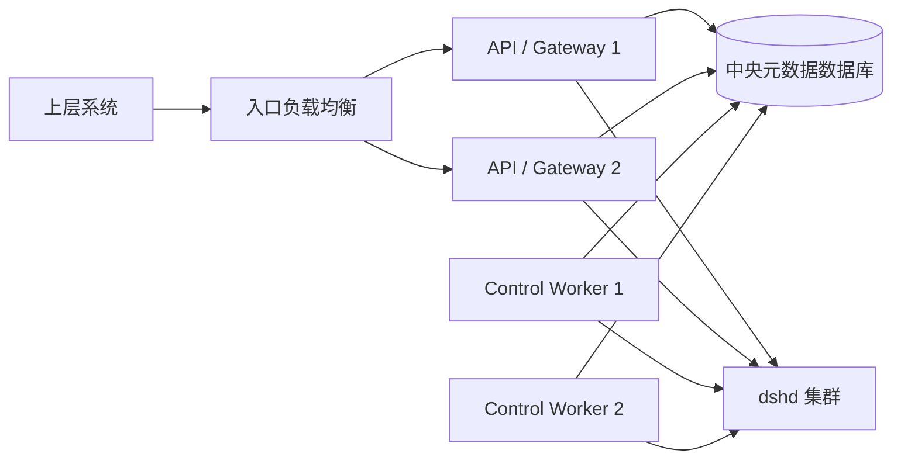
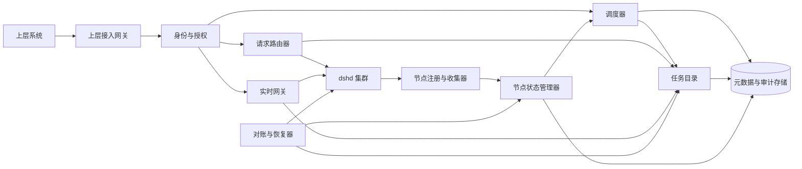

# 修订记录

| 版本 | 日期 | 作者 | 修订内容 | 依据 |
| --- | --- | --- | --- | --- |
| v0.1 | 2026-08-29 | Agent | 初次形成中央服务高层设计。 | 用户要求、[PRD-01][ARCH-01][HLD-01][IFACE-01] |
| v0.2 | 2026-08-29 | Agent | 按“定义、职责、边界、约束、形式和组成”六个维度重构文档，删除不属于服务定义主体的展开内容。 | 用户澄清、[PRD-01] |
| v0.3 | 2026-08-29 | Agent | 将中央到节点的固定 8080 假设修正为注册 advertise URL 与部署允许端口策略。 | 用户澄清、[ARCH-01][IFACE-01] |

# DeepSeek Harness 中央服务定义基线

本文档是中央服务的服务定义基线。其目的不是描述中央服务的全部实现细节，而是唯一明确中央服务是什么、负责什么、不负责什么、必须遵守什么、以什么形态存在，以及由哪些部分组成。[PRD-01]

| 维度 | 结论 |
| --- | --- |
| 定义 | 位于上层系统与后端节点集群之间的全局收集器、调度器和路由器 |
| 职责 | 收集节点与任务路由事实，调度新任务，路由既有任务，按需建立实时通信链路 |
| 边界 | 只拥有全局控制与路由元数据，不执行任务，不拥有 Harness 业务数据 |
| 约束 | 一个任务只能路由到一个 owner 节点；只对新任务负载均衡；只能通过 `dshd` 访问后端 |
| 形式 | 逻辑集中、物理可扩展的无 UI 后端服务；MVP 采用模块化单体和关系型元数据存储 |
| 组成 | 上层接入、节点收集、状态判定、调度、任务目录、请求路由、实时网关、对账和元数据存储 |

# 1. 定义

## 1.1 一句话定义

**中央服务是部署在上层系统与后端 `dshd + Harness` 集群之间的全局收集器、调度器和路由器。它向上提供统一任务入口，向下掌握节点可用性，为新任务选择一个后端节点，并把任务后续的普通请求和实时通信稳定路由到该节点。**[PRD-01][ARCH-01]

## 1.2 服务性质

中央服务同时具有三种性质：[PRD-01][ARCH-01][IFACE-01]

1. **收集器**：汇集节点注册、心跳、租约、运行状态、资源摘要和任务路由信息，形成全局视图。
2. **调度器**：在新任务到达时，从可接单的后端节点中选择一个节点，建立任务归属。
3. **路由器**：根据任务归属，把后续 HTTP 请求和实时双向流量转发到唯一 owner 节点。

中央服务还是整个集群的**全局控制面**，但不是任务执行面。它决定“任务去哪里”，不决定 Harness “如何执行任务”。[ARCH-01][HLD-01]

## 1.3 任务的定义

中央服务所称的“任务”，是一个需要被分配到某个后端节点、并在其生命周期内保持稳定路由的执行单元。在当前 Harness MVP 中，该路由单元对应一个普通 Harness Session，中央服务直接使用 opaque `session_id` 作为 `task_id`，不再生成第二套后端业务 ID。[ARCH-01][IFACE-01]

Subagent child 不构成独立调度任务；它继承 parent Session 的节点归属，并通过 `parentSessionId` 找到 owner 节点。[IFACE-01]

# 2. 职责

中央服务承担以下九项职责。这些职责构成闭合集合；未列入的业务能力不应默认归入中央服务。[PRD-01][ARCH-01][IFACE-01]

## 2.1 上层统一接入

- 向上层系统提供统一的任务提交、任务操作、节点管理和实时通信入口。
- 对上层身份进行认证和授权，确定调用方是否可以创建、访问或控制指定任务。
- 隐藏后端节点地址、节点 token、instance、lease 和 Harness generation 等基础设施细节。

## 2.2 节点注册与信息收集

- 接受 `dshd` 的注册、心跳续租和注销。
- 收集节点身份、持久卷身份、当前实例、租约、dshd/Harness 状态、generation、版本、能力、活动代理连接数和资源摘要。
- 保存最后一次有效观测及其来源时间，不把过期观测解释为当前事实。[IFACE-01]

## 2.3 节点可用性判定

- 根据租约、反向 readiness probe、daemon 状态、Harness desired/observed 状态、版本兼容性和 Session inventory 对账结果，派生中央节点状态。
- 只有中央状态为 `ONLINE` 的节点可以接收新任务。
- `SYNCING` 节点只允许服务已经存在明确路由的任务，不参与新任务调度。[IFACE-01]

## 2.4 新任务调度与负载均衡

- 接收上层的新任务请求。
- 从 `ONLINE` 且管理模式允许接单的节点中筛选候选集。
- 按能力、版本、资源水位、中央在途请求和已分配任务负载选择节点。
- 在调用后端前，先原子保存 `task_id/session_id → node_id` 的 `CREATING` 路由。
- 后端创建成功后把路由转为 `ACTIVE`。[PRD-01][ARCH-01][IFACE-01]

负载均衡只发生在任务首次分配时。任务一旦建立 owner，就不再按每次请求重新负载均衡。[ARCH-01]

## 2.5 任务目录与路由维护

- 维护全局唯一的 `task_id/session_id → node_id` 映射。
- 保存路由状态、创建时间、owner 节点、授权范围、最近一次对账时间和 owner 当前可用性。
- 在节点恢复、generation 变化或映射缺失时执行 Session inventory 对账。
- 发现同一 SessionId 出现在不同节点时标记 `ROUTE_CONFLICT`，禁止写操作，不静默覆盖。[IFACE-01]

## 2.6 普通请求路由

- 对任务操作先完成认证、授权和路由解析。
- 根据 `task_id` 找到唯一 owner 节点。
- 通过 owner 节点的 `dshd` 转发 Harness `/api/**` 请求。
- 将调用结果、错误、取消和流式响应返回上层。
- 请求结果不确定时遵守 create/fork 的专用恢复语义，不实施通用自动重放。[IFACE-01]

## 2.7 任务信息收集

中央服务收集的是**任务控制与路由信息**，不是任务业务正文。信息分为三类：[PRD-01][ARCH-01]

| 信息类别 | 中央服务处理方式 | 示例 |
| --- | --- | --- |
| 全局控制信息 | 持久化，作为中央权威 | task/session ID、owner node、路由状态、创建时间、可用性、冲突状态 |
| 后端观测摘要 | 保存最后观测或按需查询，并标记来源和时间 | 节点状态、generation、资源摘要、任务是否可路由 |
| Harness 业务信息 | 不作为中央权威；按需读取或实时转发 | 消息、历史、输出、事件、附件、审批、问题、Workspace 内容 |

因此，“收集任务信息”不等于把 Harness Session 复制到中央数据库。中央服务可以知道任务在哪个节点、能否访问以及最近一次观测结果，但任务内容仍属于 Harness。[ARCH-01][HLD-01]

## 2.8 实时通信链路

- 上层以 `task_id` 请求建立实时连接。
- 中央服务完成身份认证和任务授权，并解析唯一 owner 节点。
- 中央服务通过该节点 `dshd` 的 `/api/remote.mux` 建立 WebSocket。
- 一条实时链路固定绑定一个 `task_id`、一个 `node_id` 和一个 Harness generation。
- 事件、审批、用户问题、控制、取消及其他实时 frame 在上层与 Harness 之间双向流动。
- 中央服务实施 backpressure 和断连传播，但不把实时 frame 持久化为第二份事件日志。[PRD-01][IFACE-01]

## 2.9 对账、审计与可观测性

- 对节点注册、租约、状态变化、调度决定、路由变化、路由冲突和实时连接建立审计记录。
- 使用 `usable_key + sync_epoch` 防止旧 probe、旧 heartbeat 或迟到 inventory 结果覆盖当前状态。
- 输出中央服务自身的日志、指标和 trace，用于定位一次上层请求经过了哪个中央实例、哪个任务路由和哪个后端节点。[IFACE-01][CONTRACT-01]

# 3. 边界

## 3.1 责任边界

| 组件 | 拥有的权威 | 不承担的职责 | 来源 |
| --- | --- | --- | --- |
| 上层系统 | 产品流程、用户交互和调用意图 | 选择物理节点、持有 node token、直接调用 dshd | [PRD-01] |
| 中央服务 | 节点目录、租约、节点可用性、任务目录、任务到节点映射、调度、授权和统一路由 | 执行 Agent、保存 Session 正文、管理节点内进程细节 | [ARCH-01][HLD-01] |
| `dshd` | 本节点 Harness 生命周期、local connection generation、节点状态、资源事实和代理连接 | 全局调度、全局任务目录、终端用户权限 | [HLD-01][IFACE-01] |
| Harness | Session、消息、事件、附件、设置、凭据、Agent runtime、工具和 Workspace 数据 | 节点注册、全局路由、中央服务协议 | [ARCH-01][HLD-01] |
| 部署控制面 | `node_id + node_token` 预置、容器、网络、安全组和单写 volume | 任务路由和 Session 业务操作 | [ARCH-01][IFACE-01] |

## 3.2 数据边界

中央服务可以持久化：[PRD-01][ARCH-01][IFACE-01]

- 节点身份、实例、租约、版本、能力和最近状态；
- 节点中央派生状态及其判断依据；
- 任务 ID、owner 节点、路由状态和对账状态；
- 调度预留、幂等记录、fork intent、审计和可观测元数据；
- 上层明确提供且不替代 Harness 事实的展示标签。

中央服务不得持久化为自身业务权威：[ARCH-01][HLD-01]

- Session 消息、推理内容、工具调用正文和模型输出；
- 附件正文、Workspace 文件、设置和凭据；
- Harness 内部 Job、Terminal、Subagent mailbox 或 runtime 状态；
- Harness cookie、launch token 或用户 credential；
- 为了“方便查询”而复制出的第二份完整 Session 数据库。

## 3.3 网络边界

```text
上层系统
   │  统一 HTTP / WebSocket
   ▼
中央服务
   │  私网 HTTP / WebSocket，仅访问注册的 dshd advertise_url
   ▼
dshd
   │  容器内 loopback
   ▼
Harness
```

上层系统只访问中央服务；中央服务只访问 `dshd`；`dshd` 才能访问本机 Harness。任何跨层直连都违反系统边界。[ARCH-01][IFACE-01]

## 3.4 明确不属于中央服务的内容

- 不执行任务、Agent、工具、Job 或 Terminal。
- 不重新实现 Harness API 或业务模型。
- 不管理 Harness 的 loopback 端口、launch token 和 cookie。
- 不提供 Session 共享存储。
- 不执行任务跨节点迁移或自动故障转移。
- 不把多个节点的透明 WebSocket frame 合并成一个后端连接。
- 不取代容器平台、Secret Manager、日志平台或数据库运维系统。[ARCH-01][IFACE-01]

# 4. 约束

以下约束是中央服务实现和运行时必须保持的不变量。[ARCH-01][IFACE-01][CONTRACT-01]

## 4.1 路由约束

1. 一个任务在任一时刻只能有一个 owner 节点。
2. 每个南向请求在发出前必须解析为一个且仅一个 `node_id`。
3. 新任务只能调度到 `ONLINE` 节点。
4. 既有任务保持粘性路由；节点离线时返回不可用，不自动改投。
5. 相同 SessionId 出现在不同节点时进入冲突，禁止写入。
6. Subagent child 继承 parent 的节点路由。

## 4.2 节点可用性约束

节点可调度必须同时满足有效租约、反向 readiness 成功、daemon READY、registration LEASED、Harness desired RUNNING、Harness observed READY、协议与能力兼容，以及当前 `usable_key + sync_epoch` inventory 已完成。[IFACE-01]

单个 heartbeat、单次 TCP 成功或单个 READY 字段都不能独立证明节点可调度。[IFACE-01]

## 4.3 调用与重试约束

1. 中央服务不得绕过 `dshd` 访问 Harness。
2. 透明 Harness HTTP 和 WebSocket 调用不得做基础设施级自动重放。
3. create 响应不确定时只能以相同 SessionId、相同节点和相同参数恢复。
4. fork 响应不确定时不得重试 fork，只能在同一节点对账。
5. 已提交部分 HTTP 响应后只能终止流，不能拼接第二次响应。
6. WebSocket 断线后可以重新连接同一任务 owner，但不得自动重放 Remote 写调用。[IFACE-01]

## 4.4 实时链路约束

1. 一条实时链路只能绑定一个节点和一个 Harness generation。
2. 中央服务不得把一个后端连接拆分到多个节点，也不得合并多个节点的透明 frame。
3. frame、fragment、顺序、ping/pong、close 和 backpressure 语义必须保持。
4. 中央服务不把实时通信转换成消息队列，也不建立第二份事件日志。[IFACE-01]

## 4.5 安全约束

1. 中央服务负责上层用户或服务身份授权；`dshd` 只认证中央服务身份。
2. 每个节点使用独立 node token，token 必须与 `node_id` 绑定。
3. 中央服务只接受符合部署规则的私网 `advertise_url`，并校验其端口属于节点预登记或部署策略允许的 dshd service port，防止注册信息变成任意代理目标。
4. 用户 Authorization、Cookie、Forwarded、Sec-Fetch 等外部凭据不得进入 Harness。
5. token、credential、prompt 和响应正文不得写入中央日志。
6. 私网信任条件不成立时必须使用 TLS/mTLS。[IFACE-01][CONTRACT-01]

## 4.6 故障约束

1. 中央服务故障时，节点租约最终过期并停止承载中央业务，但本地 Harness 按 desired state 继续运行。
2. 中央服务恢复后，节点必须重新建立租约并完成新 sync epoch 对账，才能重新接收新任务。
3. 中央数据库不可用时，中央服务不得在缺少权威状态的情况下继续创建租约、调度任务或修改路由。
4. 迟到的 heartbeat、probe 和 inventory 结果不得覆盖当前 instance、lease、generation 或 epoch。[ARCH-01][IFACE-01]

# 5. 形式

## 5.1 服务形态

中央服务是一个**独立部署、无 UI、长期运行的后端服务**。它同时提供：[PRD-01][IFACE-01]

- 面向上层系统的 HTTP API 和 WebSocket/流式入口；
- 面向 `dshd` 的 Node Registry API；
- 面向后端节点的 HTTP/WebSocket 调用能力；
- 面向运维的管理、审计和可观测输出。

## 5.2 架构形态

中央服务采用“逻辑集中、物理分布”的形态：[PRD-01]

- **逻辑集中**：节点目录、任务目录、调度和路由只有一套权威语义。
- **物理分布**：服务可以运行多个 API/Gateway 和 Worker 副本，不形成单进程单点。
- **状态外置**：共享控制状态保存在关系型元数据数据库中，不能只保存在某个服务实例内存。
- **流量无持久化**：HTTP body、ZIP 和 WebSocket frame 以流式方式经过中央服务，不作为中央业务数据落库。

## 5.3 MVP 实现形态

MVP 采用**模块化单体**，而不是立即拆分为多个微服务：[PRD-01]

- 一个代码库；
- 一个版本化构建物；
- 清晰分隔的内部模块；
- 通过启动角色分别运行 API/Gateway 和 Control Worker；
- 共用一个关系型元数据数据库；
- 不引入中央—节点消息队列、反向隧道或命令轮询。[IFACE-01]

模块化单体只是交付形式，不允许模块绕过应用接口直接争抢彼此的数据所有权。Node Registry、Scheduler、Task Directory 和 Router 必须保持独立职责。[PRD-01]

## 5.4 部署形态



API/Gateway 副本承载上层 API、普通请求代理和实时连接；Control Worker 承载 readiness probe、租约到期收敛、inventory 对账和恢复任务。多个 Worker 通过数据库工作租约或 CAS 保证同一项协调工作只有一个有效提交者。[PRD-01][IFACE-01]

# 6. 组成

中央服务由九个逻辑组件和一个共享元数据存储组成。[PRD-01][ARCH-01][IFACE-01]

| 组件 | 定义 | 核心职责 | 核心输出 |
| --- | --- | --- | --- |
| 1. 上层接入网关 | 中央服务的北向入口 | HTTP/WS 接入、请求校验、限流、request/trace id | 标准化调用上下文 |
| 2. 身份与授权 | 上层信任边界 | 用户/服务认证、任务和节点权限判断、actor 审计 | 授权决定 |
| 3. 节点注册与收集器 | dshd 的接入入口 | 预登记、注册、心跳、续租、注销、状态与资源收集 | 节点事实快照和当前租约 |
| 4. 节点状态管理器 | 节点可用性权威 | usable key、reverse-ready、sync epoch、状态派生 | REGISTERING/SYNCING/ONLINE/DEGRADED/OFFLINE/CONFLICT |
| 5. 调度器 | 新任务 owner 选择器 | 候选过滤、能力匹配、负载排序、原子预留 | 选定的唯一 node_id |
| 6. 任务目录 | 全局任务路由权威 | task/session 到 node 映射、路由状态、fork intent、冲突 | CREATING/ACTIVE/ROUTE_CONFLICT 路由记录 |
| 7. 请求路由器 | 普通任务请求数据面 | 解析任务 owner、调用 dshd、流式返回 HTTP 结果 | 单节点 HTTP 路由 |
| 8. 实时网关 | 双向实时数据面 | task-scoped 建链、WS 代理、backpressure、断连传播 | 单节点实时链路 |
| 9. 对账与恢复器 | 中央一致性修复单元 | Session inventory、fork 不确定结果、迟到结果 CAS、路由缺失/冲突发现 | 当前 epoch 对账结果 |
| 10. 元数据与审计存储 | 全局控制状态载体 | 事务、唯一约束、租约、任务目录、工作领取、审计 | 可恢复的中央权威状态 |

## 6.1 组件关系



这组组件形成两个闭环：[PRD-01][IFACE-01]

1. **收集—决策闭环**：dshd → 节点收集器 → 状态管理器 → 调度器/任务目录。
2. **接入—路由闭环**：上层 → 接入与授权 → 调度器或任务目录 → 请求路由器/实时网关 → dshd。

## 6.2 最终组成结论

中央服务不是单一“转发代理”，也不是一个“任务数据库”。它是由全局元数据、节点收集、可用性判定、任务调度、稳定路由和实时桥接共同组成的集群控制与流量中介服务。其中：[PRD-01][ARCH-01]

- 收集器让中央服务知道“有哪些节点和任务路由、它们现在是否可用”；
- 调度器决定“新任务交给哪个节点”；
- 任务目录记住“任务属于哪个节点”；
- 请求路由器和实时网关负责“把上层与该节点连接起来”；
- 对账器负责“在重启、断线和结果不确定后恢复正确的全局视图”；
- 元数据存储保证“多个中央服务副本仍共享同一套权威判断”。

# 参考文献

| 标记 | 来源 | 说明 |
| --- | --- | --- |
| [PRD-01] | 用户于 2026-08-29 提出的中央服务要求及本轮澄清 | 明确中央服务的定义、职责、边界、约束、形式和组成；中央服务是收集器和路由器 |
| [ARCH-01] | [DeepSeek Harness 分布式管理 MVP 基线](../mvp-baseline.md) | 已冻结的总体目标、职责、任务路由、数据所有权和 MVP 边界 |
| [HLD-01] | [后端节点 HLD](../backend-node-hld.md) | 中央服务、dshd 与 Harness 的职责和数据权威边界 |
| [IFACE-01] | [中央服务—dshd 接口规范](../interfaces/central-dshd-interface-spec.md) | 节点注册、租约、状态、透明代理、Session 路由和故障语义 |
| [CONTRACT-01] | [中央服务—dshd 一致性测试规范](../contracts/central-dshd-conformance.md) | 单写、状态、代理、路由与竞态行为不变量 |
