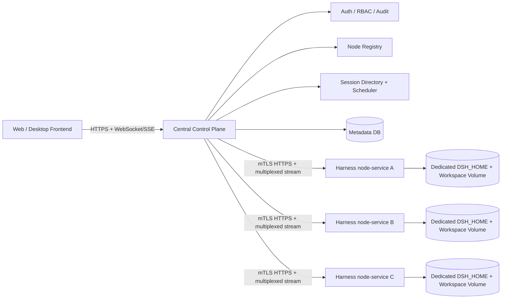

# DeepSeek Harness 分布式控制面可行性与技术路线

> 文档性质：可行性研究（informative），包含超出冻结 MVP 的长期路线；正式 MVP 结论以 `mvp-baseline.md`、`backend-node-hld.md` 和 `central-dshd-interface-spec.md` 为准。  
> 研究基线：DeepSeek Harness `cd5ef8148158c3a752a658978873241fdf8e2bbc`（`dsh-v0.1.2-alpha.1`）  
> 研究日期：2026-08-29  
> 目标：多台 ECS 运行 DeepSeek Harness，由统一前端/API 管理节点及节点上的完整会话能力。

## 1. 结论

目标总体可行，推荐采用“中央控制面 + 多个 Harness 节点服务 + 会话单主归属”的架构。

最合适的实现路线不是直接公网暴露现有 `dsh web`，也不是给 SDK stdio 协议套一层 HTTP，而是为 Harness 新增一个无 UI 的 `node-service` profile：复用现有 Typert Gateway、Remote API、Session Controller 和事件流协议，只替换浏览器专用的 Connection 传输与认证层。中央控制面负责用户认证、RBAC、节点注册、调度、会话目录、流代理和审计；浏览器永远不直接连接 ECS 节点。

首版应把每个会话固定到一个节点。同一个会话不得被多个 Harness 进程同时激活或写入。这并不是保守设计，而是当前持久化与运行时语义的明确要求：JSONL 后端只允许单会话单写者，部分任务、终端、子代理协调和控制基线只存在于进程内。

可行性分级如下：

| 能力 | 可行性 | 推荐实现 |
|---|---:|---|
| 多节点部署、注册、健康检查 | 高 | 新增 `node-service` profile 与节点控制 API |
| 统一列出、创建、搜索、打开会话 | 高 | 中央 Session Directory + 代理现有 Session Controller |
| 提示、取消、排队、历史、事件流、分叉、模型选择 | 高 | 粘性路由到会话所属节点，复用现有 Remote API |
| 节点扩缩容、容量调度、维护排空 | 高 | 仅调度新会话；旧会话保持归属，排空时做冷迁移 |
| 节点宕机后的冷恢复 | 中高 | 独占持久盘重新挂载，或从快照恢复后重新取得租约 |
| 会话在节点间冷迁移 | 中 | 停止接单、等待安全点、flush、搬迁数据、切换归属 |
| 运行中无感迁移/故障切换 | 低 | 需要重做 durable job、terminal、mailbox、fencing 和工具幂等性 |
| 同一会话 active-active | 不推荐 | 与现有单写者和进程内状态模型冲突 |

## 2. 为什么应复用现有 Host API

Harness 已经具备相当完整的业务 API。Session Controller 提供：

- `list`、`search`、`create`、`rename`、`fork`；
- `selectModel`、`modelCatalog`；
- `prompt`、`updateQueue`、`cancel`；
- `page` 历史分页、`follow` 持久事件流、`control` 实时控制流；
- 附件读取和工作区路径操作。

这些接口可在 [Session Controller 源码](https://github.com/deepseek-ai/deepseek-harness/blob/cd5ef8148158c3a752a658978873241fdf8e2bbc/packages/api/session-controller/src/index.ts#L208-L391) 中直接核验。其设计还明确区分了冷读和激活：列表、搜索、附件、历史等可不启动 Agent，提示、改模型、重命名等会按需恢复会话；只有创建和分叉直接创建新 Agent。[Session Controller 说明](https://github.com/deepseek-ai/deepseek-harness/blob/cd5ef8148158c3a752a658978873241fdf8e2bbc/packages/api/session-controller/README.md#L28-L30)

此外，Web 客户端实际挂载的 Remote 不只包含会话控制，还包含 Agent presets、commands、settings、goals、LLM、插件清单、消息反馈、会话引用、子代理和 workspace 等能力。[Remote 客户端装配](https://github.com/deepseek-ai/deepseek-harness/blob/cd5ef8148158c3a752a658978873241fdf8e2bbc/packages/api/remotes/src/client/index.ts#L4-L13) [挂载列表](https://github.com/deepseek-ai/deepseek-harness/blob/cd5ef8148158c3a752a658978873241fdf8e2bbc/packages/api/remotes/src/client/index.ts#L158-L160)

因此，工作重点应是把这套业务接口变成安全、稳定的服务间接口，而不是重新实现一套“远程 Harness API”。

## 3. 为什么不能直接暴露 `dsh web`

现有 Web Connection 是为本机浏览器设计的：普通调用使用 HTTP POST，流使用 `/api/remote.mux` WebSocket；Host 同时负责浏览器认证、Host/Origin 校验和路由。[Connection 协议](https://github.com/deepseek-ai/deepseek-harness/blob/cd5ef8148158c3a752a658978873241fdf8e2bbc/packages/client/connection/README.md#L28-L28)

认证方式是进程启动时生成随机 launch token，再通过根路径交换签名 cookie；它不接受 `Authorization` header。cookie 为适配 loopback HTTP 而特意没有 `Secure` 属性。[浏览器认证](https://github.com/deepseek-ai/deepseek-harness/blob/cd5ef8148158c3a752a658978873241fdf8e2bbc/packages/client/connection/README.md#L35-L39) [安全限制](https://github.com/deepseek-ai/deepseek-harness/blob/cd5ef8148158c3a752a658978873241fdf8e2bbc/packages/client/connection/README.md#L62-L63)

CLI 甚至主动拒绝 `dsh web --host 0.0.0.0`，错误信息指出这会把远程代码执行能力暴露到网络。[启动保护](https://github.com/deepseek-ai/deepseek-harness/blob/cd5ef8148158c3a752a658978873241fdf8e2bbc/packages/bundle/web-app/src/startup.ts#L65-L75) 底层 webserver 虽能绑定 `0.0.0.0`，但它自身没有 TLS、认证或 Origin 策略。[Webserver 边界](https://github.com/deepseek-ai/deepseek-harness/blob/cd5ef8148158c3a752a658978873241fdf8e2bbc/packages/host/webserver/README.md#L39-L39)

结论：直接反向代理 Web Host 只适合隔离网络内的验证原型，不应成为生产架构。

## 4. 为什么不应以 SDK stdio 为核心

SDK 协议目前只有三个请求：`initialize`、`session/prompt` 和 `shutdown`。[SDK 请求映射](https://github.com/deepseek-ai/deepseek-harness/blob/cd5ef8148158c3a752a658978873241fdf8e2bbc/packages/sdk/protocol/src/types.ts#L107-L118) 它明确没有 cancel 或 session-close，客户端要放弃执行只能关闭 runtime 进程。[SDK 限制](https://github.com/deepseek-ai/deepseek-harness/blob/cd5ef8148158c3a752a658978873241fdf8e2bbc/packages/sdk/protocol/README.md#L115-L115)

用它包装节点服务，会立即需要重复实现会话列表、搜索、历史分页、分叉、队列、取消、workspace、设置、审批、交互问题和子代理等能力。它适合嵌入式单进程调用，不适合作为本项目的完整节点管理协议。

## 5. 推荐架构



### 5.1 中央控制面

中央服务建议拆成以下逻辑模块，首版可以部署为一个模块化单体：

1. **Public API/BFF**：浏览器登录、租户隔离、RBAC、限流和输入校验。
2. **Node Registry**：记录 node id、版本/commit、能力、配置版本、模型、容量、心跳、`active/draining/offline` 状态。
3. **Session Directory**：维护 `globalSessionId -> nodeId + nativeSessionId + ownershipEpoch`。
4. **Scheduler**：只为新会话选节点；依据可用模型、workspace/镜像能力、活动会话数、并发 turn 和资源水位调度。
5. **Session Proxy**：把 unary 和 stream 调用转给唯一所有者；客户端不感知节点地址。
6. **Event Gateway**：汇聚 `follow`/`control`，向前端输出 WebSocket 或 SSE；保存每个连接的序列游标并处理重连。
7. **Metadata DB**：保存节点、路由、权限、审计、幂等键、迁移任务；首版不把它当作原始 Session log 的替代品。

### 5.2 Harness 节点服务

新增 `dsh --profile node-service`（名称可调整），装配：

- base runtime、Agent、session persistence、workspace、attachments、credentials；
- Typert Gateway、Session Controller、Workspace Controller、Settings Controller；
- 经 allowlist 筛选的 Remote 集合；
- 新增 Node Control 服务：`describe`、`health`、`capacity`、`drain`、`reloadConfig`、`shutdownGracefully`；
- 新增服务间 Connection carrier：内部 HTTPS + multiplexed WebSocket，使用 mTLS 与短期签名令牌；
- 不装配 frontend static、浏览器 launch-token/cookie 认证和桌面专用能力。

这条路线与现有抽象吻合。Gateway 文档明确说明：Connection 负责 transport、RPC id、响应封装、取消和信任边界；Gateway 负责 Remote 数据协议和业务分发，替换 Connection carrier 不要求修改 Remote descriptor 或客户端编程接口。[Gateway 边界](https://github.com/deepseek-ai/deepseek-harness/blob/cd5ef8148158c3a752a658978873241fdf8e2bbc/docs/api-gateway.md#L121-L124)

### 5.3 安全边界

- 公网只暴露中央控制面；节点仅接受中央服务身份。
- ECS 节点位于私有子网，安全组只允许控制面访问，或者节点主动建立出站长连接。
- 节点间使用 mTLS；请求还携带 `requestId`、`actor`、`tenantId`、`sessionId`、`ownershipEpoch`、deadline。
- 控制面做用户级授权；节点仍做资源级校验，防止路由或控制面 bug 越权。
- Remote 装配必须使用显式 allowlist。现有 Web 装配包含动态 Cordis/插件管理能力，不能未经区分地交给普通租户。
- 对 prompt/create/fork/rename/updateQueue 等写操作使用幂等键，避免网络重试产生重复副作用。

## 6. 会话归属与一致性模型

### 6.1 核心不变量

任意时刻，一个 `globalSessionId` 只有一个活动 owner：

```text
route = { globalSessionId, nodeId, nativeSessionId, ownershipEpoch, state }
state = ACTIVE | DRAINING | RECOVERING | OFFLINE
```

控制面每次转发写请求都带 `ownershipEpoch`。节点只接受当前 epoch；迁移或恢复时先 fence 旧 owner，再递增 epoch，避免旧节点恢复网络后继续写入。

不能把同一份 `DSH_HOME` 放到 NFS/EFS 上供多个在线节点共同读写。JSONL 持久化明确要求每个会话只有一个 live writer；另一实例必须等待旧 owner 静默销毁。[JSONL 单写者约束](https://github.com/deepseek-ai/deepseek-harness/blob/cd5ef8148158c3a752a658978873241fdf8e2bbc/packages/session/session-persistence-jsonl/README.md#L150-L150) JSON storage 没有跨进程写锁，[JSON storage 限制](https://github.com/deepseek-ai/deepseek-harness/blob/cd5ef8148158c3a752a658978873241fdf8e2bbc/packages/storage/storage-json/README.md#L142-L142) SQLite storage 也把跨进程协调置于范围外。[SQLite storage 限制](https://github.com/deepseek-ai/deepseek-harness/blob/cd5ef8148158c3a752a658978873241fdf8e2bbc/packages/storage/storage-sqlite/README.md#L130-L130)

### 6.2 状态分类

| 状态/能力 | 当前持久性 | 集群策略 |
|---|---|---|
| Session event log、消息、模型选择、目标、计划主状态 | 持久，可重放 | owner 节点为事实来源；冷恢复后重放 |
| 历史分页与 `follow` journal | 持久并带序列 | 控制面保存 cursor，断线后补齐 gap |
| `control` 队列、jobs、实时 projection | 进程内 baseline | 重连可替换 baseline；进程重启不能完整重建 |
| Background jobs | 进程内 | 重启/迁移时终止；后续实现 durable backend |
| Persistent terminal/PTY | 进程内 | 不支持跨节点迁移；向用户明确终止语义 |
| 子代理 activation inbox/ownership graph | 进程内 | 子会话固定到同一节点；后续增加 durable mailbox + lease |
| Attachments | 默认本机磁盘 | 首版随 owner volume；后续切 S3/OSS provider |
| Credentials | 默认本地文件 | 首版节点专属；生产建议 Vault/KMS provider |
| Workspace | 物理目录 | 与节点/卷绑定；迁移必须连同 workspace 处理 |

证据：控制流 baseline 是进程内状态，Host 重启后无法重建 jobs。[Session Control 限制](https://github.com/deepseek-ai/deepseek-harness/blob/cd5ef8148158c3a752a658978873241fdf8e2bbc/packages/api/session-controller/README.md#L61-L61) 本地 job 会随 Harness 进程死亡，[Jobs Local](https://github.com/deepseek-ai/deepseek-harness/blob/cd5ef8148158c3a752a658978873241fdf8e2bbc/packages/jobs/jobs-local/README.md#L12-L32) terminal 同样不跨重启。[Terminal](https://github.com/deepseek-ai/deepseek-harness/blob/cd5ef8148158c3a752a658978873241fdf8e2bbc/packages/terminal/terminal/README.md#L12-L32) 子代理跨进程需要 durable mailbox 和 lease。[Subagent](https://github.com/deepseek-ai/deepseek-harness/blob/cd5ef8148158c3a752a658978873241fdf8e2bbc/packages/subagent/subagent/README.md#L168-L181) 默认附件只在本机可读。[Attachment Local](https://github.com/deepseek-ai/deepseek-harness/blob/cd5ef8148158c3a752a658978873241fdf8e2bbc/packages/attachment/attachment-local/README.md#L12-L12)

## 7. 控制面 API 建议

对外 API 应保持稳定、面向业务，不直接泄漏 Typert endpoint 或节点地址。

```text
GET    /v1/nodes
GET    /v1/nodes/{nodeId}
POST   /v1/nodes/{nodeId}:drain

GET    /v1/sessions
POST   /v1/sessions
GET    /v1/sessions/{sessionId}
POST   /v1/sessions/{sessionId}/prompts
POST   /v1/sessions/{sessionId}:cancel
POST   /v1/sessions/{sessionId}:fork
PATCH  /v1/sessions/{sessionId}
GET    /v1/sessions/{sessionId}/events?afterSeq=...
GET    /v1/sessions/{sessionId}/stream
GET    /v1/sessions/{sessionId}/control-stream
```

内部节点协议可以保留现有 Remote 方法和 stream 结构，另加一个薄的 node namespace。中央服务内部维护映射：

```text
public session operation
  -> authorize tenant/user
  -> resolve owner and epoch
  -> invoke existing remote endpoint on node
  -> normalize errors and audit
```

错误码至少区分：`NOT_FOUND`、`FORBIDDEN`、`NODE_OFFLINE`、`SESSION_BUSY`、`STALE_OWNER`、`DRAINING`、`MODEL_UNAVAILABLE`、`RETRYABLE_TRANSPORT`、`BUSINESS_FAILURE`。只有 transport 失败且操作具备幂等键时才能自动重试；不能把业务错误当作断线重试。

## 8. 技术路线比较

| 路线 | 完整能力 | 安全性 | 改造量 | 长期性 | 结论 |
|---|---:|---:|---:|---:|---|
| 反代每台 `dsh web` | 高 | 低 | 低 | 低 | 仅限隔离环境 PoC |
| SDK stdio + 自建 HTTP wrapper | 低 | 中 | 表面低、补 API 后高 | 低 | 不采用 |
| 新增 `node-service`，复用 Gateway/Remotes | 高 | 高 | 中 | 高 | **推荐** |
| 首期即改造成共享数据库 active-active | 理论高 | 中 | 极高 | 不确定 | 延后且不建议 active-active |

## 9. 分期实施方案

### Phase 0：协议与风险验证（约 1–2 周）

完成三个 spike，作为是否进入工程化的门槛：

1. **自定义 carrier spike**：在 Node 客户端通过新 Connection carrier 调用 `session.list/create/prompt/page/follow/control/cancel`，验证 Remote descriptor 无需修改。
2. **进程重启 spike**：执行会话、jobs、terminal、subagent、审批/问题交互，逐项记录重启前后的恢复语义。
3. **owner fencing spike**：模拟节点断网、控制面切换 epoch、旧节点恢复，证明旧 owner 无法继续接受写请求。

通过标准：事件流无重复业务副作用、可按 seq 补洞；所有写 API 都有明确幂等/非幂等定义；fencing 测试无双写。

### Phase 1：可生产 MVP（约 4–8 周）

- 实现 `node-service` profile 和 service Connection；
- 实现中央控制面、Postgres 元数据、节点注册/心跳、会话路由；
- 每节点独占持久块存储，定期快照；
- 支持会话完整代理和 stream 重连；
- 支持节点 `draining`，只停止分配新会话；
- 明确展示 owner node、节点离线和进程内能力丢失状态；
- 完成 mTLS、RBAC、审计、限流、secrets 管理。

### Phase 2：冷迁移与灾难恢复

- 进入 drain，停止新 prompt 或等待当前 turn 达到安全点；
- flush session、attachment、storage 和 workspace；
- fence 旧 owner；
- 快照/复制或重新挂载独占卷；
- 目标节点加载并校验 session 尾序列；
- 递增 epoch，更新 Session Directory，重新开放流量。

如果存在运行中 job、terminal、审批、问题交互或未落盘子代理消息，迁移操作应拒绝、等待或显式强制终止，不能宣称无损。

### Phase 3：共享耐久后端（按实际需求）

利用现有 provider seam 逐步替换：

- SessionPersistence -> PostgreSQL/专用事件存储；
- Attachment -> S3/OSS；
- Storage Domain -> PostgreSQL；
- Credentials -> Vault/KMS；
- Jobs -> durable queue/executor；
- Subagent -> durable mailbox + lease。

即使使用共享后端，也保留“每会话单活动 owner + fencing”，除非工具执行、terminal 和所有副作用都具备分布式幂等协议。

## 10. 主要风险与决策门

1. **“所有会话特性”的定义**：如果要求节点重启后连 PTY、后台进程、进行中的审批和模型流都不丢失，则项目不是简单分布式封装，而是运行时级重构。MVP 应定义为 API 能力完整、持久事件可恢复，进程内资源遵循明确终止语义。
2. **远程代码执行面**：Harness 能读写 workspace、运行 shell、安装/装配插件。节点协议的每个能力必须经过 allowlist、租户授权、审计和沙箱约束。
3. **工作区数据位置**：必须尽早决定 workspace 是节点本地卷、网络文件系统、对象存储同步还是 Git 工作副本。这个选择会直接决定调度与迁移成本。
4. **配置与模型差异**：调度不能假设所有节点同构，节点必须上报模型、工具、profile、镜像、credentials scope 和 workspace 能力。
5. **版本兼容**：控制面与节点握手应交换 Harness commit、协议版本、Remote schema hash 和 feature flags；不兼容节点不得接单。
6. **列表规模**：当前 persistence `list()` 无分页无过滤，只适合本地规模。[Persistence 限制](https://github.com/deepseek-ai/deepseek-harness/blob/cd5ef8148158c3a752a658978873241fdf8e2bbc/packages/session/session-persistence/README.md#L137-L137) 集群列表应读取中央元数据，而不是广播查询所有节点。
7. **本地检索索引**：SQLite session-query 要求单进程独占索引路径，不支持多进程共享。[Session Query 限制](https://github.com/deepseek-ai/deepseek-harness/blob/cd5ef8148158c3a752a658978873241fdf8e2bbc/packages/session-query/session-query-sqlite/README.md#L108-L108) 全局搜索应由中央索引或独立搜索服务承担。

## 11. 最终建议

建议现在批准的架构决策是：

1. 采用中央控制面，不允许浏览器直连 Harness 节点；
2. 新增 `node-service` profile，复用 Gateway/Remote/Session Controller；
3. 实现 mTLS 服务间 Connection carrier，而非暴露 Web cookie transport；
4. 首版采用节点本地独占持久卷和会话粘性路由；
5. Session Directory 使用租约/epoch fencing，禁止同一会话双写；
6. 承诺冷恢复，不承诺进行中 turn、job、PTY 的透明热迁移；
7. 先完成 Phase 0 三个 spike，再锁定 MVP 详细设计和工期。

这条路线对上层保留“统一管理所有会话特性”的产品体验，对下层尊重 Harness 当前的单进程运行时边界，并为以后替换成共享耐久 provider 留出清晰演进空间。
