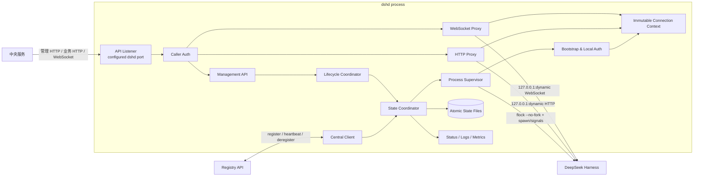
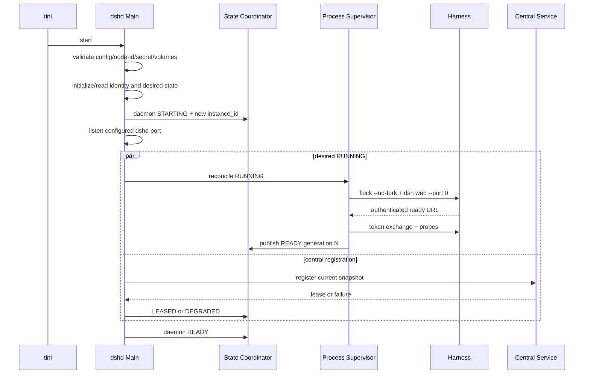

# 修订记录

| 版本 | 日期 | 作者 | 修订内容 | 依据 |
| --- | --- | --- | --- | --- |
| v0.1 | 2026-08-29 | Agent | 在已冻结后端架构和中央服务—dshd 契约基础上，定义 dshd 的实现架构、技术路线、模块协作、状态与持久化、Docker 交付及分阶段开发路线图。 | 用户要求、[PRD-01][ARCH-01][IFACE-01][FREEZE-01][ACCEPT-01] |
| v0.2 | 2026-08-29 | Agent | 固化单镜像最终交付定义，并为 M0～M8 补齐目标、工作方法、边界、约束、交付物、验收标准与方法。 | 用户确认、[DELIVERY-01][PRD-01][ARCH-01][IFACE-01][TEST-01] |
| v0.3 | 2026-08-29 | Agent | 纠正路线图定义层级：以整条路线图为对象统一定义最终目标、整体工作方法、边界、约束、交付物、验收标准和验收方法；阶段仅保留推进路径与阶段结果。 | 用户澄清、[DELIVERY-01][PRD-01][ARCH-01][IFACE-01][TEST-01] |
| v0.4 | 2026-08-29 | Agent | 纠正中央服务与 dshd 的职责表述；将固定 8080 修正为“单一可配置 dshd 服务端口”，8080 仅为默认值。 | 用户澄清、[DELIVERY-01][ARCH-01][IFACE-01] |
| v0.5 | 2026-08-29 | Agent | 按六要素审查根因统一修复接口方向、advertise URL 配置、非 root 端口范围、后端独立验收边界和目标环境基线。 | 用户要求、[DELIVERY-01][ARCH-01][IFACE-01][TEST-01][ACCEPT-01] |
| v1.0 | 2026-08-29 | Agent | 经复验通过后，正式冻结 dshd 路线图六要素；本次不改变六要素正文，仅固化其基线状态和变更控制规则。 | 用户确认、[DELIVERY-01][PRD-01][ARCH-01][IFACE-01][TEST-01][ACCEPT-01] |
| v1.1 | 2026-08-29 | Agent | 在不改变冻结六要素的前提下，补齐 Web 能力基线、验收资产阶段归属、无歧义阶段依赖和 M7 ECS 环境前置门禁。 | 用户要求、[CAPABILITY-01][DELIVERY-01][ARCH-01][TEST-01][ACCEPT-01] |
| v1.2 | 2026-08-29 | Agent | 随工作区整理更新冻结源码和模块文档路径；六要素、总体方案和路线图语义不变。 | 用户要求、[FREEZE-01][CAPABILITY-01] |

# 1. 文档概述

本文档是 dshd MVP 的服务级总体设计和开发路线图。它把已批准的后端 HLD 与中央服务—dshd 契约收敛为可实施的 dshd 内部架构，但不重新定义中央服务内部实现，也不修改原生 DeepSeek Harness。[PRD-01][ARCH-01]

| 项目 | 内容 |
| --- | --- |
| 系统对象 | Harness Node Daemon（`dshd`） |
| 交付形态 | 与固定 Harness 共同发布的 Linux Docker 镜像 |
| 技术栈 | Node.js 24、TypeScript ESM、HTTP/1.1、WebSocket RFC 6455 字节隧道 |
| 外部端口 | 一个可配置的 dshd TCP 服务端口，默认 `8080`；HTTP/WS/管理/健康共端口 |
| 内部业务进程 | 一个由 dshd 管理的原生 `dsh web` 子进程 |
| 最终产品交付 | 一个同时包含 dshd 与固定 dsh 的 OCI/Docker 镜像，以及完整使用说明 |
| 设计状态 | 路线图六要素已冻结（v1.0），可进入仓库初始化和详细实现设计 |
| 实现状态 | 尚未开发；行为向量仍为 `66 declared, 0 executed` |

# 2. 背景与目标

## 2.1 目标

| 目标 | MVP 成功标准 | 来源 |
| --- | --- | --- |
| Harness 服务化 | 能无人值守启动、停止、重启、守护一个固定版本 Harness | [PRD-01][ARCH-01] |
| 官方 Web UI 后端能力无损 | `/api/**`、Session export 和 `/api/remote.mux` 能透明通过 | [PRD-01][TECH-02] |
| 中央服务唯一控制点 | 中央服务只通过 dshd 管理节点和访问 Harness | [PRD-01][IFACE-01] |
| 节点事实可信 | 身份、instance、lease、generation、desired/observed state 可查询且有明确 owner | [IFACE-01] |
| 容器化可交付 | 非 root、只读 rootfs、固定目录/权限/端口、固定 Harness 版本 | [ARCH-01][FREEZE-01] |
| 契约可验证 | OpenAPI、schema 正反例和 66 个行为向量可由测试 runner 执行 | [OPENAPI-01][TEST-01] |

## 2.2 非目标

dshd 不实现全局节点选择、Session→Node 路由、终端用户授权、跨节点 Session 迁移、共享存储、中央数据库或前端 API；不解析 Harness Session 数据、Typert payload 或 Remote 业务帧；不管理容器外 Harness、Docker daemon 或其他 ECS task。[PRD-01][ARCH-01]

# 3. 架构摘要

dshd 采用“单守护进程 + 单 Harness 子进程 + 单序列化状态协调器”的结构。Node.js event loop 承载管理、代理和中央客户端；所有会改变身份、lease、desired/observed state、generation 或 active connection 的事件进入同一个状态协调器，避免多个异步模块直接改写共享状态。[ARCH-01][IFACE-01]



核心设计原则：原生 Harness 是业务事实权威；dshd 是本节点运行事实和网络入口权威；中央服务是全局节点、租约、调度和 Session 路由权威。三者不建立竞争性的第二份业务状态。[PRD-01][ARCH-01]

# 4. 范围边界

| 类型 | 内容 | 边界结论 |
| --- | --- | --- |
| 范围内 | 配置、身份初始化、持久 desired state | dshd 拥有 |
| 范围内 | Harness spawn、stop、restart、crash recovery、writer guard | dshd 拥有 |
| 范围内 | ready URL 解析、launch-token/cookie 交换、connection generation | dshd 拥有 |
| 范围内 | `/daemon/v1/**`、health、operation、幂等 | dshd 提供 |
| 范围内 | `/api/**` 与 `/api/remote.mux` 透明代理 | dshd 提供，不解释 payload |
| 范围内 | register、heartbeat、lease、deregister、FENCED | dshd outbound client 实现 |
| 范围内 | status/heartbeat 指标、stdout/stderr 日志 | dshd 输出 |
| 范围外 | 中央服务数据库、调度算法、用户/租户模型 | 中央服务拥有 |
| 范围外 | Harness Session/Workspace 内部存储格式 | Harness 拥有 |
| 范围外 | 跨节点迁移、共享 Session 存储、自动故障转移 | MVP 不实现 |

# 5. 干系人与关注点

| 干系人 | 关注点 | 设计响应 |
| --- | --- | --- |
| dshd 开发 | 模块边界、异步竞态、可测试性 | 单状态协调器、不可变 connection context、端口适配器 |
| 中央服务开发 | API、错误、状态、重试、租约 | OpenAPI + 行为规范作为唯一服务契约 |
| QA | parity、流式代理、竞态和故障 | 单元、契约、fake Harness、真实 Harness、ECS 五层测试 |
| 运维 | Docker、健康、日志、恢复 | live/local/ready 分离，单镜像，结构化 stdout/stderr |
| 安全 | token/cookie、RCE 入口、文件权限 | Harness loopback、Bearer、header 隔离、非 root、secret mount |

# 6. 质量属性目标

| 属性 | 可验收目标 | 验证方式 |
| --- | --- | --- |
| 功能完整性 | [CAPABILITY-01] 中全部 `WUI-*` 通过代理，且不存在未覆盖 ID | 逐 ID inventory contract + parity E2E 覆盖报告 |
| 透明性 | 请求/响应/stream/frame 语义保持；只处理连接级 header 和节点策略 close | PX 行为向量、录制回放、故障注入 |
| 状态正确性 | 所有状态变化经 coordinator；迟到 instance/lease/generation 事件不能复活旧状态 | ST/SR 竞态测试、property tests |
| 内存边界 | ZIP、HTTP body 和 WS frame 使用 streaming/backpressure，不完整缓冲 | 大文件和慢消费者测试 |
| 可恢复性 | desired=RUNNING 时异常退出退避恢复；合法 STOPPED/FENCED 不被隐式拉起 | 生命周期和容器重启 E2E |
| 安全 | secret 不出节点、不进入日志；Harness 不可绕过 dshd 访问 | 日志扫描、端口扫描、header 捕获测试 |
| 可运维性 | live/status 在 dshd 正常时可用；本地/业务就绪与容器 liveness 分离 | health matrix 测试 |

在没有真实容量基线前不冻结吞吐、连接数和延迟 SLO；路线图把容量压测作为发布门槛，避免以臆测数字约束实现。[ARCH-01][ACCEPT-01]

# 7. 约束、假设与依赖

| 类型 | 结论 | 影响 |
| --- | --- | --- |
| 约束 | Harness 固定为 [FREEZE-01] | dshd 与 Harness 成对发布，禁止运行时替换 |
| 约束 | Linux Docker/ECS、UID/GID `10001:10001` | writer guard 和 signal 设计以 Linux 为准 |
| 约束 | 单容器最多一个 active Harness | 生命周期 coordinator 全局串行 |
| 约束 | 容器只对外发布一个 dshd 服务端口，端口值由配置与部署确定 | listener 统一承载 HTTP/WS；Harness loopback 动态端口不得发布 |
| 约束 | `/var/lib/dsh` 是 single-attach RW volume | 存储写权不由中央 lease 替代 |
| 假设 | 中央服务通过可信 ECS 私网访问 dshd 注册的 `advertise_url` | MVP 可用 HTTP + Bearer；不可信网络必须 TLS/mTLS |
| 依赖 | `tini`、Node.js 24、`util-linux flock` | 镜像必须固定并验证这些 runtime 工具 |
| 依赖 | OpenAPI 3.1 与 66 个行为向量 | 代码和测试不得另建冲突契约 |

# 8. 技术路线

## 8.1 语言与运行时

dshd 使用 Node.js 24 + TypeScript ESM。该选择与冻结 Harness 的 Node 运行环境一致，可直接使用 `child_process`、stream、HTTP upgrade 和 AbortSignal；dshd 仍作为独立项目包，不导入 Harness 私有模块，双方只通过 CLI/stdout/HTTP/WS 契约通信。[FREEZE-01][TECH-01][ARCH-01]

## 8.2 网络实现

- 入站 server 使用 `node:http`，保持 HTTP/1.1 streaming、upgrade、header 和响应提交点的直接控制；
- Harness 上游 HTTP 使用 `node:http.request`，不使用会自动重试、自动重定向或完整缓冲 body 的高级客户端；
- WebSocket 不使用会终止 RFC 6455 协议的高层库。入站由 `node:http` 捕获 `upgrade`，上游由 `node:http.request` 完成受控 Upgrade；两端都成功后直接 `socket.pipe` 双向转发 upgrade head 和后续字节，dshd 不解析 frame、不重组 message、不响应 ping/pong。只有 generation、lease 或 FENCED 变化时，先停止隧道，再由最小 close-frame encoder 按 client/server masking 规则分别发送契约规定的策略 close；
- Registry/heartbeat 是小型 JSON 控制请求，可以使用显式 timeout/AbortSignal 的 HTTPS client；
- 路由只区分公开 health、鉴权 management、`/api/remote.mux` upgrade 和其他 `/api/**`，不复刻 Harness 业务路由表。[IFACE-01]

## 8.3 Schema 与类型

OpenAPI 3.1 是 Registry/Management DTO 和错误结构的机器权威。构建阶段生成 TypeScript 类型；运行时使用支持 Draft 2020-12 的 schema validator 校验控制 JSON。RFC 8785 JCS 采用经过测试的标准实现，不手写浮点和 Unicode canonicalization。透明 Harness payload 保持 opaque，不进入 DTO 生成。[OPENAPI-01][IFACE-01]

## 8.4 进程和锁

dshd 通过 `child_process.spawn` 启动：

```text
flock --nonblock --no-fork /var/lib/dsh/dshd/writer.lock \
  dsh web --no-open --port 0
```

`--no-fork` 使受管 PID 最终成为 Harness 进程，同时由内核持有 advisory lock；跨 task 写权仍由 single-attach volume 保证，flock 只防止同一挂载中的重复进程。dshd 以独立 process group 管理 signal，外层由 tini 承担 PID 1 转发和僵尸回收。[ARCH-01][IFACE-01]

## 8.5 持久化

dshd 不引入数据库。低频控制状态使用版本化 JSON 文件、同目录临时文件、fsync 和 atomic rename：identity、desired state、operation 和 idempotency 索引。cookie、launch token、lease monotonic deadline 和 connection context 只在内存中存在。[IFACE-01]

# 9. 模块设计

| 模块 | 主要输入 | 职责和输出 | 禁止边界 |
| --- | --- | --- | --- |
| Bootstrap/Main | argv、env、mounts、signals | 依赖装配、启动顺序、顶层 shutdown | 不包含业务规则 |
| Configuration | config、node-id、secret、目录 | 严格校验并输出不可变配置 | 不读取 Harness settings |
| Identity Store | node-id、identity volume | 空卷初始化 storage_id、读取 predecessor、原子持久化 | 不实施 token enrollment |
| State Coordinator | typed events | 串行归约 daemon/registration/desired/observed/generation；发布 snapshot | 其他模块不得直接改共享状态 |
| Lifecycle Coordinator | start/stop/restart commands | 前置校验、operation、desired 落盘、互斥、优先级 | 不判断 Session 业务结果 |
| Process Supervisor | desired snapshot、child exit | flock/spawn、signals、timeout、退避、process group | 不访问中央数据库 |
| Bootstrap/Auth | ready stdout、connection config | 解析 URL、换 cookie、API/Remote probe | secret 不持久化、不写日志 |
| Connection Context | bootstrap success/failure | 原子发布/撤销 `{authority,origin,cookie,generation}` | 发布后不可变 |
| API Listener/Router | 配置的 dshd port 上的 HTTP/upgrade | 路由、request id、transport limit | 不按 Session ID 路由节点 |
| Caller Authentication | Bearer/token/node identity | 鉴权和 401/403 | 不承担用户/租户授权 |
| Management API | `/daemon/v1/**` | status、health、lifecycle、operation | 不混入 `/api/**` |
| HTTP Proxy | `/api/**` request + context | 单次尝试 streaming relay、header filter、cancel | 不解析/重试 Harness 业务 |
| WebSocket Proxy | `/api/remote.mux` upgrade | 对齐双端握手、原始 socket 字节隧道、连接级撤销和策略 close encoder | 不终止稳态 WebSocket、不解析 frame/payload、不自生 ping |
| Central Client | Registry config + snapshot | register、heartbeat、lease deadline、deregister、FENCED event | 不接收业务命令 |
| Operation Store | lifecycle operation | durable operation、JCS fingerprint、24h retention | 不保存 Session 操作 |
| Observability | state/proxy/process events | status snapshot、heartbeat metrics、JSON logs | 不提供日志读取或 `/metrics` API |

建议项目源代码按模块边界组织为 `dshd/src/{config,identity,state,lifecycle,supervisor,harness,transport,proxy,central,operations,observability}`，测试分为 `unit/contract/integration/e2e`。该布局属于 dshd 自有仓库，不写入冻结的 `dsh/`。[FREEZE-01]

# 10. 运行时设计

## 10.1 启动



身份/配置错误在 listener 和 Harness 前 fail closed；中央不可达不阻塞本地 Harness 启动。listener 启动后 `/health/live` 表示 dshd event loop 存活，业务 ready 仍取决于 lease 和 Harness observed state。[IFACE-01]

## 10.2 状态并发模型

所有异步输入转换为 typed event：API command、child stdout/exit、bootstrap result、timer、register/heartbeat result、lease deadline 和 OS signal。State Coordinator 使用单一 promise queue 顺序处理；每次迁移产生新 immutable snapshot，并向 supervisor、proxy、central client 和 observability 发布变更通知。

代理请求开始时捕获当前 lease/generation/context snapshot，同时向 coordinator 注册 cancellation handle。lease deadline、FENCED 或 generation 撤销由 coordinator 在同一迁移中先拒绝新请求，再取消 active HTTP 和关闭 WS，从而消除“状态已失效但连接仍接收新业务”的窗口。[IFACE-01][TEST-01]

## 10.3 生命周期

优先级固定为：`FENCED/container shutdown > 已接受 operator operation > 自动恢复`。Lifecycle Coordinator 只有一个活动 operator operation；start/restart 先持久 desired=RUNNING，stop 先持久 desired=STOPPED。每个 operation 的 PENDING/RUNNING/SUCCEEDED/FAILED 字段联合由 OpenAPI schema 校验。[IFACE-01][OPENAPI-01]

## 10.4 关闭

收到 SIGTERM 后 daemon 进入 STOPPING，停止接受新业务，撤销当前 connection context，取消 active HTTP，WS 按 generation shutdown 使用 1012，未完成 operation 以 `DAEMON_STOPPING` 失败；随后向 Harness process group 发送 SIGTERM，8 秒后升级 SIGKILL，完成 best-effort deregister 并退出。容器 stop grace 不少于 15 秒。[IFACE-01][ARCH-01]

# 11. 数据与接口设计

## 11.1 持久化文件

| 路径 | 内容 | 一致性规则 |
| --- | --- | --- |
| `/var/lib/dsh/dshd/identity.json` | schema version、node_id、storage_id、last accepted instance | create-if-absent；已有 node_id 不匹配即失败 |
| `/var/lib/dsh/dshd/desired-state.json` | `{harness: RUNNING|STOPPED}` | 先落盘再执行生命周期副作用 |
| `/var/lib/dsh/dshd/operations/by-id/<id>.json` | operation state/result/error，以及幂等 scope、key、fingerprint | 每次状态迁移 atomic replace，保留至少 24h；是 operation 和幂等事实源 |
| `/var/lib/dsh/dshd/operations/by-key/<scope-hash>.json` | 可重建的 idempotency key → fingerprint/operation 索引 | operation 事实记录先落盘并 fsync，再写索引；响应只在两者 durable 后提交 |
| `/var/lib/dsh/dshd/writer.lock` | flock inode | 只作本地互斥，不作为持久状态 |

所有文件必须 `0700` 目录、`0600` 文件并由 UID/GID `10001:10001` 拥有。启动时扫描仍在 retention 内的 operation 事实记录并重建缺失或不一致的 by-key 索引；因此进程在“两文件提交”之间崩溃也不会让同一 key 重复执行。未完成 operation 仍按契约收敛为 `FAILED/DAEMON_RESTARTED`。operation/idempotency 清理由低优先级定时任务按同一 retention 边界完成，不影响状态 coordinator 的正确性。[ARCH-01][IFACE-01]

## 11.2 外部接口

| 接口面 | dshd 角色 | 契约来源 |
| --- | --- | --- |
| `/daemon/v1/status`、health、lifecycle、operation | server | [OPENAPI-01][IFACE-01] |
| `/api/**` | transparent HTTP reverse proxy | [IFACE-01][TEST-01] |
| `/api/remote.mux` | transparent WebSocket tunnel | [IFACE-01][TEST-01] |
| Registry register/heartbeat/deregister | authenticated client | [OPENAPI-01][IFACE-01] |

OpenAPI 生成 server/client 类型，但业务处理仍通过 adapter 调用内部模块；不得让 HTTP handler 直接操作 child process 或持久文件。

## 11.3 最小启动配置契约

| 逻辑配置 | 部署绑定 | 必填性与约束 | 所有权 |
| --- | --- | --- | --- |
| dshd listener port | `DSHD_LISTEN_PORT` | 可选；默认 `8080`；MVP 非 root 运行时只接受 `1024..65535` | dshd 监听配置 |
| dshd advertised endpoint | `DSHD_ADVERTISE_URL` | 必填；绝对 `http://host:port`，不得含 userinfo、path、query 或 fragment；端口是中央实际可达映射端口，可与 listener 不同 | 部署控制面提供，dshd 原样注册 |
| Central Registry base URL | `DSHD_CENTRAL_BASE_URL` | 必填；绝对 origin，不得含 userinfo、query 或 fragment；生产 transport 必须符合私网/TLS 策略 | 部署控制面提供，Central Client 使用 |
| 稳定节点身份 | `/etc/dshd/node-id` | 必填、只读、非 secret | 部署控制面预置 |
| 节点 token | `/run/secrets/dshd-node-token` | 必填、只读、secret | 部署控制面预置 |

dshd 不从 listener socket、容器 hostname、ECS metadata 或外部请求推测 `advertise_url`。缺失或语法非法的必填配置必须在打开 listener 或启动 Harness 前失败；中央服务仍独立校验 advertised host/port 是否符合预登记或部署策略。该分工同时覆盖一对一端口和 container/host 端口映射，且不把地址发现职责引入 dshd。[ARCH-01][IFACE-01]

# 12. 安全、隐私与合规设计

| 控制 | 实现要求 |
| --- | --- |
| 服务身份 | token 从 `/run/secrets/dshd-node-token` 只读加载，内存比较 constant-time |
| 网络 | Harness 只绑定 `127.0.0.1`；实际 dshd 服务端口只对中央服务安全组开放 |
| Header 隔离 | request/response 双向过滤 hop-by-hop、外部 auth/cookie/Host/Origin、Set-Cookie 和保留 header |
| URL/authority | 只接受 ready URL 的 `127.0.0.1:<valid-port>`，全 generation 使用 exact authority |
| 文件 | non-root、只读 rootfs，只有声明 volume/tmpfs 可写 |
| 日志 | node/launch token、cookie、Authorization、credential 和 body 写出前移除 |
| 遥测 | 固定 `DSH_TELEMETRY_MODE=DISABLED`、`DSH_TELEMETRY_DISABLED=1` |
| 依赖 | lockfile frozen install、镜像扫描、SBOM、基础镜像 digest 固定 |

dshd 不接收终端用户 credential，也不实施终端用户权限判断；中央服务必须在转发前完成用户/租户授权。Bearer + 私网是 MVP 信任假设，不得被扩展解释为公网安全方案。[ARCH-01][IFACE-01]

# 13. 可靠性、性能与容量设计

| 主题 | 设计 |
| --- | --- |
| Crash recovery | desired=RUNNING 且未 FENCED 时按 1/2/4…30 秒、20% jitter 重试，稳定 5 分钟后清零 |
| Start/stop timeout | startup 60 秒；SIGTERM 8 秒后 SIGKILL；operation 10 秒内停止收敛 |
| Lease | monotonic deadline；乱序/迟到响应不能延长；到期原子撤回业务 |
| HTTP | 一次请求一次 Harness 尝试；stream/backpressure/AbortSignal；已提交响应只终止流 |
| WebSocket | 一个外部连接绑定一个 generation；握手后原始 socket 字节隧道；Harness 保有 ping/pong/close owner；generation/lease/FENCED 时 dshd 终止隧道并按契约关闭外部连接 |
| 存储 | single-attach 防跨 task 双写，flock 防同挂载重复进程 |
| 过载 | MVP 不生成应用层 429；依赖 socket/resource 上限、backpressure 和目标压测确定容量 |

实现必须为 state reducer、lease algorithm、header filter、operation schema 和 idempotency fingerprint 建立确定性单元/property tests；它们是逻辑核心，不应只由慢速 E2E 覆盖。[IFACE-01][TEST-01]

# 14. 运维、可观测性与发布设计

## 14.1 Docker 交付

采用多阶段构建：Harness builder 按冻结 commit/lockfile 构建固定产物；dshd builder 编译 TypeScript 并运行 unit/contract test；runtime stage 只包含 Node.js、tini、flock、dshd、Harness runtime closure 和必要 CA。runtime 使用 `USER 10001:10001`、只读 rootfs，`ENTRYPOINT ["tini","--","dshd"]`。镜像可用 `EXPOSE 8080` 描述默认 listener；运行环境只能 publish/map 该 dshd listener，并让 security group 和 `advertise_url` 指向中央实际可达的映射端点；不得发布任何 Harness 端口。HEALTHCHECK 调用容器内当前 dshd listener 的 `/daemon/v1/health/live`。[ARCH-01][FREEZE-01]

## 14.2 日志与指标

日志为 stdout/stderr JSON lines；dshd 行包含 ts/level/component/event/node/instance，可选 generation/request_id；Harness stdout/stderr 包装 stream 标签并在 ready URL 写出前脱敏。协议指标只通过 status/heartbeat 暴露，不增加 `/metrics` 或日志读取 API。[IFACE-01]

## 14.3 发布与回滚

发布物以 `dshd version + Harness baseline + image digest` 三元组标识。CI 生成 SBOM、镜像 digest 和兼容矩阵；部署只引用 digest。回滚必须回滚完整三元组，不能只替换 dshd 或 Harness。数据文件 schema 只允许向前兼容读取；任何破坏性 migration 必须在后续版本单独设计。[FREEZE-01][ARCH-01]

# 15. 架构决策与权衡

| 决策 | 选择 | 主要理由 | 接受的代价 |
| --- | --- | --- | --- |
| DSHD-ADR-001 | Node.js 24 + TypeScript ESM | 与 Harness runtime 对齐，适合 child/stream/HTTP/WS | CPU 密集逻辑需避免阻塞 event loop |
| DSHD-ADR-002 | dshd 独立包，`dsh/` 冻结快照只读 | 保持“不改 Harness”和升级审计 | 需要单独发布/兼容矩阵 |
| DSHD-ADR-003 | 单进程、单状态协调器 | 状态和竞态 owner 唯一 | coordinator 需保持小而纯 |
| DSHD-ADR-004 | `node:http` 原生 streaming proxy | 精确控制 header、cancel、commit 和 retry | 路由/错误处理需自行封装 |
| DSHD-ADR-005 | `node:http` 双端 Upgrade + raw socket tunnel | 真正保持 Harness frame、fragment、ping/pong 和 close owner | 握手失败映射、半关闭和 backpressure 测试复杂 |
| DSHD-ADR-006 | 原子 JSON 文件，不引入 DB | 状态低频、部署简单、volume 已存在 | 查询和 retention 逻辑自行维护 |
| DSHD-ADR-007 | util-linux flock + single-attach | 无自制 native addon，职责分层清楚 | 运行镜像依赖 Linux util-linux |
| DSHD-ADR-008 | OpenAPI 生成类型 + runtime schema | 独立团队兼容实现、负例可执行 | 构建链增加生成和 drift gate |

# 16. 风险、技术债与待确认事项

| 类型 | 内容 | 缓解/决策点 | 状态 |
| --- | --- | --- | --- |
| 前置决策 | Harness 已整理为无嵌套 Git 的 `dsh/` 固定快照 | M1 直接消费冻结快照，并在构建中校验来源记录与 lockfile 哈希 | 已完成 |
| 风险 | `flock --no-fork` 在目标 runtime 的具体 util-linux 版本行为 | 镜像启动测试、PID/signal/lock E2E | 待验证 |
| 风险 | Node socket 隧道在 upgrade head、半关闭和 backpressure 上处理不当 | 禁止高层 WebSocket termination；执行 PX-09/PX-10 和慢消费者/断连故障注入 | 待验证 |
| 风险 | Node stream/代理库对 trailer、abort、partial response 的行为差异 | fault-injection proxy test | 待验证 |
| 风险 | Harness developer preview 后续破坏接口 | 固定基线、升级门禁、成对发布 | 已控制 |
| 技术债 | 66 个行为向量尚无 runner | M1 建立 runner/reference stub 骨架，M2～M6 增量补齐，M7 出口前完成并冻结 | 待开发 |
| 未知 | 性能容量和 ECS 规格 | M7 先冻结目标环境清单并验证架构前提；容量数值由该环境压测产生 | 待测量 |

上述项目不阻断总体设计；M1 解决仓库和工具链，M2～M8 通过实现证据逐项关闭。若目标环境不支持 single-attach、flock、non-root sandbox 或中央到节点私网直连，则属于架构假设失效，必须暂停对应实现而不是静默降级。[ACCEPT-01]

# 17. 开发路线图

## 17.1 整体定义

**冻结声明：** 本节 `17.1.1`～`17.1.7` 构成 dshd 路线图六要素的 v1.0 冻结基线，其中“验收标准”和“验收方法”共同构成第六要素。后续开发必须以此为基准；任何改变最终目标、整体工作方法、边界、约束、交付物或验收含义的修订，都必须取得明确确认、提升文档版本，并同步复验受影响的 HLD、接口契约和一致性规范。未改变上述语义的实现细化和缺陷修正不构成解冻。[DELIVERY-01][PRD-01][ARCH-01][IFACE-01][TEST-01][ACCEPT-01]

以下定义适用于整条 dshd 开发路线图，而不是分别适用于某个里程碑。[DELIVERY-01]

### 17.1.1 最终目标

交付一个可直接部署为 DeepSeek Harness 后端节点的 Linux OCI/Docker 镜像。启动一个该镜像的容器后，容器内同时运行 dshd 和由其启动、认证、守护的固定版本 `dsh web`。dshd 作为客户端调用中央服务的 Registry API，完成本节点注册、心跳续租和注销；dshd 同时作为服务端向中央服务提供本节点状态、生命周期、Harness HTTP 和 WebSocket 透明访问接口。中央服务仍负责全局节点目录、可用性判断、节点选择、Session 路由和用户授权。[DELIVERY-01][PRD-01][ARCH-01][IFACE-01]

最终结果不是若干独立服务安装包，也不是 dshd 源码本身，而是一个已经集成 dshd 与 dsh、可按说明运行并通过完整验收的后端节点镜像。[DELIVERY-01]

### 17.1.2 整体工作方法

| 方法 | 落地方式 |
| --- | --- |
| 固定上游 | 先冻结 Harness commit、tree、lockfile 和工具链；后续只把该基线作为只读构建输入。 |
| 契约优先 | 以接口规范、OpenAPI 3.1 和一致性行为向量作为实现权威，先建立生成、校验和测试骨架，再实现功能。 |
| 分层增量 | 按“工程基础→进程与认证→管理面→HTTP→WebSocket→中央客户端→镜像→总体验收”逐层形成可验证能力。 |
| 黑盒集成 | dshd 不依赖 Harness 私有模块；先用 fake Harness 覆盖异常，再用冻结真实 Harness 和官方 Web UI 验证真实行为。 |
| 镜像收敛 | Docker skeleton 从工程早期持续构建；全部功能完成后生成候选 digest，最终验收只针对该不可变镜像。 |
| 门禁推进 | 每阶段完成构建、测试和契约检查后才作为下一阶段稳定输入；最终由独立黑盒验收决定是否交付。 |

[FREEZE-01][OPENAPI-01][IFACE-01][TEST-01][ACCEPT-01]

### 17.1.3 边界

| 范围内 | 范围外 |
| --- | --- |
| dshd 的配置、身份、状态、Harness 生命周期、认证引导、代理、中央客户端、持久控制状态和可观测输出 | 中央服务内部实现、数据库、调度算法、前端和用户/租户授权 |
| 容器内一个 dshd 和由其管理的一个 active Harness | 管理容器外 Harness、Docker daemon、ECS task 或其他节点 |
| 中央服务—dshd Registry、Management、HTTP Proxy 和 WebSocket Proxy 全部约定接口 | 跨节点 Session 迁移、共享 Session 存储、自动故障转移和消息队列 |
| 固定 Harness 的官方 Web UI 后端能力透明暴露 | 修改 Harness 存储、Agent runtime、Session 模型、业务 API 或 Remote payload |
| 单节点 Docker/ECS 运行、持久卷、权限、日志、健康、升级和回滚说明 | 中央服务部署、网络基础设施建设和生产容量规划 |

[PRD-01][ARCH-01][IFACE-01][DELIVERY-01]

### 17.1.4 约束

- Harness 固定为 [FREEZE-01]，`dsh/` 只读；任何升级必须建立新基线并重新执行兼容验收。
- 最终运行单元是一个 Linux 容器，包含一个 dshd 和至多一个 active Harness；dshd 只管理本容器。
- 容器只对外发布一个 dshd TCP 服务端口；`DSHD_LISTEN_PORT` 默认 `8080`，MVP 非 root runtime 接受 `1024..65535`。需要外部 80/443 时由 Docker/ECS 映射到该 listener，不为 dshd 增加 bind capability。Harness 只监听 loopback 动态端口，中央服务不得绕过 dshd。
- runtime 使用非 root `10001:10001` 和只读 rootfs；只有声明的 `/var/lib/dsh`、`/workspace` 与 tmpfs 可写。
- `/var/lib/dsh` 必须具备 single-attach 或等价排他写保证；本地 writer guard 不能替代部署层排他挂载。
- node identity/token 由部署控制面预置，secret 只读注入；Harness token/cookie 只驻内存且不得写入日志。
- `DSHD_ADVERTISE_URL` 由部署控制面显式提供且不得由 dshd 猜测；MVP 依赖中央服务可通过可信 ECS 私网访问该 URL。监听、端口映射、安全组和 advertise URL 必须构成一条一致可达链路。不可信网络需要另行增加 TLS/mTLS 设计。
- 所有控制 DTO、状态、错误和行为以 OpenAPI、接口规范和一致性向量为准；透明 Harness payload 保持 opaque。
- 镜像构建必须锁定依赖和基础镜像，运行时不得下载源码或安装依赖。

[FREEZE-01][ARCH-01][IFACE-01][OPENAPI-01]

### 17.1.5 交付物

核心产品交付物为：

1. **后端节点 Docker/OCI 镜像**：包含 dshd、冻结的 DeepSeek Harness、Node.js runtime、tini、flock、CA 和必要运行闭包，以不可变 image digest 标识。
2. **使用说明**：覆盖环境前提、镜像拉取与 digest 校验、完整运行配置参考、端口与映射、advertise URL、node-id、secret、volume、Workspace、只读 rootfs、Docker/ECS 启动、中央服务接入、健康检查、日志、停止、持久化、升级、回滚和常见故障处理。

随附证据包括 release manifest、SBOM、dshd/Harness 兼容矩阵、验收环境清单和独立验收报告。源码、锁文件、测试、契约 runner、中央 reference stub、CI 和 Dockerfile 是形成产品交付物所需的工程资产，不被包装成额外运行服务。[DELIVERY-01][FREEZE-01][ACCEPT-01]

### 17.1.6 验收标准

最终交付必须同时满足以下条件：[DELIVERY-01][IFACE-01][TEST-01][ACCEPT-01]

1. 按使用说明在干净 Linux Docker 和目标 ECS 环境能够启动一个容器，dshd 正常运行并拉起、认证和守护固定 dsh。
2. 容器只对外提供一个配置一致的 dshd 服务端口；默认和非默认 listener、外部端口映射及无映射场景均符合配置契约；Harness 不可从容器外直接访问；非 root、只读 rootfs、volume、secret 和目录权限符合设计。
3. 契约一致的中央 reference stub 能够接受 dshd 的全部 Registry 调用，并调用 dshd 的全部 Management、HTTP Proxy 和 WebSocket Proxy 功能；跨接口身份、租约、generation、desired/observed state 和 operation 事实一致。
4. 固定 Harness 官方 Web UI 使用的 HTTP、流式下载、Session export、Remote mux、审批、问题、follow/control、事件和 heartbeat 能力通过 dshd 保持 parity。
5. start、stop、restart、异常退出恢复、lease 到期、中央失联、FENCED、容器关闭和持久卷重启行为符合契约，且不出现旧实例或旧 generation 复活。
6. secret、外部 Authorization、本地 cookie 和请求 body 不泄漏到错误响应或日志；不存在绕过 dshd 的暴露端口。
7. 现有 66 个一致性行为向量全部执行通过，VG-01～VG-03 通过，无未关闭 P0/P1 验收问题。
8. 正式交付镜像与验收镜像 digest 完全一致，使用说明中的部署步骤已由独立环境实际复现；验收报告记录预先冻结的 CPU 架构、ECS launch type、OS/kernel、container runtime、网络模式、端口映射、volume driver 和安全选项。

### 17.1.7 验收方法

验收以最终候选镜像为黑盒，不以源码审查、单个模块测试或演示成功代替整体结果。执行顺序固定为：[DELIVERY-01][TEST-01][ACCEPT-01]

1. 校验 image digest、release manifest、SBOM、Harness 基线和兼容矩阵。
2. 核验 M7 已冻结的验收环境清单，再严格按照使用说明在干净 Docker 环境和该目标 ECS sandbox 完成 volume、Workspace、node-id、secret、网络和容器部署；环境漂移必须作为新的验收环境记录。
3. 检查进程、端口、用户、文件权限、只读 rootfs、挂载、遥测关闭、日志脱敏和 SIGTERM 行为。
4. 使用项目随附、契约一致的中央 reference stub 执行 OpenAPI 正反契约、66-vector runner、配置矩阵、超时、重复、乱序、断连、旧实例、lease 到期和 fencing 故障注入；该步骤是后端交付的强制门禁。
5. 通过 reference stub 的节点调用端访问固定 Harness 的完整 `/api/**` inventory、流式响应、Session export 和 `/api/remote.mux`，运行官方 Web UI 或等价协议 parity E2E。
6. 真实中央服务可用时执行系统级兼容联调并记录结果；它不替代 reference stub，也不作为 dshd 后端镜像自身合格的前置条件。
7. 执行 Harness crash、dshd/container restart、持久卷重挂载、中央失联恢复、慢消费者和半响应等恢复测试。
8. 保存机器测试报告、环境信息和镜像 digest，由独立验收复核；任何修复都生成新候选 digest 并重新执行受影响测试及最终完整回归。

## 17.2 阶段路径

阶段只描述整条路线图的推进顺序和阶段结果，不单独改变 17.1 的总体目标、边界、约束、交付和验收定义。[DELIVERY-01]

| 阶段 | 直接依赖 | 工作重点 | 出口门禁/阶段结果 |
| --- | --- | --- | --- |
| M0 Harness 与能力冻结 | 无 | 固定 tag/commit/tree/lockfile/toolchain；冻结 [CAPABILITY-01] 的 `WUI-*`、`DSHD-*`、`OUT-*` 集合 | Harness 基线与机器能力清单可重复校验；当前已完成 |
| M1 工程与验收基础 | M0 | dshd TypeScript 工程、依赖锁、OpenAPI 生成、lint/typecheck/unit/contract CI、Docker skeleton；建立 fake Harness、中央 reference stub、66-vector runner 和能力覆盖报告骨架 | 产品工程与验收工具均可在 CI 启动；测试资产有独立版本和自检 |
| M2 进程与认证 | M1 | state coordinator、supervisor、flock、desired state、ready URL、cookie exchange、probe、generation、crash recovery；补齐 ID/CF/ST 基础场景 | dshd 能可靠管理并连接真实 Harness；相关 runner 场景可执行 |
| M3 管理面 | M2 | 单端口 router、Bearer、health/status、lifecycle、operation/idempotency；补齐管理面 CT/ST 场景 | dshd 单节点管理接口完整；M4/M5/M6 共用的 router、认证、snapshot 与 operation 契约稳定 |
| M4 HTTP 代理 | M3 | `/api/**` 单次 streaming relay、header 隔离、backpressure、cancel、partial response；补齐对应 `WUI-*` inventory 与 PX 场景 | `WUI-*` 的 HTTP/Fetch 子集取得 inventory contract 证据，HTTP/export surface 可透明通过 |
| M5 WebSocket 代理 | M3 | aligned Upgrade、raw socket tunnel、策略 close；补齐对应 `WUI-*` parity 与 PX 场景 | `WUI-*` 的 Remote mux 子集取得 frame/事件证据，实时能力可透明通过 |
| M6 中央客户端 | M3 | register、heartbeat、monotonic lease、deregister、FENCED 和状态/资源上报；补齐 Registry、lease 和跨接口场景 | dshd 主动控制面完整，reference stub 能覆盖全部双向接口 |
| M7 候选交付准备 | M4、M5、M6 | 多阶段构建、runtime 收敛、non-root/只读 rootfs/volume/health、使用说明和发布证据；完成并冻结 reference stub、66-vector runner、能力覆盖工具；选择并冻结目标 ECS 环境清单，执行 single-attach、非 root、只读 rootfs、私网可达和端口映射预检 | 所有验收工具已就绪且自检通过；目标环境满足架构前提；形成不可变候选 image digest 和完整说明 |
| M8 最终验收 | M7 | 在 M7 冻结的环境、工具版本和候选 digest 上执行 66-vector、全部 `WUI-*` inventory/parity、故障恢复与安全边界；真实中央联调仅作系统级兼容证据 | 同一 digest 晋级正式镜像并形成独立验收报告；M8 不开发产品功能或验收工具 |

阶段 DAG 固定为 `M0 → M1 → M2 → M3 → {M4,M5,M6} → M7 → M8`。M4、M5、M6 只在 M3 出口契约稳定后并行，分别拥有 HTTP、WebSocket 和 Central Client 代码/测试面；M7 消费三者全部输出，M8 是唯一最终产品交付门。任何阶段出口缺少对应产品输出或验收资产，后续阶段不得开始。[DELIVERY-01][ARCH-01][CAPABILITY-01][TEST-01][ACCEPT-01]

## 17.3 中央服务界面验收闭包

“面向中央服务的全部界面功能”按以下闭合集合验收，不以某个演示流程代替接口完整性：[OPENAPI-01][IFACE-01]

| 接口面 | 必须具备的功能 | 验收证据 |
| --- | --- | --- |
| dshd → 中央 Registry | instance register/recover、lease heartbeat/status/resources、best-effort deregister、STALE/FENCED 处理 | OpenAPI client contract + ID/CF/ST/SR 向量 |
| 中央 → dshd 健康与状态 | live、local、ready、完整 authenticated status | OpenAPI server contract + health/status 状态矩阵 |
| 中央 → dshd 生命周期 | Harness start、stop、restart、operation 查询、幂等和冲突处理 | OpenAPI server contract + CT/ST 向量 |
| 中央 → Harness HTTP | 完整 `/api/**`、流式 body、Session export、取消与失败传播 | Harness API inventory + PX + 官方 UI parity |
| 中央 → Harness WebSocket | `/api/remote.mux` 双向实时能力、原始 frame/heartbeat/close 传播和策略 close | PX + frame-level + 官方 UI parity |
| 跨接口一致性 | node/instance/storage/lease/generation/desired/observed/operation 状态在上述接口中一致 | 66-vector runner + 故障/重启 E2E |

# 18. 需求追踪矩阵

| 需求 | 设计模块 | 路线阶段 | 验证 |
| --- | --- | --- | --- |
| 固定 Harness、不改内核 | 独立 dshd package、只读 `dsh/` 快照 | M0/M1/M7 | 来源记录、tree/lock/digest、源码内容校验 |
| 生命周期与守护 | Coordinator + Supervisor + Bootstrap | M2/M3 | ST、kill/restart/shutdown |
| 官方 UI HTTP 能力 | HTTP Proxy + [CAPABILITY-01] | M0/M4/M8 | `WUI-*` inventory coverage + PX + parity E2E |
| Remote 实时能力 | WebSocket Proxy + [CAPABILITY-01] | M0/M5/M8 | `WUI-*` frame/event coverage + frame-level PX + parity |
| 节点注册和 fencing | Central Client + State Coordinator | M6 | ID/CF/ST/SR |
| Docker 目录权限端口 | Runtime image | M7 | image inspection + target ECS |
| 状态、日志和指标 | Management + Observability | M3/M6/M7 | OpenAPI、CT-15、日志扫描 |
| 整体协议一致性 | OpenAPI generator + conformance runner | M1/M8 | validator + 66/66 behavior |

# 19. 参考文献

| 标记 | 来源 | 说明 |
| --- | --- | --- |
| [DELIVERY-01] | 用户于 2026-08-29 确认的 dshd 交付目标 | 一个 Docker 容器包含 dshd 与 dsh，并实现面向中央服务的全部约定接口；核心交付为镜像和使用说明 |
| [PRD-01] | [DeepSeek Harness 分布式管理 MVP 基线](mvp-baseline.md) | 冻结目标、边界和后端组成 |
| [ARCH-01] | [后端节点 HLD](backend-node-hld.md) | dshd/Harness 架构、Docker、状态和模块边界 |
| [IFACE-01] | [中央服务—dshd 接口规范](interfaces/central-dshd-interface-spec.md) | 双向 API、状态、认证、租约、代理和故障语义 |
| [OPENAPI-01] | [OpenAPI 3.1](contracts/central-dshd-openapi.yaml) | Registry/Management 机器 schema |
| [TEST-01] | [一致性测试规范](contracts/central-dshd-conformance.md) | 66 个行为向量和通过规则 |
| [CAPABILITY-01] | [Web 能力冻结基线](dsh/harness-web-capability-baseline.md)与[机器能力清单](contracts/harness-web-capabilities.yaml) | 官方 Web UI、dshd 补齐和 MVP 排除能力的稳定 ID、阶段与逐项验收规则 |
| [FREEZE-01] | [Harness 版本冻结基线](dsh/harness-version-baseline.md) | 固定 commit/tag/tree/lockfile/toolchain |
| [TECH-01] | [Harness package.json](../dsh/package.json) | Node engines、pnpm 和 TypeScript 工具链事实 |
| [TECH-02] | [Harness API 暴露审计](dsh/harness-api-exposure-audit.md) | 官方 Web UI 使用的 API/WS/export surface |
| [ACCEPT-01] | [后端独立验收报告](acceptance/backend-independent-acceptance.md) | 设计通过结论和保留实现门槛 |
