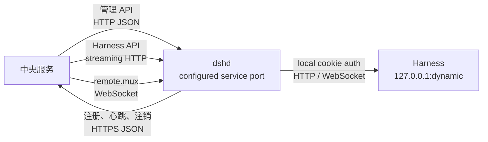
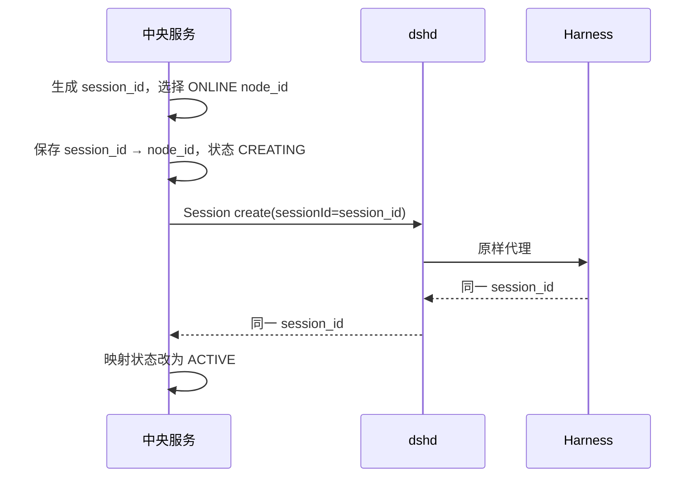
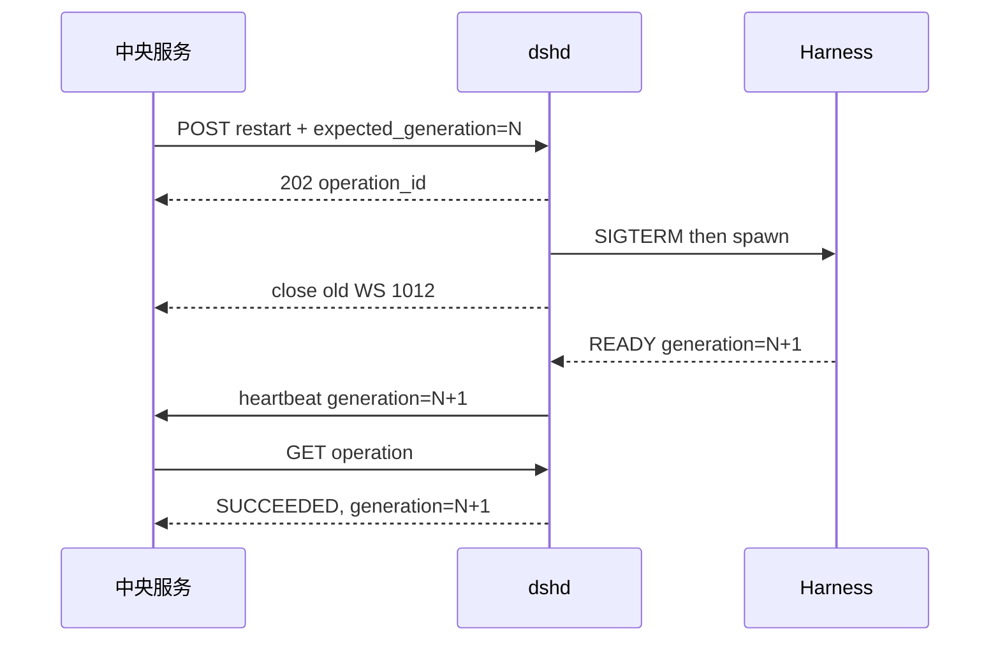

# 修订记录

| 版本 | 日期 | 作者 | 修订内容 | 依据 |
| --- | --- | --- | --- | --- |
| v0.1 | 2026-08-29 | Agent | 定义中央服务与后端节点 dshd 的 MVP 双向接口、数据结构、状态、鉴权、幂等、错误与故障语义。 | 用户确认、[HLD-01][OPS-03] |
| v0.2 | 2026-08-29 | Agent | 修复独立验收问题：增加 storage 单写 fencing、正交状态与三类健康、canonical Harness authority、双向 header 规则、Session 派生对账、token 轮换和机器契约。 | [HLD-01][OPS-04] |
| v0.3 | 2026-08-29 | Agent | 修复二次独立验收问题：增加持久化 desired state、liveness 健康、monotonic lease、SYNCING 对账、raw WebSocket tunnel 和条件 schema。 | [HLD-01][OPS-04] |
| v0.4 | 2026-08-29 | Agent | 关闭三次独立验收问题：增加预置节点身份、版本化 usable key、流式提交边界、判别 Operation、状态码错误闭包、生命周期优先级和确定性幂等指纹。 | [HLD-01][OPS-04][CONTRACT-01] |
| v0.5 | 2026-08-29 | Agent | 将 dshd 固定 8080 修正为单一可配置服务端口；8080 仅为默认值，中央服务以 advertise URL 和部署端口策略为准。 | 用户澄清、[HLD-01][OPS-04] |
| v0.6 | 2026-08-29 | Agent | 明确 Registry/Management 相反调用方向，固化 advertise URL/中央 URL 配置来源、非 root listener 范围和 reference stub 验收边界。 | 用户要求、[HLD-01][OPS-04][CONTRACT-01] |
| v0.7 | 2026-08-29 | Agent | 将官方 Web UI 后端能力验收绑定到稳定 `WUI-*` 清单，避免以路径存在或抽样演示替代完整 parity。 | 用户要求、[HLD-01][CAPABILITY-01][CONTRACT-01] |
| v0.8 | 2026-08-29 | Agent | 随工作区模块化整理更新接口、契约、能力和源码引用路径；协议语义不变。 | 用户要求、[HLD-01][CONTRACT-01] |
| v0.9 | 2026-08-29 | Agent | 修复参考文献中的失效本地绝对路径为仓库相对路径，并将 `/health/live` 语义措辞统一为“dshd 进程可响应”（liveness 行为语义不变）；接口定义不变。 | 仓库一致性维护、[CONTRACT-01] |

# 1. 文档目标

本文档是中央服务与 `dshd` 之间可直接进入开发的接口基线。它只定义服务间界面，不定义前端 API、中央服务内部数据库，也不重新定义 DeepSeek Harness 的业务协议。[HLD-01][OPS-03]

本文件定义行为语义；[OpenAPI 3.1 契约](../contracts/central-dshd-openapi.yaml)定义 Registry/Management API 的机器可校验字段与必填性；[一致性测试规范](../contracts/central-dshd-conformance.md)定义透明代理和故障场景；[Web 能力机器清单](../contracts/harness-web-capabilities.yaml)定义官方 Web UI parity 的稳定能力集合；[契约验证器](../contracts/validate_contracts.py)负责 OpenAPI 语义、能力 ID、引用、示例、追踪标记和测试向量的持续一致性检查。它们共同构成规范，发生差异时必须修订到一致，禁止实现方自行选择解释。[HLD-01][OPS-04][CAPABILITY-01][CONTRACT-01]

接口目标如下：

1. `dshd` 能够向中央服务注册、续租并报告节点状态；
2. 中央服务能够通过 `dshd` 管理本容器 Harness；
3. 中央服务能够无损访问当前官方 Web UI 使用的 Harness HTTP、WebSocket 和下载能力；
4. 双方能够正确处理重试、重复请求、进程重启、租约过期和旧实例消息；
5. Harness 不感知中央服务，中央服务不得绕过 `dshd`。[HLD-01]

# 2. 接口总览



| 接口面 | 提供方 | 调用方 | 基础路径 | 用途 |
| --- | --- | --- | --- | --- |
| Node Registry API | 中央服务 | dshd | `/internal/dshd/v1` | 注册、心跳续租、注销 |
| Daemon Management API | dshd | 中央服务 | `/daemon/v1` | 状态、健康、生命周期操作 |
| Harness HTTP Proxy | dshd | 中央服务 | `/api/**` | 原样代理 Harness HTTP/Fetch 路由 |
| Harness Remote Proxy | dshd | 中央服务 | `/api/remote.mux` | 原样代理 Harness multiplexed WebSocket |

MVP 不使用消息队列、反向隧道、命令轮询或中央服务到 Harness 的直接连接。[HLD-01]

# 3. 通用协议约定

## 3.1 传输与编码

| 项目 | 约定 |
| --- | --- |
| 服务协议 | HTTP/1.1；WebSocket 使用 RFC 6455 Upgrade |
| JSON | `Content-Type: application/json; charset=utf-8` |
| 时间 | UTC RFC 3339，例如 `2026-08-29T10:30:00.000Z` |
| 控制协议 ID | `instance_id`、`storage_id`、`lease_id`、`operation_id`、`X-Request-Id` 和 `Idempotency-Key` 为 UUID v4 小写字符串；`node_id` 除外 |
| Harness Session ID | opaque、大小写敏感的 Harness `SessionId`；不得按 UUID 解析或改写，默认形态 `session-<uuid>` 也不是协议约束 |
| 字段命名 | JSON 使用 `snake_case` |
| 未知字段 | 接收方必须忽略，保证向前兼容 |
| 空值 | 可选字段缺失表示未知；不得用空字符串代替未知 |
| 数值 | 时间间隔使用整数毫秒；容量使用整数 bytes |
| 压缩 | JSON 可协商 gzip；流式代理保持 Harness 原始编码 |

dshd 只监听一个服务端口。`DSHD_LISTEN_PORT` 默认 `8080`；MVP 的非 root runtime 只接受 `1024..65535`，外部 80/443 通过 Docker/ECS 映射到 listener。HTTP、WebSocket、Management 和 health 共用该端口。端口值不是业务协议常量；运行环境只能发布这一 dshd listener，并保证 container/host 映射、安全组与注册 `advertise_url` 形成可达的一致映射，二者存在显式端口映射时不要求数值相同。Harness 仍只监听 `127.0.0.1:<dynamic>`，不得发布。[HLD-01]

`DSHD_ADVERTISE_URL` 是部署控制面必填的非 secret 配置，格式为绝对 `http://host:port`，不得含 userinfo、path、query 或 fragment；它表示中央服务实际可达端点，dshd 必须原样放入 RegistrationRequest，禁止从 listener、hostname、ECS metadata 或来访请求推导。`DSHD_CENTRAL_BASE_URL` 同样由部署控制面必填，供 dshd 定位 Registry API。两个配置缺失或语法非法时，dshd 必须在打开 listener 或启动 Harness 前失败；中央服务仍按预登记/部署策略验证 advertised host 与 port，不信任节点自报地址。[HLD-01][OPS-04]

Registry 与 Management JSON 请求解压后上限为 `65536` bytes，超出返回 `413 PAYLOAD_TOO_LARGE`；该上限不适用于透明 `/api/**`，后者继承固定 Harness 版本的 body 约束并保持 streaming/backpressure。dshd HTTP server 的完整 request-header section 上限固定为 `65536` bytes，超出时在业务路由前由 transport 拒绝连接。MVP 不增加应用层并发配额，也不生成 `429`；HTTP/WS 依靠 streaming、backpressure、取消和有界 socket/resource 配置承压，容量上限由目标镜像压测确定而不是写入业务协议。协议 enum 在同一 major 内不得增加新值；需要扩展时新增可选字段/capability，或提升 major，避免旧实现误解释未知状态。

## 3.2 标准请求头

| Header | 规则 |
| --- | --- |
| `Authorization` | `Bearer <node_token>`；除公开健康检查外必填 |
| `X-Request-Id` | UUID；调用方生成，接收方原样回传；缺失时接收方生成 |
| `traceparent` | 可选；存在时按 W3C Trace Context 继续传播，但不得传给 Harness |
| `Idempotency-Key` | 生命周期写操作必填；UUID，保留至少 24 小时 |
| `User-Agent` | dshd outbound 使用 `dshd/<version>`；中央调用使用中央服务版本标识 |

## 3.3 节点身份

| 字段 | 语义 | 生成与生命周期 |
| --- | --- | --- |
| `node_id` | 持久化 Harness 节点的稳定逻辑 ID | 部署控制面在首次启动前分配并与 token 预登记；以只读 `/etc/dshd/node-id` 注入，同时持久化到 identity；替换容器沿用同一值 |
| `storage_id` | 该逻辑节点持久卷的稳定身份 | dshd 仅在空白 volume 上生成并与注入的 node_id 原子写入 identity；数据卷重建必须生成新 storage_id，并作为新逻辑节点重新置备 node_id/token |
| `instance_id` | 一次 dshd 进程启动实例 | dshd 每次启动生成；进程重启即变化 |
| `generation` | 当前 Harness 本地连接代际 | dshd 每次成功建立新的 Harness cookie/API/WS 上下文后递增 |
| `lease_id` | 中央服务授予当前 instance 的租约 | 注册成功后生成；instance 被替换、注销或租约过期后失效 |

`node_id` 格式为 `^[a-z0-9][a-z0-9._-]{0,63}$`。中央控制面使用 `node_id + storage_id + instance_id + lease_id` fencing 网络所有权；部署层单写 volume 和 dshd writer guard fencing DSH_HOME 写入权。中央租约本身不是存储锁。[HLD-01]

首次启动前，部署控制面必须在同一置备事务中生成合法 `node_id` 和不少于 256 bit 的随机 `node_token`、在中央服务预登记 token→node_id 绑定，并注入 `/etc/dshd/node-id`、`/run/secrets/dshd-node-token`、`DSHD_ADVERTISE_URL` 与 `DSHD_CENTRAL_BASE_URL`；MVP 不提供首次使用认领、匿名 enrollment 或 endpoint 自动发现。空白 volume 上，dshd 校验全部必填配置和 node_id 后生成 `storage_id`，再以 create-if-absent + fsync + atomic rename 写入 `identity.json`。已有 identity 的 node_id 必须与注入值完全相同，否则在启动 listener/Harness 前以配置错误退出；已有 storage_id 永不重写。中央服务只允许预置 node_id 的首次已鉴权注册原子绑定一个 storage_id。

`identity.json` 保存 schema version、`node_id`、`storage_id` 和最近成功注册的 `instance_id`。新进程将最近实例作为 `predecessor_instance_id` 提交，并在取得新租约后原子更新该文件；首次注册时省略该字段。首次注册响应丢失时同一进程以相同 instance 幂等重试；若中央已接受但进程在持久化前退出，新进程不得猜测 predecessor，须等当前 lease 到期后再安全接入。`desired-state.json` 原子保存 `{ "harness": "RUNNING|STOPPED" }`，文件不存在时初始化为 RUNNING；显式 stop/start/restart 必须先持久化目标意图，进程或容器重启不得覆盖。instance fencing 强制停止当前 Harness，但不改写 operator desired state。

dshd 启动 Harness 前必须取得 `/var/lib/dsh/dshd/writer.lock` 的 exclusive non-blocking guard，并持有到 Harness 完全退出；部署环境必须使用目标云提供的 single-attach 块存储或等价机制，保证该 volume 不会同时挂载给多个活动 task，普通共享文件系统多挂载不合规。排他挂载是跨 task 单写的权威保证，writer guard 只负责同一挂载内防重复启动，系统正确性不依赖 dshd 崩溃后文件锁仍存活。dshd 的 operation/idempotency 记录保存在 `/var/lib/dsh/dshd/operations`，容器重启后将未完成操作收敛为 `FAILED/DAEMON_RESTARTED`。

# 4. 服务身份认证

MVP 使用“ECS 私网隔离 + 每节点独立 Bearer token”：

- 每个 `node_id` 对应一个不少于 256 bit 的随机 `node_token`；
- node_id 与 token 必须在空白节点启动前成对预登记，中央服务不接受未绑定 token 认领 URL/body 中的 node_id；
- token 通过 ECS secret 注入 dshd 的 `/run/secrets/dshd-node-token`，权限 `0400`；
- 中央服务只保存 token 的加密值或受控 Secret 引用；
- dshd 调用中央服务和中央服务调用 dshd 时使用同一个节点 token；
- 中央服务校验 token 绑定的 `node_id` 与 URL/body 一致；
- dshd 只接受与自身 `node_id` 匹配的 token；
- token、Harness launch token、cookie 和终端用户凭据均不得进入日志；
- ECS Security Group 仅允许中央服务安全组访问节点实际 dshd service port；节点不得向公网发布该端口。[HLD-01][OPS-03]

Bearer token 是 MVP 选择。生产环境可在不改变应用层接口的情况下升级为 TLS/mTLS；若网络环境不能保证私网链路隔离，则 TLS/mTLS 是上线前置条件。

MVP token 轮换使用“新 token 预登记 → 节点滚动替换 → 新 instance 首次成功注册后提升 → 撤销旧 token”：

- 中央服务在轮换窗口内可以同时保存 current/next token，但每个 token 都绑定 `node_id` 和 token generation；
- 新 dshd 只读取一个 next token，不在节点文件系统持有两份 token；
- 新 instance 使用正确 `storage_id` 成功取得 lease 后，中央服务原子提升 next 并拒绝旧 token 的新请求；
- 旧 token 泄漏时先撤销并停止向节点路由，再由 ECS 停止旧 task、释放单写卷并使用新 token 启动替代 task；
- token 比较必须 constant-time；成功认证、失败原因、轮换 generation 只记结构化审计元数据，不记录 token 值。

# 5. Node Registry API（中央服务提供）

中央服务提供以下内部接口，供 dshd 主动调用。

## 5.1 注册或恢复节点实例

```http
PUT /internal/dshd/v1/nodes/{node_id}/instances/{instance_id}
Authorization: Bearer <node_token>
Content-Type: application/json
X-Request-Id: <uuid>
```

请求：

```json
{
  "protocol_version": "1.0",
  "storage_id": "7ac23552-7406-4f0f-8a44-1f6f18b34d53",
  "predecessor_instance_id": "5ba5cfe4-eccd-4eb4-886f-91afaa0db434",
  "advertise_url": "http://10.0.12.34:8080",
  "started_at": "2026-08-29T10:30:00.000Z",
  "dshd": {
    "version": "0.1.0",
    "build_sha": "0123456789abcdef"
  },
  "harness": {
    "version": "dsh-v0.1.2-alpha.1",
    "build_sha": "cd5ef8148158c3a752a658978873241fdf8e2bbc",
    "desired_state": "RUNNING",
    "state": "STARTING",
    "generation": 0
  },
  "capabilities": [
    "daemon.lifecycle.v1",
    "harness.http-proxy.v1",
    "harness.remote-mux.v1",
    "harness.session-export.v1"
  ]
}
```

成功响应：

```http
200 OK
```

```json
{
  "node_id": "ecs-cn-hz-a-001",
  "storage_id": "7ac23552-7406-4f0f-8a44-1f6f18b34d53",
  "instance_id": "2be7d40e-8752-4537-bca1-ad3f219b40e7",
  "lease_id": "47079863-301e-41be-920b-10bd0d361763",
  "lease_expires_at": "2026-08-29T10:30:30.000Z",
  "heartbeat_interval_ms": 10000,
  "lease_ttl_ms": 30000,
  "accepted_protocol_version": "1.0",
  "server_time": "2026-08-29T10:30:00.100Z"
}
```

注册规则：

- `PUT` 对同一个 `node_id + instance_id` 幂等，重复调用返回同一有效租约；
- node_id 必须已由置备事务存在且当前 token 已绑定该 node_id；该 node_id 首次注册时原子绑定 `storage_id`，后续不同 `storage_id` 必须返回 `409 STORAGE_ID_MISMATCH`，不得通过 predecessor 或租约过期接管；
- 同一 instance 的旧 lease 已过期时，重复注册可以取得新 lease；
- 没有当前 instance 时直接接受；
- 当前 instance 与请求的 `predecessor_instance_id` 一致时，中央服务以原子 compare-and-swap 接受新 instance，并使旧 lease 失效；
- 当前 instance 不匹配且租约仍有效时返回 `409 NODE_INSTANCE_CONFLICT`；
- 当前租约已经过期时可接受新 instance；
- 示例使用默认端口 `8080`；`advertise_url` 必须是部署允许的私网地址，显式端口必须与该节点预登记或部署策略允许的 dshd service port 一致，否则返回 `422 INVALID_ADVERTISE_URL`；
- dshd 必须在语法校验后逐字注册 `DSHD_ADVERTISE_URL` 配置值；listener port 与 advertised port 可以因显式映射不同，中央服务以 reverse-ready probe 验证 advertised endpoint 的实际可达性；
- 协议或必需 capability 不兼容时返回 `426 PROTOCOL_UNSUPPORTED`。

dshd listener、Harness 本地状态收敛和注册退避彼此独立。desired=RUNNING 时，只要本地配置有效且取得 writer guard，即使中央服务从容器启动前就不可达，dshd 仍启动并守护 Harness；desired=STOPPED 时保持 observed STOPPED。未取得 lease 时 registration 为 `REGISTERING` 或 `DEGRADED`，业务 proxy 和节点 readiness 不开放。

## 5.2 心跳与续租

```http
PUT /internal/dshd/v1/nodes/{node_id}/instances/{instance_id}/lease
Authorization: Bearer <node_token>
Content-Type: application/json
```

```json
{
  "lease_id": "47079863-301e-41be-920b-10bd0d361763",
  "sequence": 42,
  "observed_at": "2026-08-29T10:31:00.000Z",
  "daemon": {
    "state": "READY",
    "uptime_ms": 60000
  },
  "harness": {
    "desired_state": "RUNNING",
    "state": "READY",
    "generation": 1,
    "uptime_ms": 58000,
    "restart_count": 0,
    "last_error": null
  },
  "proxy": {
    "active_http_requests": 2,
    "active_websockets": 1
  },
  "resources": {
    "cpu_percent": 8.4,
    "memory_working_set_bytes": 268435456,
    "workspace_free_bytes": 10737418240,
    "state_free_bytes": 5368709120
  }
}
```

成功响应：

```json
{
  "accepted_sequence": 42,
  "lease_expires_at": "2026-08-29T10:31:30.000Z",
  "server_time": "2026-08-29T10:31:00.050Z"
}
```

心跳规则：

- 默认每 10 秒发送一次，租约默认 30 秒；实际值以注册响应为准；
- `sequence` 在当前 instance 内严格递增；重复 sequence 幂等，较小 sequence 被忽略但返回最后接受值；
- `instance_id` 或 `lease_id` 不是当前值时返回 `409 STALE_INSTANCE`；dshd 原子进入 registration `FENCED`，立即撤回 readiness、拒绝并关闭业务 HTTP/WS、停止 Harness、释放 writer guard 并停止续租；
- 网络故障或 lease 自然过期后，registration 进入 `DEGRADED`；dshd 保持本地 Harness 和 writer guard，但停止接收新业务、取消未完成 HTTP，并以 `1013 Try Again Later` 关闭业务 WebSocket，然后可用同一 instance 重新注册；收到明确的 `STALE_INSTANCE` 后不得自动抢占；
- 心跳只报告事实，不携带中央服务下发命令；控制命令始终通过 dshd 管理 API 发起；
- 这些条件只形成 dshd 的业务-ready 候选；中央服务还必须完成当前 `usable_key + sync_epoch` 的 Session inventory 对账，才可把节点置为 ONLINE 并用于新 Session 调度。

lease 本地失效必须使用 monotonic clock。对每次 Registry/heartbeat 请求，dshd 记录 monotonic `m_send` 和 `m_recv` 及发送时的 instance/lease/sequence 上下文；注册响应仅在其 instance 注册尝试仍是当前尝试时接受，heartbeat 响应仅在其请求使用当前 `lease_id` 且 `accepted_sequence` 不小于最近已处理 sequence 时接受。计算：

```text
rtt_ms = m_recv - m_send
server_remaining_ms = max(0, lease_expires_at - server_time)
safety_margin_ms = max(1000, ceil(lease_ttl_ms * 0.10))
local_budget_ms = max(0, min(lease_ttl_ms, server_remaining_ms) - rtt_ms - safety_margin_ms)
local_deadline = m_recv + local_budget_ms
```

`lease_ttl_ms` 使用注册响应协商值，并在当前 lease 生命周期内固定。wall clock 只用于日志和显示，不参与本地有效性。乱序旧响应不得延长 deadline；响应在旧 deadline 到达后才被处理时不得直接恢复 LEASED，dshd 必须以同一 instance 重新注册。deadline 到达时必须在同一个状态迁移中撤回 `/health/ready`、拒绝新 proxy、取消未完成 HTTP，并以 WS `1013` 关闭连接。

中央服务必须从同一权威 wall clock 在一次原子 lease 更新中生成 `server_time` 和 `lease_expires_at`，并保证 `0 < lease_expires_at - server_time <= lease_ttl_ms`；不满足该关系的响应视为无效，不能更新本地 deadline。

MVP 中央服务的必需 capability 集合为 `daemon.lifecycle.v1`、`harness.http-proxy.v1`、`harness.remote-mux.v1` 和 `harness.session-export.v1`；未知 capability 被记录但不自动授权新行为。`cpu_percent` 表示相邻两次采样间 cgroup CPU 使用量相对已分配 vCPU quota 的百分比，范围 `0..100`；`memory_working_set_bytes` 取容器 cgroup working set；两个 free-bytes 字段分别对 `/workspace` 和 `/var/lib/dsh/state` 所在文件系统采样，采样失败时省略整个未知字段而不是填 `0`。

## 5.3 注销节点实例

```http
DELETE /internal/dshd/v1/nodes/{node_id}/instances/{instance_id}?lease_id={lease_id}
Authorization: Bearer <node_token>
```

- 正常关闭时 best-effort 调用；
- 成功或资源已不存在均返回 `204 No Content`；
- 异常退出不依赖注销，由租约过期完成收敛；
- 注销只影响当前 instance，不删除节点记录、Session→Node 映射或 Harness 数据。

# 6. Daemon Management API（dshd 提供）

## 6.1 查询状态

```http
GET /daemon/v1/status
Authorization: Bearer <node_token>
```

```json
{
  "protocol_version": "1.0",
  "node_id": "ecs-cn-hz-a-001",
  "storage_id": "7ac23552-7406-4f0f-8a44-1f6f18b34d53",
  "instance_id": "2be7d40e-8752-4537-bca1-ad3f219b40e7",
  "daemon": {
    "state": "READY",
    "version": "0.1.0",
    "started_at": "2026-08-29T10:30:00.000Z",
    "uptime_ms": 60000
  },
  "harness": {
    "desired_state": "RUNNING",
    "state": "READY",
    "generation": 1,
    "version": "dsh-v0.1.2-alpha.1",
    "pid": 18,
    "started_at": "2026-08-29T10:30:02.000Z",
    "uptime_ms": 58000,
    "restart_count": 0,
    "last_error": null
  },
  "registration": {
    "state": "LEASED",
    "lease_expires_at": "2026-08-29T10:31:30.000Z",
    "last_heartbeat_at": "2026-08-29T10:31:00.000Z"
  },
  "proxy": {
    "active_http_requests": 2,
    "active_websockets": 1
  },
  "resources": {
    "cpu_percent": 8.4,
    "memory_working_set_bytes": 268435456,
    "workspace_free_bytes": 10737418240,
    "state_free_bytes": 5368709120
  }
}
```

状态对象遵守条件字段不变量：`harness.desired_state` 始终必填；`harness.state=READY` 时 `pid` 和 `started_at` 必填，`STOPPED` 时二者必须省略；`registration.state=LEASED` 时两个 lease 时间必填，`UNREGISTERED | REGISTERING` 时必须省略。`DEGRADED | FENCED` 可以保留最后一次已接受租约时间用于诊断，但它们不表示租约仍有效。

## 6.2 健康检查

| 方法与路径 | 鉴权 | 成功 | 失败 | 语义 |
| --- | --- | --- | --- | --- |
| `GET /daemon/v1/health/live` | 不要求 | `200 {"status":"live"}` | 进程不可响应 | 只表示 dshd 进程可响应；Docker/ECS container health 使用 |
| `GET /daemon/v1/health/local` | 不要求 | `200 {"status":"local","generation":N}` | `503 {"status":"not_local"}` | 表示本地 Harness generation 可用；不依赖租约；仅作诊断和告警 |
| `GET /daemon/v1/health/ready` | 不要求 | `200 {"status":"ready","generation":N}` | `503 {"status":"not_ready","reason":"..."}` | 表示 daemon READY、registration LEASED、Harness desired RUNNING 且 observed READY；中央服务反向 probe 使用 |

公开健康响应不得包含版本、PID、地址、错误堆栈或 secret。`reason` 只能是稳定枚举 `DAEMON_NOT_READY | REGISTRATION_NOT_LEASED | HARNESS_NOT_READY`。完整状态必须调用已鉴权的 `/status`。Dockerfile HEALTHCHECK 只能调用 `/health/live`；STOPPED、UNHEALTHY、FENCED、中央服务中断和 inventory SYNCING 均不得仅因 `/local` 或 `/ready` 失败而触发容器替换。

## 6.3 Harness 生命周期操作

```http
POST /daemon/v1/harness/start
POST /daemon/v1/harness/stop
POST /daemon/v1/harness/restart
Authorization: Bearer <node_token>
Idempotency-Key: <uuid>
Content-Type: application/json
```

统一请求体：

```json
{
  "reason": "operator_request",
  "expected_generation": 1
}
```

- `expected_generation` 可选；不匹配时返回 `409 GENERATION_MISMATCH`，避免对已重启的新 Harness 执行旧命令；
- start、stop、restart 串行执行；存在冲突操作时返回 `409 OPERATION_CONFLICT`；
- start/restart 通过全部前置校验后先原子保存 desired=RUNNING，再执行 observed 状态收敛；stop 在发信号前先原子保存 desired=STOPPED；
- 首次部署 desired 默认 RUNNING；显式 STOPPED 跨 dshd 和容器重启保持；异常退出只有在 desired=RUNNING 且 registration 非 FENCED 时自动恢复；
- 收到 STALE_INSTANCE 时强制停止 observed Harness，但不修改 desired；FENCED task 保持 live 供诊断，必须由部署控制器或运维停止旧 task 后才能释放 single-attach volume；
- 已处于目标状态时也持久化一个已完成 operation，返回 `200`、`state: SUCCEEDED` 和 `no_op: true`，因此所有生命周期响应都有可查询的 `operation_id`；
- 需要执行时返回 `202 Accepted`。
- `Idempotency-Key` 的作用域为 `node_id + HTTP method + canonical path`。接收方先按 schema 解析解压后的 UTF-8 JSON；重复 object member name 返回 `400 INVALID_REQUEST`。请求指纹为 `SHA-256(UTF8(node_id + "\n" + upper(method) + "\n" + canonical_path + "\n") || JCS(request_body))`，其中 JCS 严格采用 [RFC 8785](https://www.rfc-editor.org/rfc/rfc8785)；所有收到的已知和未知字段都参与，key 顺序与无意义空白不影响指纹，字段缺失与显式 `null` 不等价。相同 key 与相同指纹返回第一次 operation/响应，不重复执行；相同 key 配不同指纹返回 `409 IDEMPOTENCY_KEY_REUSE`；
- registration 非 `LEASED` 时 start/restart 返回 `409 NODE_NOT_LEASED`；FENCED 时只允许 status、health 和 stop；
- 默认 startup timeout 为 `60000ms`；异常退出按 `1s → 2s → 4s ... 30s`、20% jitter 无限重试，稳定运行 `300000ms` 后重置；stop 发送 SIGTERM 后等待 `8000ms`，再 SIGKILL，并在 `10000ms` 内收敛 operation。

```json
{
  "operation_id": "c6464d38-98cd-494c-9f79-01f03bd1fca8",
  "type": "RESTART",
  "state": "RUNNING",
  "no_op": false,
  "requested_at": "2026-08-29T10:32:00.000Z",
  "started_at": "2026-08-29T10:32:00.010Z",
  "expected_generation": 1
}
```

查询操作：

```http
GET /daemon/v1/operations/{operation_id}
Authorization: Bearer <node_token>
```

```json
{
  "operation_id": "c6464d38-98cd-494c-9f79-01f03bd1fca8",
  "type": "RESTART",
  "state": "SUCCEEDED",
  "no_op": false,
  "requested_at": "2026-08-29T10:32:00.000Z",
  "started_at": "2026-08-29T10:32:00.010Z",
  "finished_at": "2026-08-29T10:32:04.200Z",
  "result": {
    "previous_generation": 1,
    "current_generation": 2,
    "harness_state": "READY"
  },
  "error": null
}
```

操作状态为 `PENDING | RUNNING | SUCCEEDED | FAILED`，其字段联合是硬不变量：

| state | 必填 | 禁止/约束 |
| --- | --- | --- |
| PENDING | 公共字段 | `no_op=false`；禁止 started/finished/result/error |
| RUNNING | 公共字段、`started_at` | `no_op=false`；禁止 finished/result/error |
| SUCCEEDED | 公共字段、`finished_at`、`result`、`error:null` | `no_op=false` 时必须有 started；`no_op=true` 时禁止 started；STOP result 必须 STOPPED，START/RESTART result 必须 READY；RESTART result 必须有 previous_generation |
| FAILED | 公共字段、`finished_at`、非空 `error` | `no_op=false`；禁止 result；daemon 在执行前后重启都可能失败，故 started 可选 |

操作记录至少保留 24 小时，与 `Idempotency-Key` 保留时间一致。生命周期优先级唯一如下：

1. 收到明确 FENCED/STALE 或容器/dshd shutdown 时，基础设施停止优先于普通 operation；未完成 operation 分别收敛为 `FAILED/NODE_FENCED` 或 `FAILED/DAEMON_STOPPING`，任何 `STARTING | AUTHENTICATING | READY | UNHEALTHY` observed state 都经 `STOPPING` 收敛到 `STOPPED`，但不改写持久 desired state；
2. 已接受的 operator start/stop/restart 串行执行，其他冲突请求返回 `409 OPERATION_CONFLICT`，不得抢占；operator stop 若遇到没有 operator operation 占用的自动启动/故障恢复，先持久化 desired=STOPPED，再中止恢复并经 `STOPPING` 收敛；
3. 自动启动/恢复优先级最低，仅在 desired=RUNNING 且 registration 非 FENCED 时运行。STOP 对 STOPPED 是 no-op；STOP 对 STARTING、AUTHENTICATING、READY 或 UNHEALTHY 都必须有界收敛为 STOPPED。

## 6.4 运维输出契约

MVP 不增加日志读取 API 或 `/metrics` endpoint。指标的完整必需输出面就是已鉴权 `/daemon/v1/status` 与 Registry heartbeat 中的现有字段：daemon/harness `uptime_ms`、Harness `restart_count`/`last_error`、proxy active HTTP/WS 数，以及 cgroup `cpu_percent`、`memory_working_set_bytes`、Workspace/state free bytes；字段单位和采样语义以 5.2 为准。HTTP error 和 WebSocket close 的累计计数不是 MVP 协议字段，不得被中央服务实现当成必需输入。

dshd 与 Harness 日志只写容器 stdout/stderr，由 ECS/container log driver 采集，不由中央服务经 dshd 拉取。dshd 自有结构化日志每行是一个 JSON object，必含 `ts`、`level`、`component`、`event`、`node_id`、`instance_id`，有当前连接上下文时增加 `generation`，有请求时增加 `request_id`；Harness stdout/stderr 每行由 dshd 包装并增加 `component=harness` 与 `stream=stdout|stderr`。node token、launch token、cookie、Authorization、credential 和请求/响应 body 必须在写出前移除；日志 schema 不进入服务间兼容性判断。

# 7. Harness 透明代理契约

每个 Harness generation 只能发布一个不可变 connection context：

```text
{
  authority: "127.0.0.1:<dynamic-port>",
  origin: "http://127.0.0.1:<dynamic-port>",
  cookie: "<authority-bound browser cookie>",
  generation: N
}
```

dshd 必须从 Harness ready URL 取得 exact `authority`，只接受 `127.0.0.1` 与有效端口。launch-token exchange、API/WS probe、全部 HTTP 和 WebSocket 请求必须使用该 generation 的相同 Host/cookie；Origin 缺失是首选，若客户端库发送 Origin，则必须严格等于 context.origin。`127.0.0.1` 与 `localhost` 不得互换。generation 切换必须原子撤销旧 context、清除旧 token/cookie 并关闭旧连接。[TECH-02]

## 7.1 HTTP

中央服务连接正确节点已注册的 dshd `advertise_url` 后，使用 Harness 原始路径：

```http
<METHOD> /api/<original-path-and-query>
Authorization: Bearer <node_token>
```

dshd 必须：

- 支持所有 HTTP 方法，包括 `POST`、`GET` 和 `HEAD`；
- 原样流式转发 path、query、body、status、端到端 response headers 和 response body；
- 支持 chunked body、取消、backpressure、ZIP 下载和空 body；
- 请求侧移除 `Authorization`、`Cookie`、`Host`、`Origin`、`Forwarded`、全部 `X-Forwarded-*`、全部 `Sec-Fetch-*`、标准 hop-by-hop headers，以及 `Connection` 点名的 headers；
- 注入 connection context 的 exact `Host` 和 cookie；Origin 省略或使用 exact context.origin；
- 响应侧移除标准 hop-by-hop headers、`Connection` 点名的 headers、`Set-Cookie` 和上游伪造的保留 header `X-DSHD-Generated`；
- 相对 `Location` 原样保留；绝对 `Location` 若 authority 等于 Harness context.authority，则重写为相对 path/query/fragment；其他绝对 Location 原样保留；
- `Content-Length`、`Content-Encoding`、`ETag` 等端到端 header 在 body 未变换时保留；响应 trailer 仅在下游 transport 支持且通过相同过滤后转发；
- 不解析、不重编码 Typert payload；
- 调用方断开时取消对应上游请求；
- Harness 不可用时返回 dshd 标准错误，而不是伪造 Harness 业务响应；
- dshd 与中央服务的透明 `/api/**` relay 都不得因方法“幂等”而隐式自动重试；一次下游请求至多建立一次 Harness 上游尝试。若尚未向下游提交 response headers，连接失败/超时分别返回 `502 HARNESS_BAD_GATEWAY` 或 `504 HARNESS_TIMEOUT`；一旦任意 response headers 或 body 已提交，只能终止并标记该响应流不完整，不能拼接新上游 body、改写状态或追加 JSON error envelope；
- 请求 body 尚在流入时断开、generation 变化或调用方取消都立即取消唯一上游尝试，不缓存后重放。需要恢复的业务操作只能由调用方按 Session create/fork 等显式协议发起新请求。[TECH-01]

本文的标准 hop-by-hop 集合为 `Connection`、`Keep-Alive`、`Proxy-Authenticate`、`Proxy-Authorization`、`TE`、`Trailer`、`Transfer-Encoding` 和 `Upgrade`；WebSocket Upgrade 握手仅在 7.2 的专用路径中保留所需 `Connection/Upgrade`，不得套用普通 HTTP 转发规则。

中央服务必须先根据节点操作或 `session_id → node_id` 映射选定 dshd。dshd 不读取 Session ID 来进行二次路由。只有 daemon `READY`、registration `LEASED`、Harness desired `RUNNING` 且 observed `READY` 时允许业务代理；其他状态返回 dshd 标准错误。inventory 是否已对账是中央服务的新 Session 调度门禁，不由 dshd 的逐请求代理层判断。

## 7.2 WebSocket

```http
GET /api/remote.mux
Connection: Upgrade
Upgrade: websocket
Authorization: Bearer <node_token>
```

dshd 在 Upgrade 阶段校验服务身份、daemon `READY`、registration `LEASED`、Harness desired `RUNNING` 和 observed `READY`，然后使用当前 connection context 的 exact Host/cookie 建立上游 `/api/remote.mux`；Origin 省略或严格等于 context.origin。除被隔离的 Authorization/Cookie/Host/Origin/Forwarded/Sec-Fetch 外，上游握手必须复用下游的 `Sec-WebSocket-Key`、version、subprotocol 和 extensions，使两端协商结果一致；101 响应过滤本地 cookie 后返回中央服务，随后切换为 raw frame tunnel。

代理规则：

- 一个中央服务上游 WebSocket 对应一个 dshd、一个 Harness generation 和一个 Harness WebSocket；
- 稳态下二进制/文本 frame、fragment、顺序、ping/pong、close code、close reason 和 backpressure 原样传播；
- dshd 不解码 Remote mux、stream、event 或 waterfall 业务帧；
- dshd 不产生周期性 ping/pong；Harness 原生 WebSocket heartbeat 通过 raw tunnel 到达中央服务，中央服务的 pong 原样返回 Harness；
- 中央服务在 dshd 节点连接上也不得启用库级自动 ping；除转发调用方已有 frame 和响应 Harness ping 外，中央服务与 dshd 都不注入合成控制帧；
- Harness generation 变化时，dshd 使用 close code `1012 Service Restart` 关闭旧连接；
- lease deadline 到达时使用 `1013 Try Again Later`，FENCED 使用 `1008 Policy Violation`；这些策略 close 是稳态 raw 传播的唯一例外，dshd 分别向两端写入符合各自 client/server masking 规则的 close frame；
- Harness 未 READY 时 Upgrade 返回 `503 HARNESS_NOT_READY`；
- 中央服务不得把一个 remote.mux 连接拆分到多个节点，也不得把多个节点的 frame 合并到一个透明隧道；需要访问多个节点时建立多个节点级 WebSocket。[TECH-01]

# 8. 状态模型

## 8.1 daemon 状态

`STARTING | READY | STOPPING`

- `READY` 只表示 dshd 管理面可用，不等同于 registration、Harness 或节点业务 READY；
- dshd 进程退出后状态由中央服务租约超时推导，不在节点内增加 OFFLINE 值。

## 8.2 registration 状态

`UNREGISTERED | REGISTERING | LEASED | DEGRADED | FENCED`

- `UNREGISTERED`：尚未发起首次注册；
- `REGISTERING`：正在注册且尚无有效 lease；
- `LEASED`：当前 instance 持有有效 lease；
- `DEGRADED`：因网络/中央故障不能确认或续租，Harness 可以本地继续运行，但业务 proxy 和 `/health/ready` 关闭；进入状态时取消未完成 HTTP 并以 WS `1013` 关闭现有业务连接；
- `FENCED`：中央明确返回 `STALE_INSTANCE`；dshd 关闭业务连接、停止 Harness、释放 writer guard，只允许 live/local/ready、status 和 Harness stop；start、restart、`/api/**` 与 `/api/remote.mux` 返回 `409 NODE_FENCED`。

## 8.3 Harness 状态

`STOPPED | STARTING | AUTHENTICATING | READY | UNHEALTHY | STOPPING`

以上是 observed state。独立的持久化 desired state 为 `RUNNING | STOPPED`。业务代理必须同时满足 daemon `READY`、registration `LEASED`、desired `RUNNING` 和 observed `READY`；其他 observed 状态返回 `503 HARNESS_NOT_READY`。desired=STOPPED 时 observed 必须最终收敛为 STOPPED；FENCED 时 observed 也必须 STOPPED，但不得隐式覆盖 desired。

## 8.4 中央服务派生状态

`REGISTERING | SYNCING | ONLINE | DEGRADED | OFFLINE | CONFLICT`

中央服务将节点判定为可调度必须同时满足：

```text
lease_valid
AND reverse_ready_probe_success(generation = usable_key.generation)
AND daemon.state = READY
AND registration.state = LEASED
AND harness.desired_state = RUNNING
AND harness.state = READY
AND protocol_and_capabilities_compatible
AND inventory_synced(usable_key, sync_epoch)
```

`usable_key = (node_id, storage_id, instance_id, lease_id, generation)`，必须由同一份当前 Registry/heartbeat 快照构造，禁止混用不同采样的字段。反向 `/health/ready` 的 200 结果只有在返回 generation 等于发起 probe 时的 usable_key generation，且 probe 完成时该 key 仍是当前 key 才有效。

除 `inventory_synced` 外的运行条件均成立、但当前 `usable_key + sync_epoch` inventory 尚未成功对账时，中央状态为 SYNCING。`sync_epoch` 是中央内部的连续可用区间编号：完整可用谓词 false→true，或 usable_key 任一字段变化，即使两个相邻样本的布尔谓词都为 true，都必须递增 epoch、作废旧同步标记并启动 single-flight inventory job；任一前置条件失效也立即作废当前 job。job 捕获 key+epoch，重试前和提交前都以 compare-and-swap 验证二者仍当前，迟到 probe/job 结果不得提交。SYNCING 节点可以服务已有明确 `session_id → node_id` 的请求，但不得接收新 Session 调度，也不得宣称全局 Session list 已完成；当前 key+epoch 对账成功后原子转 ONLINE。

# 9. 错误模型

由中央服务或 dshd 自身产生的 JSON 错误统一使用：

```json
{
  "error": {
    "code": "HARNESS_NOT_READY",
    "message": "Harness is not ready",
    "retryable": true,
    "request_id": "41fc2103-5881-4278-849c-297bc7b32a1b",
    "details": {
      "harness_state": "STARTING"
    }
  }
}
```

| HTTP | code | retryable | 语义 |
| --- | --- | --- | --- |
| 400 | `INVALID_REQUEST` | false | JSON、字段或 Header 非法 |
| 401 | `UNAUTHENTICATED` | false | token 缺失或无效 |
| 403 | `NODE_ID_MISMATCH` | false | token 与目标节点不匹配 |
| 404 | `NOT_FOUND` | false | operation 或资源不存在 |
| 409 | `NODE_INSTANCE_CONFLICT` | false | 当前节点已有不能被替换的有效 instance |
| 409 | `STORAGE_ID_MISMATCH` | false | 请求的持久卷身份与 node_id 已绑定身份不一致 |
| 409 | `STALE_INSTANCE` | false | instance/lease 已被 fencing |
| 409 | `NODE_FENCED` | false | 当前 dshd 不是中央服务接受的节点实例 |
| 409 | `NODE_NOT_LEASED` | true | 当前 dshd 尚无有效 lease，不能启动或代理业务 |
| 409 | `GENERATION_MISMATCH` | true | 生命周期命令针对旧 Harness generation |
| 409 | `OPERATION_CONFLICT` | true | 存在互斥生命周期操作 |
| 409 | `IDEMPOTENCY_KEY_REUSE` | false | 同一幂等键被用于不同路径或请求体 |
| 413 | `PAYLOAD_TOO_LARGE` | false | Registry/Management JSON 解压后超过 65536 bytes |
| 422 | `INVALID_ADVERTISE_URL` | false | 节点发布地址不符合私网规则 |
| 426 | `PROTOCOL_UNSUPPORTED` | false | 协议或必需 capability 不兼容 |
| 502 | `HARNESS_BAD_GATEWAY` | true | Harness 连接异常或返回无效传输 |
| 503 | `HARNESS_NOT_READY` | true | Harness 当前不可服务 |
| 504 | `HARNESS_TIMEOUT` | true | 连接或响应超时 |

dshd 生成的代理错误必须携带 `X-DSHD-Generated: true`。Harness 自身返回的状态码和 body 不套错误 envelope，也不得添加该 Header。

`harness.last_error` 与 operation `error` 使用同一结构：`{code, message, retryable, at}`，四个字段均必填；`code` 为稳定大写枚举字符串，`message` 不含堆栈、secret 或请求 body，`at` 为 UTC RFC 3339。operation `result` 按 operation type 使用 schema 中的判别联合。成功时 error 为 `null`，失败时 result 省略；不得同时返回非空 result 和 error。

# 10. 重试、超时与背压

| 操作 | 重试策略 | 超时/限制 |
| --- | --- | --- |
| 注册 | 指数退避 `1s → 2s → 4s ... 30s`，20% jitter，无限重试 | 单次连接 3s、请求 10s |
| 心跳 | 下一周期重试；连续失败时可使用最短 1s 退避，但不得超过租约 TTL | 单次连接 3s、请求 5s |
| 注销 | 最多一次，不阻塞容器正常退出 | 2s |
| GET/status/health | 中央服务可重试一次 | 单次 5s |
| 生命周期 POST | 仅使用同一 `Idempotency-Key` 重试 | 单次提交 10s；执行通过 operation 查询 |
| Harness HTTP | 透明 relay 不做任何基础设施级自动重试；create/fork 恢复由调用方按第 11 节发起新的显式请求 | 不设置统一总时限；传播调用方 deadline 和取消；已提交响应只能终止流 |
| WebSocket | 断线后由中央服务重新选择同一节点并新建连接；不得自动重放 Remote 业务调用 | Upgrade 10s；稳态 heartbeat 由固定 Harness generation 所有，dshd 不另设 ping 周期 |

所有 HTTP 和 WebSocket 转发都必须实施 backpressure，不得完整缓冲 Session 日志 ZIP、长响应或 Remote mux 流。

# 11. 关键流程

## 11.1 创建并记录 Session 路由



Harness 的 `SessionCreateRequest` 支持调用方提供 `sessionId`，并会幂等创建或接管同一普通 Session。中央服务必须在调用前生成 `session_id` 并保存到目标 `node_id` 的 `CREATING` 映射；响应丢失时可以向同一节点使用完全相同的 `sessionId`、Workspace/cwd 和 Agent preset 重试，禁止改投其他节点。这消除了“Session 已创建但响应丢失”造成的未知结果。[TECH-02]

`session_id` 是 opaque Harness SessionId。中央服务为普通 create 生成时使用 `session-<uuid-v4>`，但路由、存储和代理均不得解析该前缀或 UUID。

## 11.2 fork、subagent 与路由对账

Harness `session.fork` 不接受目标 ID，而是在节点内生成 child SessionId，因此采用与 create 不同的收敛协议：

1. 中央服务按 source `session_id` 找到 node，持久化 `FORKING` intent，并串行化同一 source 的中央 fork；
2. 调用前读取并持久化该节点 Session list 的已知 ID 集合；
3. fork 请求只发送一次，不因 timeout、断线或 `502/504` 自动重试；
4. 成功响应后立即保存返回的 child `session_id → node_id` ACTIVE 映射；
5. 结果不确定时，中央服务仍调用同一节点的 Harness `session.list`，把所有未映射的普通 Session（`origin != subagent`）登记到该 node；fork intent 可以标记 `RECONCILED` 或 `UNKNOWN`，但不得让已发现 child 保持不可路由；
6. 同一 SessionId 已映射到其他 node 时标记 `ROUTE_CONFLICT` 并禁止写请求，禁止静默覆盖。

Subagent child 不作为独立调度单元；所有 subagent API 使用 `parentSessionId` 定位 parent node，`childSessionId` 只在该节点内寻址。中央对账读取 Harness 现有 Session API，不要求 dshd 扫描、解析或上报 DSH_HOME。

注册成功只更新节点事实，不直接假定 Harness 可对账。中央服务在完整可用谓词 false→true 或 `usable_key=(node_id,storage_id,instance_id,lease_id,generation)` 变化时创建新 `sync_epoch`，以 usable_key+epoch 保证 single-flight inventory job，并把节点置为 SYNCING；ready probe generation 必须与 key 等值。`session.list` 失败时按 `1s → 2s → 4s ... 30s`、20% jitter 重试，只要 key 和谓词仍成立就不得放弃。成功提交必须 CAS 验证 key+epoch 仍当前，再原子转 ONLINE。谓词或 key 变化时取消 job、递增 epoch 并作废旧成功标记；未观察到中间 STARTING 的 generation ABA、instance/lease 更换和迟到结果都不能复用旧同步。fork 不确定结果和人工触发仍可启动同节点对账；周期性对账可以作为防漂移措施。[TECH-02]

## 11.3 Harness 重启



# 12. 故障语义与责任

| 场景 | dshd 行为 | 中央服务行为 |
| --- | --- | --- |
| 中央服务不可达 | Harness 与 writer guard 按 desired state 继续本地收敛；registration DEGRADED；若 observed READY 则 `/health/local` 保持成功，业务 `/ready` 和 proxy 关闭；注册/心跳退避重试 | 租约到期后节点 OFFLINE，不分配或转发业务；不因 Docker health 重启节点 |
| dshd 不可达 | 无法报告 | 节点 OFFLINE；现有 Session 不迁移 |
| Harness 启动失败 | dshd 保持 live/可管理，报告 UNHEALTHY 和 last_error；desired=RUNNING 时继续退避恢复 | 节点 DEGRADED，不转发业务，可下发 restart；不得用 container health 隐式替换 |
| Harness 重启 | generation 递增，关闭旧 HTTP/WS 上下文 | usable_key 变化即重新进入 SYNCING，即使未采样到中间非 READY 状态；当前 key+epoch inventory 成功后 ONLINE；客户端重新建立节点级连接 |
| 重复 node instance | 明确 STALE 的 instance 进入 FENCED，关闭业务、停止 Harness 并释放 guard但保留 desired；保持 live 供诊断 | 校验 storage_id，只接受当前 lease；拒绝旧 instance 心跳；部署控制器/运维停止旧 task 以释放 volume |
| 中央映射缺失 | dshd 保持透明，不扫描 DSH_HOME | 中央服务按候选 node 调用 Harness Session list 对账；冲突时只读并进入 ROUTE_CONFLICT，不静默覆盖 |
| 节点数据卷丢失 | 作为新节点身份接入，不伪造旧 Session | 旧映射保持不可用，不自动迁移 |

# 13. 兼容性与验收

## 13.1 版本规则

- 服务接口使用 major/minor 版本；同 major 内只允许增加可选字段或 capability；
- 删除字段、增加/改变 enum 值、改变状态语义或代理行为必须提升 major；
- 本规范仍处于首次实现前，v0.4 对 draft `1.0` schema 的身份置备、sync key、重试提交边界和 Operation/error 联合修正直接纳入初始 1.0；一旦存在已发布兼容方，同类变更必须按上一条提升 major；
- Harness API 自身不由 dshd 版本化，中央服务依据注册的 Harness 版本和 capability 判断兼容性；
- dshd 与 Harness 仍作为一个固定版本镜像成对发布。[HLD-01]

## 13.2 MVP 验收用例

1. 注册、重复注册、续租、过期、注销和 instance fencing；
2. 中央服务反向访问 dshd 状态、健康和生命周期操作；
3. `/api/**` 全方法、query、body、status、header、stream 和取消透明性；
4. Session ZIP 的 GET/HEAD 和大文件背压；
5. `remote.mux` 双向 frame、审批、用户问题、follow/control、ping/pong 和 close 传播；
6. Harness restart 时旧连接关闭、generation 更新和 operation 收敛；
7. 中央服务中断时 Harness 不退出，恢复后租约重新建立；
8. 外部 Authorization/Cookie/Host/Origin 不进入 Harness；
9. 未授权中央调用、错误 node token、错误 node ID 和私网地址伪造均被拒绝；
10. [CAPABILITY-01] 的全部 `WUI-*` 在“中央服务 → dshd → Harness”链路下同时取得 inventory contract 与 parity E2E 通过证据；路径存在或抽样演示不能替代逐 ID 覆盖。[HLD-01][TECH-01][CAPABILITY-01]
11. 中央服务从冷启动前不可达时 Harness 仍启动，local health 成功而 ready 失败；恢复 lease 后 ready 成功；
12. 同一 storage volume 的跨 task 同时挂载必须由部署层 single-attach 拒绝，writer guard 只验证同一挂载内重复进程；不同 storage_id 不能接管同一 node_id；
13. `STALE_INSTANCE` 使旧 dshd 关闭业务连接、停止 Harness、释放 writer guard，且不能自动抢占；
14. token 轮换在新 lease 生效后撤销旧 token，旧 token 不能调用 Registry、Management 或 Proxy；
15. bootstrap、HTTP 与 WS 使用同一 canonical authority；`localhost`/端口变化、外部 Sec-Fetch/Forwarded 和错误 Origin 的负例不进入 Harness；
16. 响应 hop-by-hop、Set-Cookie 和伪造 `X-DSHD-Generated` 不泄漏，绝对本地 Location 被重写；
17. create 响应丢失以相同显式 SessionId 重试；fork 响应丢失不重试并通过同节点 Session list 补齐所有新 Session 路由；
18. 镜像中 Harness telemetry 被强制禁用，`/feedback` 披露 disabled，未观察到 telemetry collector 出站；
19. OpenAPI 契约、required 字段、error union 和本文档九个映射示例通过机器校验。[OPS-04]
20. operator stop 持久化 desired=STOPPED；dshd/容器重启后 Harness 仍 STOPPED，而 live=200、local/ready=503；
21. FENCED 和 UNHEALTHY 不使 container health 失败；FENCED 旧 task 由部署控制器/运维停止并释放 volume；
22. 服务端 lease 时间对一致；wall clock 前跳/回拨、长 RTT、乱序 heartbeat response 和 deadline race 不延长本地 lease；
23. 注册先完成、Harness 先 READY 以及同 generation 失租恢复都建立新 sync epoch 并进入 SYNCING，当前 epoch inventory 成功后才 ONLINE；
24. remote.mux 握手协商一致，中央与 dshd 节点 leg 均无自生 ping/pong，Harness heartbeat 和 fragment 原样通过；策略 close code 按状态生成；
25. READY 缺少 PID/started_at、LEASED 缺少 lease 时间、缺少 desired state 的响应均被 OpenAPI 负例校验拒绝；行为向量在实现前明确报告为未执行。[OPS-04]
26. 空白卷必须使用预登记 node_id/token，只生成 storage_id；已有 identity 与注入 node_id 不同、错误 token/node 组合和首次响应丢失均按唯一流程失败或恢复；
27. READY N→READY N+1、instance/lease 变化、迟到 reverse-ready 与 inventory completion 都建立或保留正确 usable key+epoch，旧结果不能提交；
28. 透明 GET/HEAD/POST 在上游失败时都不自动重试；未提交时返回代理错误，已发送部分 ZIP/body 时只终止流且不拼接第二次响应；
29. 所有受保护 OpenAPI operation 声明 400/401/403，HTTP status 与 error code 匹配；Operation 的 state/type 正反例由机器 schema 拒绝矛盾组合；
30. stop-during-start/auth/recovery、FENCED 和 container shutdown 按固定优先级有界收敛；
31. 运维输出只由 status/heartbeat 字段和容器 stdout/stderr 构成，不存在隐含 metrics/log retrieval API；
32. 幂等指纹对 JCS 等价 JSON 相同，对未知字段变化及 omitted/null 差异不同。[OPS-04][CONTRACT-01]

# 14. 参考文献

| 标记 | 来源 | 说明 |
| --- | --- | --- |
| [HLD-01] | [后端节点 HLD](../backend-node-hld.md) | 已冻结的节点架构、Docker 边界、中央服务—dshd 关系和状态所有权 |
| [TECH-01] | [Harness API 暴露审计](../dsh/harness-api-exposure-audit.md) | 官方 Web UI 使用的 HTTP、WebSocket、事件和下载能力基线 |
| [TECH-02] | [Session Controller Types](../../dsh/packages/api/session-controller/src/types.ts) 与 [Commands](../../dsh/packages/api/session-controller/src/commands.ts) | `SessionCreateRequest.sessionId` 和幂等 create/adopt 行为 |
| [OPS-03] | 用户提出的服务界面设计要求（2026-08-29） | 完成后端节点与中央服务之间的服务接口设计 |
| [OPS-04] | [后端设计独立验收](../acceptance/backend-independent-acceptance.md) | 单写、状态、Session 路由、代理、机器契约、遥测和文档一致性问题 |
| [CONTRACT-01] | [OpenAPI 3.1](../contracts/central-dshd-openapi.yaml)、[一致性测试规范](../contracts/central-dshd-conformance.md)与[契约验证器](../contracts/validate_contracts.py) | Registry/Management schema、透明代理/故障行为测试向量与持续一致性校验 |
| [CAPABILITY-01] | [Web 能力冻结基线](../dsh/harness-web-capability-baseline.md)与[机器能力清单](../contracts/harness-web-capabilities.yaml) | 官方 Web UI、dshd 补齐和 MVP 排除能力的稳定 ID 与逐项验收规则 |
