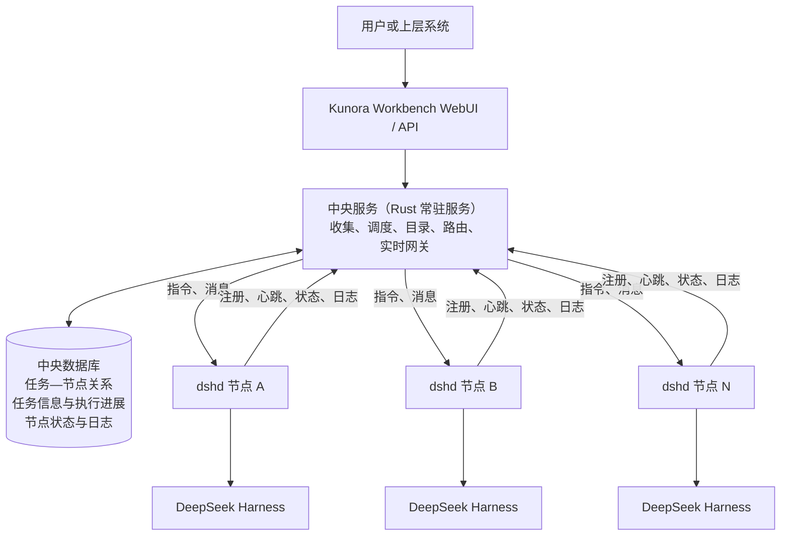

## 修订记录

| 版本 | 日期 | 作者 | 状态 | 修订内容 | 依据 |
| --- | --- | --- | --- | --- | --- |
| v0.1 | 2026-08-29 | Codex | 已废止 | 首次形成完整产品定义。 | 用户指令 [BIZ-01] |
| v0.2 | 2026-08-29 | Codex | 评审中 | 收敛文档，只保留产品定义、产品架构和产品特性；架构以用户确认的图示为准。 | 用户指令及确认图 [BIZ-01] |
| v0.3 | 2026-08-29 | Codex | 评审中 | 明确中央服务的实现形式、双向通信方式、信息存储职责及三重产品角色。 | 用户指令 [BIZ-01] |
| v0.4 | 2026-08-29 | Codex | 评审中 | 将数据库纳入中央服务，明确任务—节点关系、任务信息、执行进展和节点信息的持久化职责。 | 用户指令 [BIZ-01] |
| v0.5 | 2026-08-29 | Codex | 评审中 | 依据已冻结后端设计，固化后端节点与 dshd 节点服务的组成、技术栈、部署、接口和责任边界。 | [TECH-03][TECH-04][TECH-05][TECH-06] |
| v0.6 | 2026-08-29 | Codex | 评审中 | 按后端节点的表述方式，固化中央服务的形态、技术栈、部署、数据、接口、调度、路由和责任边界。 | [BIZ-01][TECH-07] |
| v0.7 | 2026-08-29 | Codex | 评审中 | 定义工作台的任务模型、任务关联、定义内容、启动门禁、里程碑信息和执行交付方式。 | 用户指令 [BIZ-02] |
| v0.8 | 2026-08-29 | Codex | 评审中 | 将任务基础信息从六要素中独立出来，明确任务名称和任务介绍也是任务定义及首次启动门禁的一部分。 | 用户指令 [BIZ-03] |

# Kunora Workbench 产品简报

## 1. 产品定义

Kunora Workbench 是一个基于 DeepSeek Harness 构建的分布式 Agent 任务工作台。它面向用户和上层系统提供统一的 WebUI 与 API，使任务可以从一个入口创建、查看、控制和实时交互，而不需要直接访问具体的后端执行节点。[BIZ-01]

Kunora Workbench 由工作台、中央服务和后端集群组成。中央服务是使用 Rust 实现的常驻服务，同时承担路由器、调度器和信息收集器三种角色，并由数据库支持其信息持久化。后端集群由可横向扩展的标准节点组成；每个节点都是一个独立部署的 Linux Docker/ECS 单元，由 `dshd + DeepSeek Harness` 一对一构成，负责实际执行任务。[BIZ-01][TECH-01][TECH-03]

## 2. 产品架构

架构关系如下：[BIZ-01][TECH-01]

1. 用户或上层系统通过 Kunora Workbench WebUI / API 使用产品。
2. WebUI / API 统一连接中央服务，不直接访问后端节点。
3. `dshd` 向中央服务注册，中央服务在已注册节点之间分配和调度任务。
4. 中央服务可以主动连接任意一台已注册的 `dshd`，向指定节点透传用户操作指令和消息，并把执行响应传回上层。
5. `dshd` 可以主动向中央服务上报心跳、状态和日志等信息，中央服务存储这些信息并供上层查询。
6. 中央数据库保存任务与后端节点的关系，以及任务相关信息、执行进展、节点状态和日志等数据。
7. 每个后端节点是一个独立 Docker 部署单元，内部运行一个 `dshd` 和一个由它管理的 DeepSeek Harness。
8. `dshd` 是节点唯一对外服务和控制入口；DeepSeek Harness 只监听容器内 loopback，不直接对中央服务或上层暴露。

## 3. 产品特性

### 3.1 统一工作台

工作台是用户定义、启动、控制和交互任务的统一界面，其定义固定如下：[BIZ-01][BIZ-02]

| 固定项 | 定义 | 依据 |
| --- | --- | --- |
| 任务模型 | 一个任务对应一个 Git 代码仓库中的一个分支；该分支是任务成果的主要存储空间。 | [BIZ-02] |
| 任务关联 | 用户把一个代码仓库分支关联到工作台后，工作台创建对应任务记录，并立即将其显示在任务列表中。 | [BIZ-02] |
| 任务基础信息 | 任务基础信息独立于六要素，至少包括任务名称和任务介绍；关联仓库与分支作为任务的来源身份一并展示。 | [BIZ-02][BIZ-03] |
| 任务定义 | 工作台支持查看和编辑任务基础信息、六要素、总体方案与路线图。六要素是最终目标、整体工作方法、边界、约束、交付物和验收；验收包含验收标准与验收方法。 | [BIZ-02][BIZ-03][TECH-04] |
| 启动门禁 | 任务基础信息、任务级六要素、总体方案和路线图全部明确前，任务只能保存和编辑，不能启动；全部满足后才开放“启动任务”。 | [BIZ-02][BIZ-03] |
| 里程碑定义 | 路线图中的每个里程碑最终都需要具备自己的六要素、总体方案和详细计划，但这些内容不构成整个任务首次启动的前置条件。 | [BIZ-02] |
| 执行交付 | 用户启动任务后，工作台通过中央服务把任务交给选定后端节点中的 `dshd + dsh` 执行，不直接连接或运行 dsh。 | [BIZ-01][BIZ-02] |
| 任务交互 | 任务启动后，工作台提供执行进展、实时输出、消息交互、控制和结果查看能力。 | [BIZ-01][TECH-02] |
| 存储边界 | Git 分支保存任务成果；分支内用于保存任务结构化信息的目录结构另行定义。中央数据库保存任务控制、路由和执行元数据，不替代 Git 分支保存成果。 | [BIZ-01][BIZ-02] |
| 职责边界 | 工作台负责呈现、编辑、校验和发起操作，不负责调度节点或执行任务；调度与路由属于中央服务，实际执行属于 `dshd + dsh`。 | [BIZ-01][BIZ-02] |

### 3.2 中央服务

中央服务是 Kunora Workbench 的全局控制面和流量中介，同时承担路由器、调度器和信息收集器三种角色，其定义固定如下：[BIZ-01][TECH-07]

| 固定项 | 定义 | 依据 |
| --- | --- | --- |
| 技术栈 | 使用 Rust 实现，作为 Kunora 自有的长期运行后端服务。 | [BIZ-01] |
| 服务形态 | 独立部署、无 UI、逻辑集中且物理可扩展；MVP 采用模块化单体，一个代码库和版本化构建物。 | [TECH-07] |
| 运行角色 | API/Gateway 承载上层 API、普通请求代理和实时连接；Control Worker 承载节点探测、租约收敛、任务对账和恢复工作。 | [TECH-07] |
| 中央数据库 | 使用共享关系型数据库外置中央状态，供多个服务副本共同使用；数据库不可用时不得继续调度任务或修改路由。 | [BIZ-01][TECH-07] |
| 数据范围 | 持久化任务与后端节点关系、任务相关信息和执行进展，以及节点身份、租约、状态、资源、日志和审计信息。 | [BIZ-01][TECH-07] |
| 北向入口 | 面向 WebUI 和上层系统提供统一 HTTP API、WebSocket/流式入口，并隐藏节点地址、节点 token、instance、lease 和 generation 等基础设施信息。 | [BIZ-01][TECH-07] |
| 身份与授权 | 负责上层用户或服务身份认证、任务访问授权和控制动作审计；后端 `dshd` 不承担终端用户授权。 | [TECH-01][TECH-07] |
| 节点注册 | 接受 `dshd` 的注册、心跳续租和注销，形成全局节点目录，并保存节点最后一次有效观测。 | [BIZ-01][TECH-05][TECH-07] |
| 节点可用性 | 结合租约、反向 readiness、dshd/Harness 状态、版本兼容性和任务目录对账结果派生节点状态；只有 `ONLINE` 节点接收新任务。 | [TECH-05][TECH-07] |
| 调度器 | 从兼容且 `ONLINE` 的节点中按能力、版本、资源水位和当前负载为新任务选择唯一 owner；负载均衡只发生在首次分配。 | [BIZ-01][TECH-07] |
| 任务目录 | 在中央数据库中维护全局唯一的 `task_id/session_id → node_id` 映射及 `CREATING/ACTIVE/ROUTE_CONFLICT` 等路由状态。 | [BIZ-01][TECH-01][TECH-07] |
| 请求路由 | 先完成授权和任务 owner 解析，再主动连接指定 `dshd`，透传用户操作指令、消息和 Harness `/api/**` 请求，并将响应或流式结果返回上层。 | [BIZ-01][TECH-05][TECH-07] |
| 实时网关 | 按任务连接 owner 节点的 `/api/remote.mux`；一条链路固定绑定一个任务、一个节点和一个 Harness generation，并保持双向顺序、关闭和背压语义。 | [BIZ-01][TECH-05][TECH-07] |
| 信息收集器 | 接收 `dshd` 主动上报的心跳、节点与 Harness 状态、资源摘要、任务执行进展和日志，写入中央数据库供上层查询。 | [BIZ-01] |
| 对账与恢复 | 在节点恢复、generation 变化、路由缺失或结果不确定时执行任务 inventory 对账；迟到结果不得覆盖当前节点和任务事实。 | [TECH-05][TECH-07] |
| 职责边界 | 不执行 Agent、工具或任务，不绕过 `dshd` 直连 Harness，不管理节点内进程，不在 MVP 中实施跨节点迁移或自动故障转移。 | [TECH-01][TECH-07] |

### 3.3 后端节点

后端节点是 Kunora Workbench 后端集群的最小部署、运行和故障隔离单元，其定义固定如下：[TECH-01][TECH-03][TECH-04]

| 固定项 | 定义 | 依据 |
| --- | --- | --- |
| 部署形态 | 一个 Linux Docker/ECS 容器；一个镜像同时包含 `dshd`、固定版本 DeepSeek Harness、Node.js 和必要运行依赖。 | [TECH-01][TECH-03][TECH-04] |
| 进程组成 | `tini/container init → dshd → dsh web`；一个容器内只运行一个 `dshd` 和一个由其管理的活动 Harness。 | [TECH-03][TECH-04] |
| 对外入口 | 只发布一个可配置的 `dshd` TCP 服务端口，默认 `8080`；HTTP、WebSocket、管理和健康接口共用该端口。 | [TECH-01][TECH-03][TECH-05] |
| 内部执行服务 | DeepSeek Harness 以 `dsh web --no-open --port 0` 运行，只监听容器内 `127.0.0.1` 动态端口，不直接发布。 | [TECH-03][TECH-06] |
| 数据目录 | `/var/lib/dsh` 保存节点与 Harness 状态，`/workspace` 保存工作目录；两者是独立可写 volume。 | [TECH-01][TECH-03] |
| 写入约束 | `/var/lib/dsh` 是逻辑节点专属单写 volume，同一时刻只允许一个活动节点实例使用。 | [TECH-01][TECH-03] |
| 运行身份 | 容器固定以非 root UID/GID `10001:10001` 运行，程序与配置只读，仅声明的状态、Workspace 和临时目录可写。 | [TECH-01][TECH-03][TECH-04] |
| 节点身份 | `node_id` 表示稳定逻辑节点，`storage_id` 表示持久卷身份，`instance_id` 表示一次 dshd 启动实例。 | [TECH-03][TECH-05] |
| Harness 基线 | 固定使用 `dsh-v0.1.2-alpha.1`；`dshd` 与 Harness 成对构建、验证和发布，不允许运行时单独替换。 | [TECH-06] |
| 扩展方式 | 通过增加相同标准的后端节点横向扩容，由中央服务统一注册、判定可用性和调度。 | [BIZ-01][TECH-01] |

### 3.4 dshd 节点服务

`dshd` 是每个后端节点中的常驻守护服务、唯一网络入口和中央服务在该节点上的唯一控制点，其定义固定如下：[TECH-03][TECH-04][TECH-05]

| 固定项 | 定义 | 依据 |
| --- | --- | --- |
| 技术栈 | Node.js 24 + TypeScript ESM；作为 Kunora 自有独立服务实现，不修改或导入 Harness 私有实现。 | [TECH-04][TECH-06] |
| Harness 托管 | 启动、停止、重启和守护同容器内唯一 Harness 子进程；解析 ready URL，完成本地认证并维护连接 generation。 | [TECH-03][TECH-04] |
| 管理服务 | 通过 `/daemon/v1/**` 提供状态、健康、Harness 生命周期和异步 operation 查询。 | [TECH-04][TECH-05] |
| 业务代理 | 透明代理全部 Harness `/api/**` HTTP 请求、流式响应和 Session export；不解释或重写 Harness 业务数据。 | [TECH-03][TECH-04][TECH-05] |
| 实时代理 | 透明代理 `/api/remote.mux` WebSocket，在中央服务与本机 Harness 之间保持双向 frame、顺序、关闭和背压语义。 | [TECH-03][TECH-04][TECH-05] |
| 中央连接 | 主动向中央服务注册、续租、发送心跳并注销；接收中央服务发起的管理、业务和实时连接。 | [TECH-01][TECH-03][TECH-05] |
| 状态与上报 | 维护 dshd、注册租约、Harness desired/observed state 和 generation；主动向中央服务上报心跳、节点与 Harness 状态、资源摘要、任务执行进展和日志。 | [BIZ-01][TECH-03][TECH-05] |
| 本地持久化 | 不使用数据库；以原子 JSON 文件保存节点 identity、Harness desired state 和 operation/idempotency 状态。 | [TECH-04] |
| 安全边界 | 只认证中央服务身份；Harness token/cookie 仅在节点内存中使用，不向中央服务或用户暴露。 | [TECH-01][TECH-03][TECH-05] |
| 职责边界 | 不负责全局调度、任务—节点映射、终端用户授权、跨节点迁移或 Session 业务存储；这些分别属于中央服务或 Harness。 | [TECH-01][TECH-03][TECH-04] |

DeepSeek Harness 保持原有实现，继续负责 Session、模型调用、工具执行、附件、设置、Workspace 和任务过程；`dshd` 只负责把它托管并服务化。[TECH-01][TECH-02][TECH-03]

依据：`[BIZ-01]` 用户于 2026-08-29 提供的产品说明与确认架构图；`[BIZ-02]` 用户于 2026-08-29 提供的工作台任务模型与启动规则；`[BIZ-03]` 用户于 2026-08-29 补充的任务基础信息要求；`[TECH-01]` [分布式管理 MVP 基线](mvp-baseline.md)；`[TECH-02]` [Harness API 暴露审计](dsh/harness-api-exposure-audit.md)；`[TECH-03]` [后端节点 HLD](backend-node-hld.md)；`[TECH-04]` [dshd 服务设计](dshd-service-design.md)；`[TECH-05]` [中央服务—dshd 接口规范](interfaces/central-dshd-interface-spec.md)；`[TECH-06]` [Harness 版本冻结基线](dsh/harness-version-baseline.md)；`[TECH-07]` [中央服务定义基线](central-service/central-service-hld.md)。
