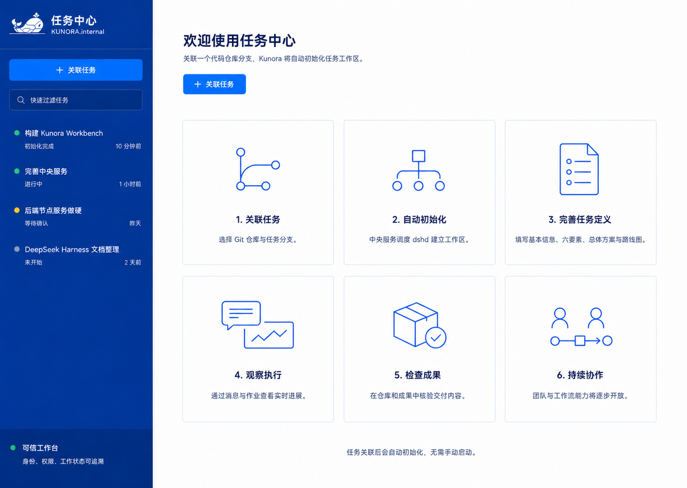
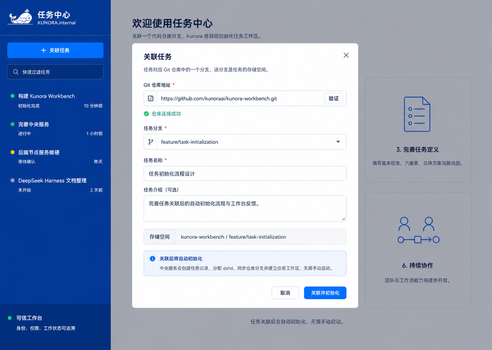
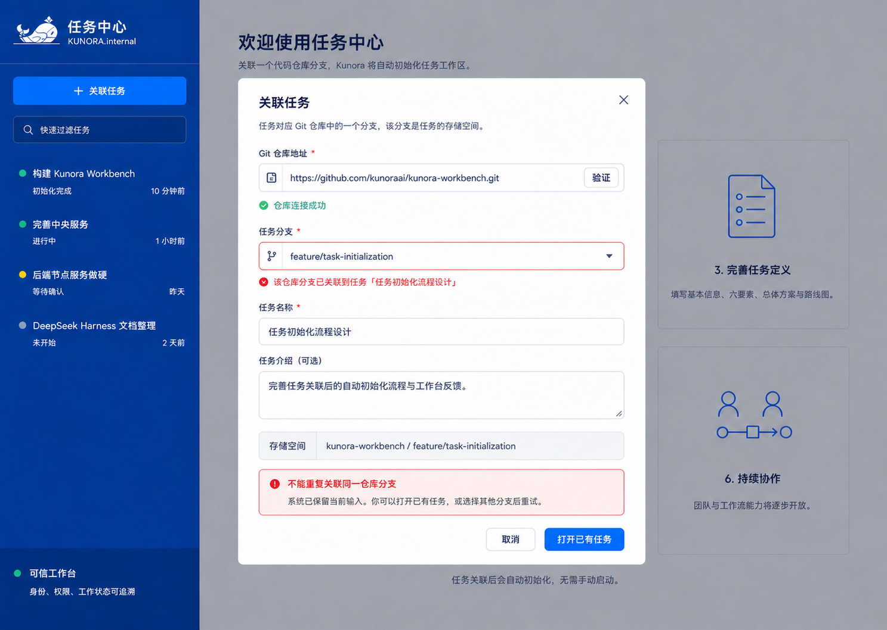
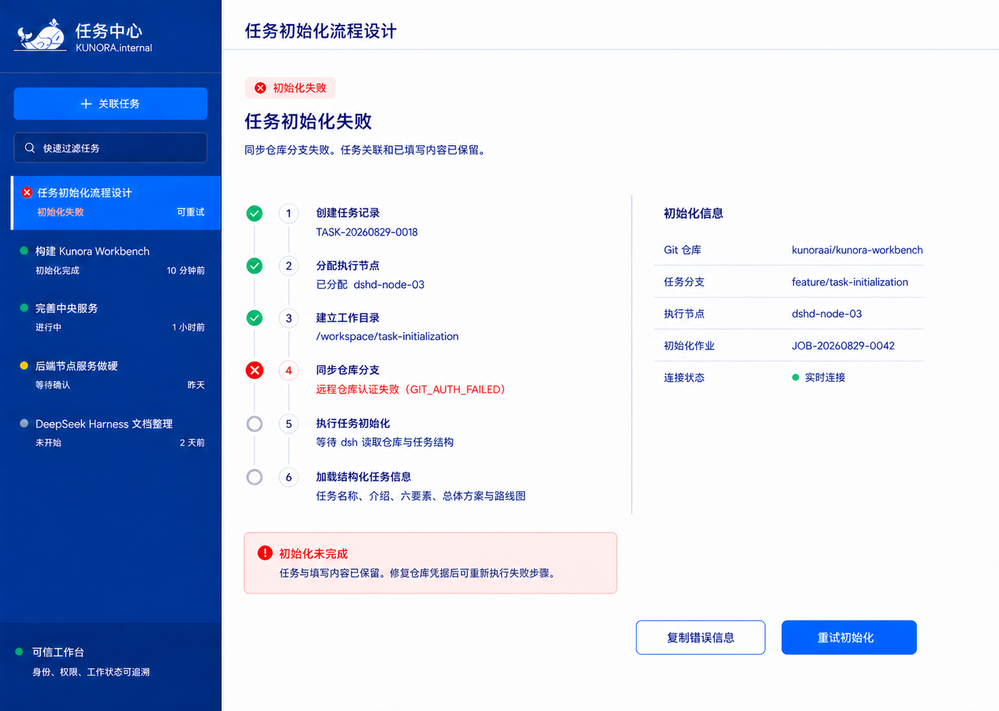
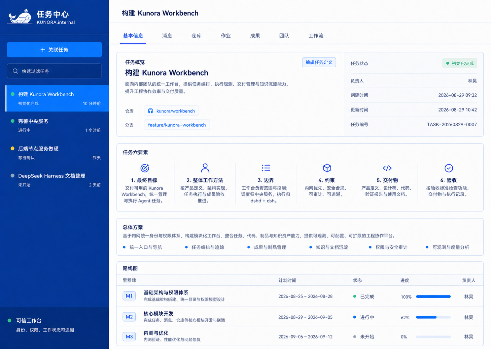
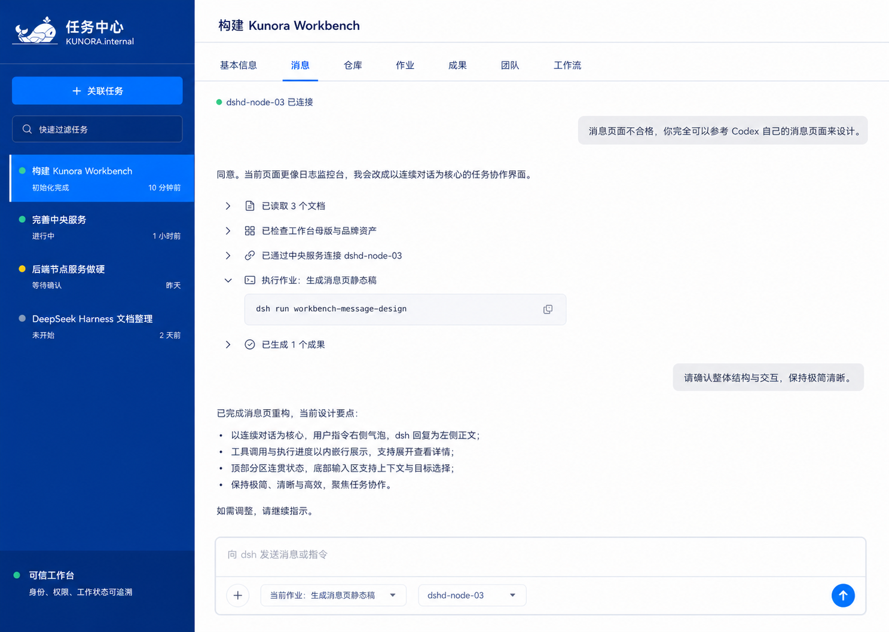
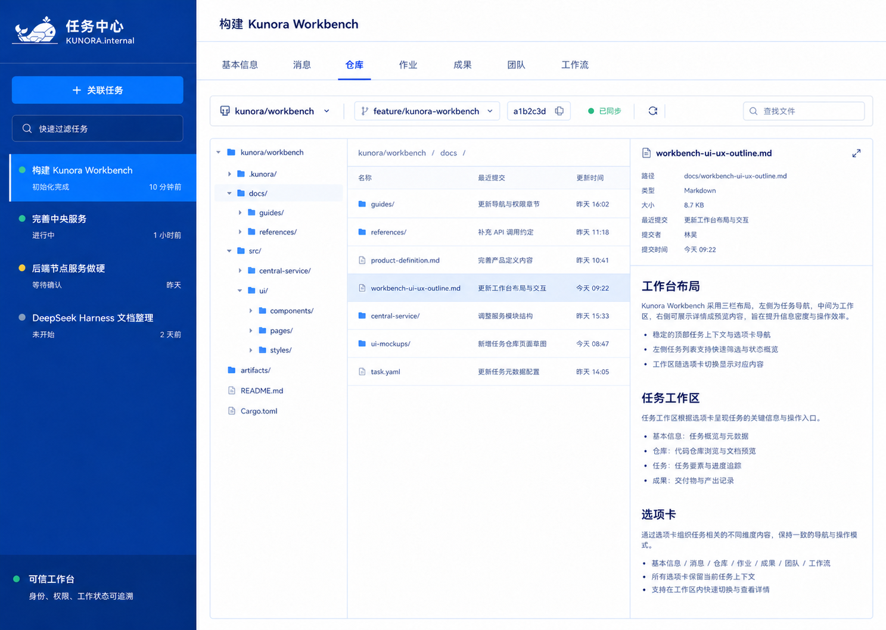
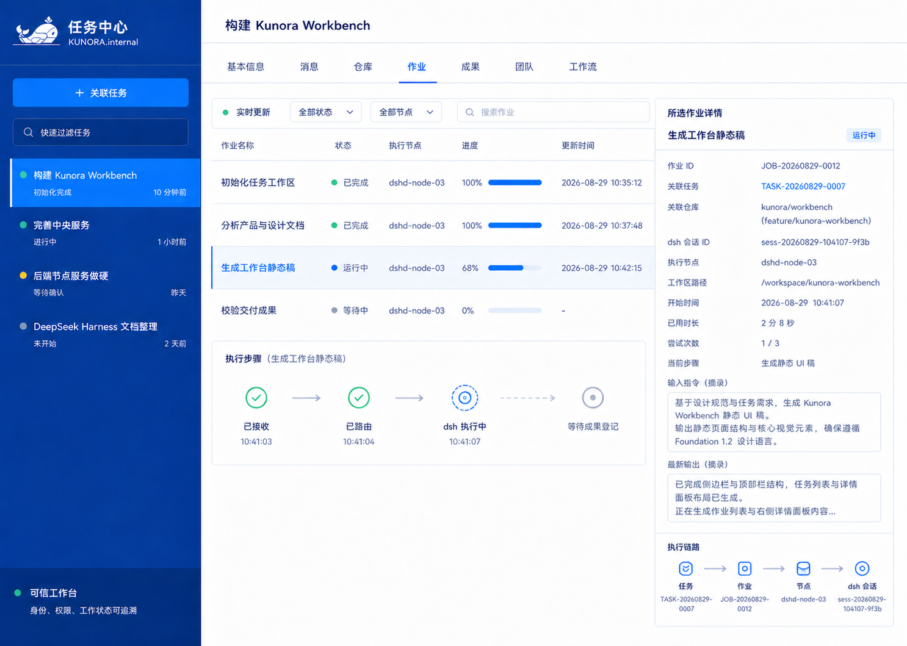
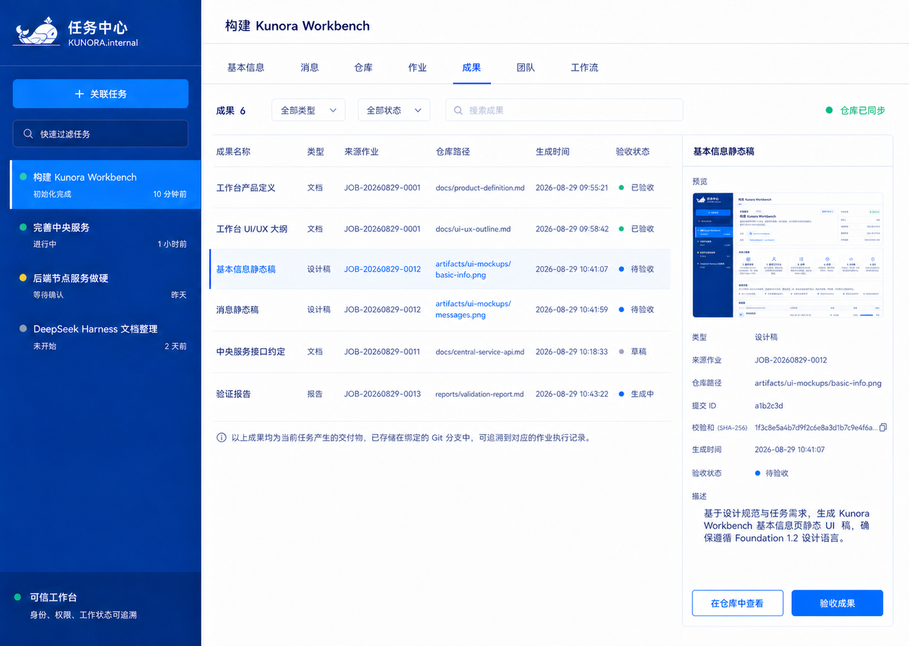

# Kunora Workbench 静态视觉稿修复验证

日期：2026-08-29  
范围：修复后的 12 个桌面静态状态  
结果：通过，可进入交互稿设计

## 1. 修复结论

本轮没有只修改截图文字，而是先建立了统一设计契约，再同步产品文档、修订现有页面并补齐异常状态。上一轮发现的问题均已关闭：

| 问题 | 修复结果 | 验证证据 |
| --- | --- | --- |
| “任务/作业”混用 | 已关闭 | 所有初始化完成页面第四页签均为“作业”。 |
| 六要素定义错误 | 已关闭 | 基本信息页统一为最终目标、整体工作方法、边界、约束、交付物、验收。 |
| 基本信息缺少编辑入口 | 已关闭 | 内容区新增“编辑任务定义”，固定标题栏仍只显示标题。 |
| 时间线漂移 | 已关闭 | 基本信息页统一使用 2026-08-29 示例数据集。 |
| 来源作业使用 TASK ID | 已关闭 | 成果列表与详情全部使用 `JOB-...`。 |
| 初始化进度含义不清 | 已关闭 | 初始化页只显示“正在执行第 4/6 步”，移除百分比。 |
| 缺少关联校验错误 | 已关闭 | 新增重复仓库分支状态，保留输入并提供“打开已有任务”。 |
| 缺少初始化失败恢复 | 已关闭 | 新增失败步骤、原因、内容保留说明与“重试初始化”。 |
| 跨页分支数据不一致 | 已关闭 | 基本信息、仓库和作业页统一为 `feature/kunora-workbench`。 |
| 成果预览仍引用旧基本信息稿 | 已关闭 | 预览缩略图已替换为修订后的基本信息页面。 |

## 2. 逐页健康度

| # | 页面 | 健康度 | 核验要点 |
| --- | --- | --- | --- |
| 1 | 未选择任务 | 良好 | 六格主路径完整。 |
| 2 | 关联任务 | 良好 | 信息输入与自动初始化说明完整。 |
| 3 | 重复关联校验 | 良好 | 字段级错误、输入保留和恢复动作同时存在。 |
| 4 | 初始化中 | 良好 | 无页签；步骤进度语义唯一。 |
| 5 | 初始化失败 | 良好 | 无页签；失败原因、保留说明和重试入口完整。 |
| 6 | 基本信息 | 良好 | 术语、六要素、时间线和编辑入口正确。 |
| 7 | 消息 | 良好 | 连续会话、执行过程与输入上下文完整。 |
| 8 | 仓库 | 良好 | 仓库、分支、目录与文件预览关系清楚。 |
| 9 | 作业 | 良好 | TASK/JOB/节点/会话链路和分支一致。 |
| 10 | 成果 | 良好 | 来源作业类型正确，预览与基本信息稿一致。 |
| 11 | 团队建设中 | 良好 | 能力状态真实，没有伪造可用功能。 |
| 12 | 工作流建设中 | 良好 | 能力状态真实，与团队页一致。 |

## 3. 仍需在交互稿验证

以下不是当前静态稿缺陷，需要在下一阶段用可交互原型验证：

- 弹窗键盘焦点、Esc 关闭和错误字段定位。
- 初始化重试后的状态迁移、断线重连与实时播报。
- 消息发送失败、停止生成、长输出折叠。
- 仓库三栏在窄桌面窗口下的折叠与文本溢出。
- 颜色对比度、焦点样式、图标按钮可访问名称及减少动态效果。

## 4. 截图证据

### 1. 未选择任务

### 2. 关联任务

### 3. 重复关联校验

### 4. 初始化中

### 5. 初始化失败

### 6. 基本信息

### 7. 消息

### 8. 仓库

### 9. 作业

### 10. 成果

### 11. 团队建设中

### 12. 工作流建设中

