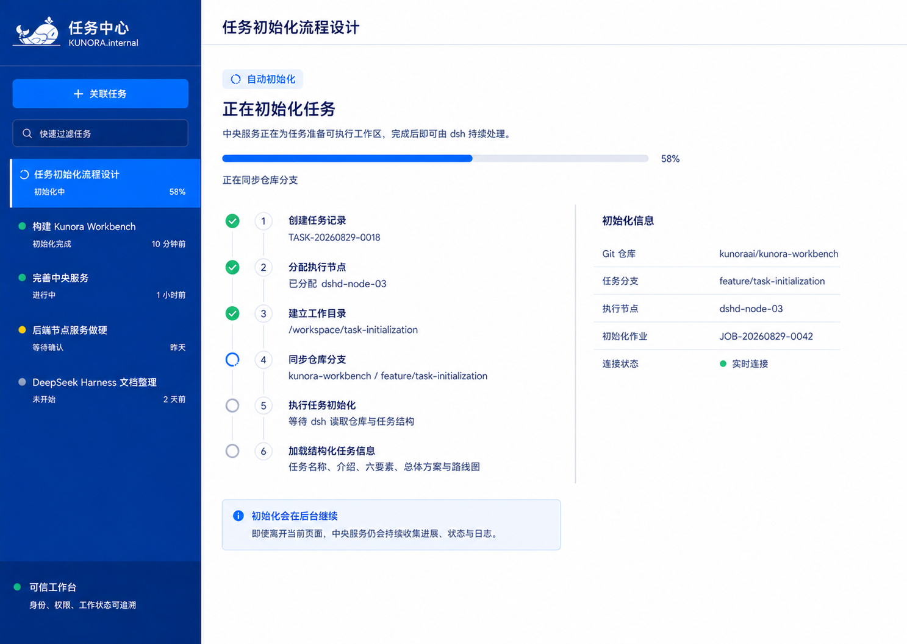
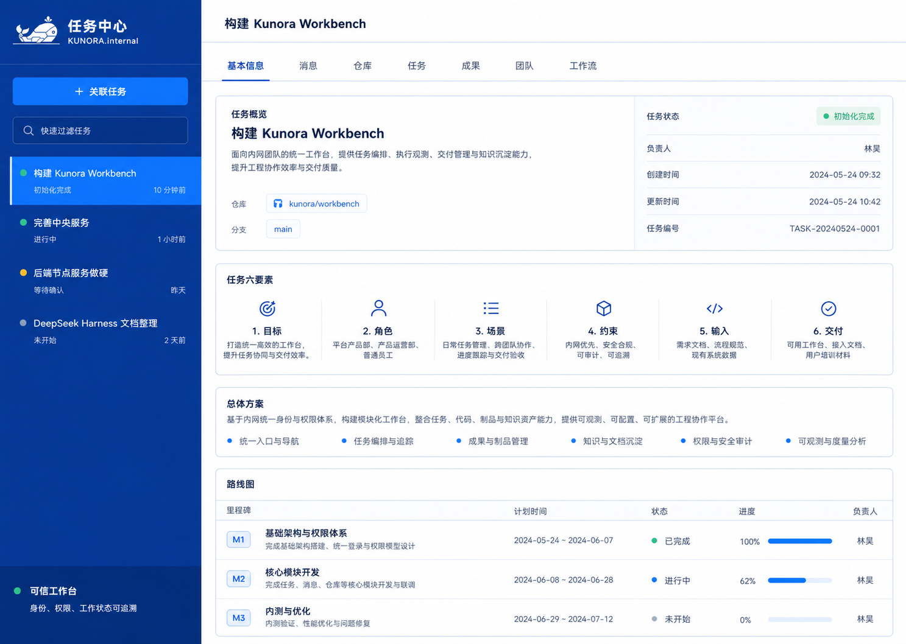
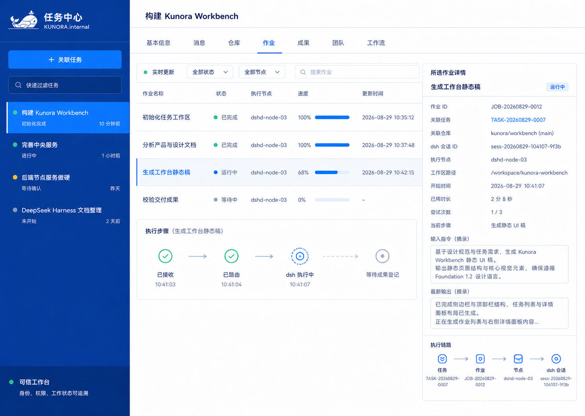
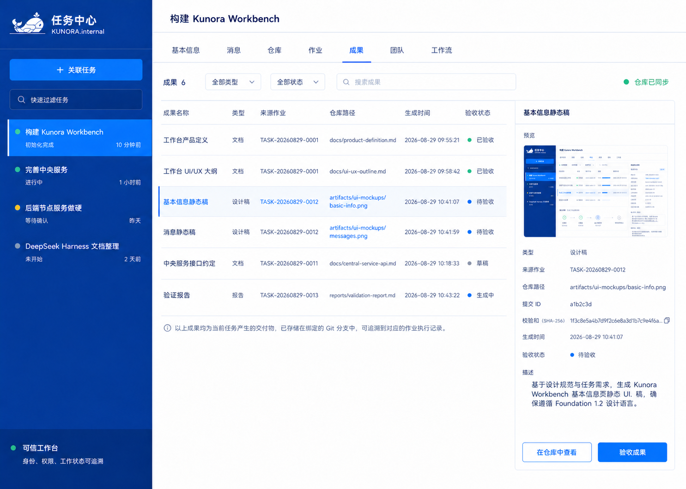
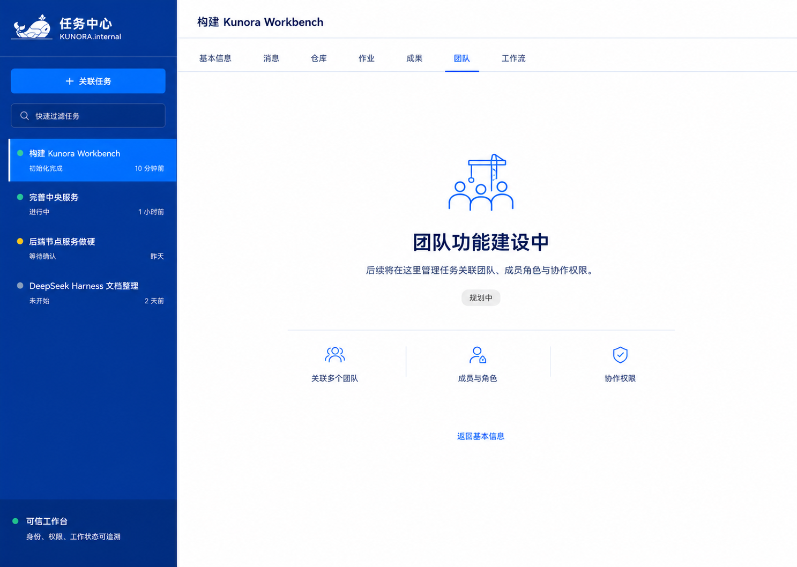
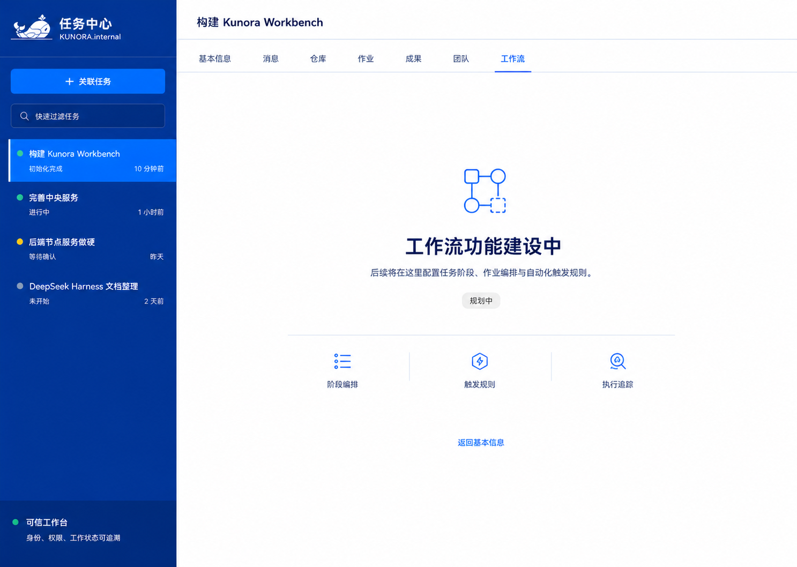

# Kunora Workbench 静态视觉稿 Review

> 本报告对应修复前版本，已由 `docs/workbench/ui-audit/2026-08-29-static-flow-v2/review.md` 取代。

评审日期：2026-08-29  
评审范围：当前已确认的 10 个桌面静态页面  
评审依据：已确认的工作台布局、任务关联后自动初始化、初始化阶段隐藏选项卡、任务页签改名为“作业”等产品约定。

## 结论

整体方向通过。当前静态稿已经形成“未选任务 → 关联任务 → 自动初始化 → 进入任务工作区 → 浏览各业务页签”的完整主路径，信息架构稳定，品牌、栅格、导航和组件语言基本统一，可以在完成下列问题后进入交互稿设计。

进入交互稿前建议先修正 4 个明确问题，并补充 2 个关键异常状态。布局本身不需要推倒重做。

## 页面清单与健康度

| # | 页面 | 健康度 | 结论 |
| --- | --- | --- | --- |
| 1 | 未选择任务 | 良好 | 六格指南和双栏工作台准确，主入口明确。 |
| 2 | 关联任务 | 良好，需补状态 | 表单与“仓库分支即任务”的模型一致，但缺少校验失败和重复关联状态。 |
| 3 | 任务初始化 | 良好，需补状态 | 正确隐藏全部页签，初始化责任链表达清楚；缺少失败与重试状态。 |
| 4 | 基本信息 | 需要修正 | 页签术语、时间数据和编辑入口存在问题。 |
| 5 | 消息 | 良好 | 已从日志监控台收敛为连续会话式协作界面，方向正确。 |
| 6 | 仓库 | 良好 | 三栏文件浏览器清楚；需要在交互稿定义窄屏和长文本行为。 |
| 7 | 作业 | 良好 | 作业列表、执行步骤、节点和 dsh 会话形成完整追踪链。 |
| 8 | 成果 | 需要修正 | 信息结构清楚，但“来源作业”的 ID 类型错误。 |
| 9 | 团队建设中 | 良好 | 建设中状态明确，没有伪造不可用功能。 |
| 10 | 工作流建设中 | 良好 | 与团队页保持一致，后续能力范围表达明确。 |

## 进入交互稿前必须修正

### 1. “任务 / 作业”术语未完全统一

基本信息页的第四个页签仍为“任务”，其余已完成页面均为“作业”。应统一为“作业”。当前 `workbench-ui-ux-outline.md` 也仍保留旧术语，建议同步修订，否则后续实现还会反复出现旧名称。

### 2. 基本信息页缺少编辑入口

产品要求该页支持查看和编辑任务基础信息、六要素、总体方案与路线图，但当前画面只提供只读展示。至少需要展示一个明确的全局“编辑”入口，或为各区块提供一致的编辑入口；不能依赖未展示的悬浮行为。

### 3. 成果页“来源作业”使用了错误的 ID

成果列表和详情中的“来源作业”显示为 `TASK-...`，但作业页已经采用 `JOB-...`。该字段应引用 `JOB-...`；如果要同时展示所属任务，应另设“所属任务”字段并使用 `TASK-...`。

### 4. 基本信息页示例时间与整组稿件不一致

基本信息页显示 `2024-05-24`，其他页面使用 `2026-08-29`。静态稿应统一使用同一条示例数据时间线，避免评审者误解为跨版本数据。

## 建议补充的关键状态

### 5. 初始化失败与重试

产品文档已明确：初始化失败后保留任务关联和已填内容，显示失败原因并提供“重试初始化”。当前只有初始化进行态。建议增加一个失败静态状态，覆盖失败原因、失败步骤、重试入口，以及用户仍可切换到其他任务的行为。

### 6. 关联任务校验失败

建议至少补一个表单错误状态，覆盖以下高频情况：仓库不可访问、分支不存在、仓库与分支已被关联。无需增加新页面，可作为“关联任务”弹窗的错误变体。

## 次要优化

- 初始化页同时展示“第 4/6 步”和“58%”。两者容易被理解为同一套等权进度，但数值并不对应。交互稿中应明确百分比是后端真实进度、步骤权重进度，还是仅展示当前步骤。
- 仓库页信息密度较高。需要定义在较窄桌面窗口下三栏的最小宽度、折叠顺序、横向滚动规则，以及超长文件名和路径的截断方式。
- 消息页的作业、节点选择器与连接状态很有价值，但交互稿需定义断线、重连、发送失败、停止生成和长输出折叠。
- 左侧任务状态、作业状态、成果验收状态已形成多套状态词。建议在交互稿前建立统一的状态字典，明确名称、颜色、图标和可执行操作。

## 做得好的部分

- 左侧任务导航在全部页面中保持稳定，关联入口、过滤器、滚动列表的层级清楚。
- 未选任务页不是普通空状态，而是直接解释完整主路径，符合首次使用场景。
- 初始化阶段完全移除了不可用页签，避免向用户暗示空功能可操作。
- 消息页以会话为主体，将工具调用和执行过程内嵌到上下文中，比单纯日志控制台更适合任务协作。
- 作业页把 `任务 → 作业 → 节点 → dsh 会话` 的追踪关系直观呈现，符合中央服务的路由与收集职责。
- 团队和工作流使用真实的建设中状态，没有用空表格伪装已具备能力。

## 可访问性与验证限制

仅凭静态图不能声明满足 WCAG，也无法验证键盘操作、焦点顺序、滚动、响应式和实时状态播报。进入交互稿时应重点验证：

- 浅灰辅助文字、输入占位文字、分隔线和禁用状态的对比度。
- 关闭、复制、展开、刷新等纯图标按钮的可访问名称、提示和点击目标尺寸。
- 关联任务弹窗的焦点圈定、Esc 关闭和错误信息与字段的关联。
- 初始化进度、节点连接状态和消息新增内容使用非颜色提示，并为读屏器提供适当的实时播报。
- 动画加载和实时更新尊重减少动态效果设置。

## 截图证据

### 1. 未选择任务

### 2. 关联任务

### 3. 任务初始化

### 4. 基本信息

### 5. 消息

### 6. 仓库

### 7. 作业

### 8. 成果

### 9. 团队建设中

### 10. 工作流建设中

