# Kunora Workbench UI/UX 定向修订记录

日期：2026-08-30。范围：原 12 页中的 8 页修订、4 页保留，新增 3 个状态，共 15 个静态状态。

## 结论与边界

本轮完成静态设计修订与交互规则补充。保留蓝白配色、鲸鱼标识、双栏壳、标题栏与七页签；所有原图保持不变。没有使用 Figma，没有修改应用代码，没有提交或推送 Git。

11 张新版逐张检查了可见文字、任务/作业身份、主操作、状态表达及整体布局。生成过程发现的英文残留、额外侧栏徽标及未经定义的字符计数已再次编辑去除。检查不等于像素级组件验收，也不等于功能或无障碍验证通过。

## 问题对应修复

| 评审问题 | 修订证据 | 状态 |
| --- | --- | --- |
| 名称必填与产品规则冲突 | 02、03 名称可选及辅助说明；交互规范第 1 节 | 静态表达已修订，空名称行为待原型验证 |
| 授权失败只有重试，无修复路径 | 05 管理员授权指引、访问检查及禁用重试 | 静态路径已补充，检查接口待对齐 |
| 节点/分支切换语义不清 | 07 节点自动分配只读；08 仓库分支只读，明确刷新文件列表 | 静态表达已修订 |
| 定义完整度、编辑与里程碑缺口 | 06 完整度和全文入口；13 保存失败；14 里程碑详情 | 关键画面已补充，其余编辑/冲突行为见规范 |
| 生成与验收状态混用 | 10 双状态列；15 指定版本、显式结论与评语 | 静态表达已修订，记录持久化待实现 |
| 作业进度无计算口径 | 09 阶段与已用时替代百分比 | 静态表达已修订 |
| 作业控制入口不足 | 09 查看消息、停止执行及不可撤销说明 | 静态入口已补充，停止确认待原型验证 |
| 窄窗口/键盘/断线/并发变更 | interaction-spec.md 第 2–7 节 | 已定义候选规则，尚未运行验证 |

## 本轮不作的承诺

- 这些图不是可点击原型。按钮、消息发送、Git 浏览、授权检查、保存与验收没有在本轮接通后端。
- 只读表示不能通过该控件改绑分支/节点，不表示任务仓库没有访问权限。
- “检查仓库访问权限”是待实现需求；不引入凭据输入或未经确认的设置页面。
- 示例短提交号、人员、日期及路径是设计数据；里程碑页面是独立交互示例，不替代项目实际 M2 计划。
- 失败页左栏已同步改为“待修复授权”，与禁用重试保持一致；检查通过后才改为“可重试”。
- 文字尺寸、色值、间距和图片像素尺寸存在生成误差；实现需收敛到统一组件和令牌，不能逐页照抄位图误差。未宣称颜色对比度、读屏、缩放或点击区域已合格。

## 顺序看图

### 01 未选择任务（沿用）

### 02 关联任务：名称可选
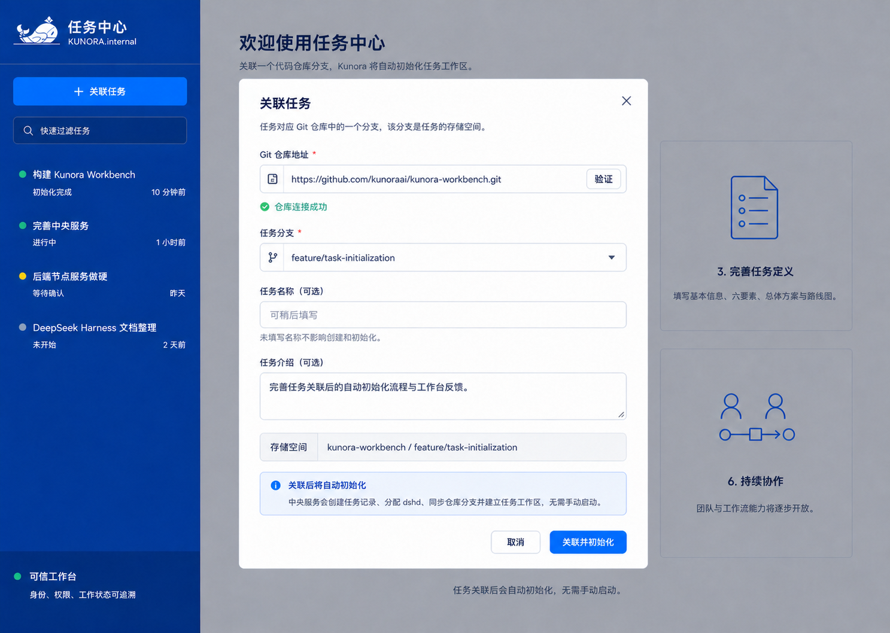

### 03 重复关联：保留输入与更换分支
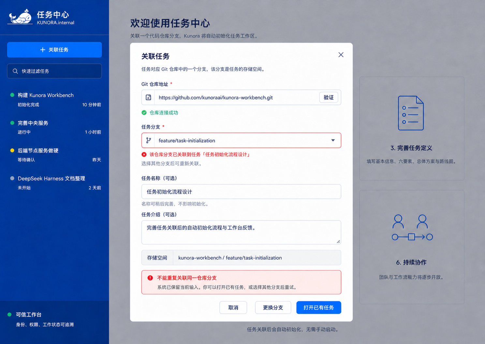

### 04 初始化中（沿用；实际步骤待后端映射）
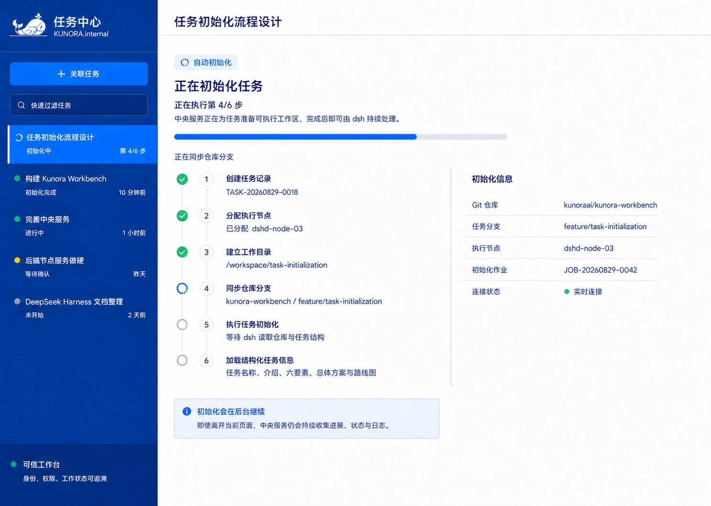

### 05 初始化失败：授权恢复路径
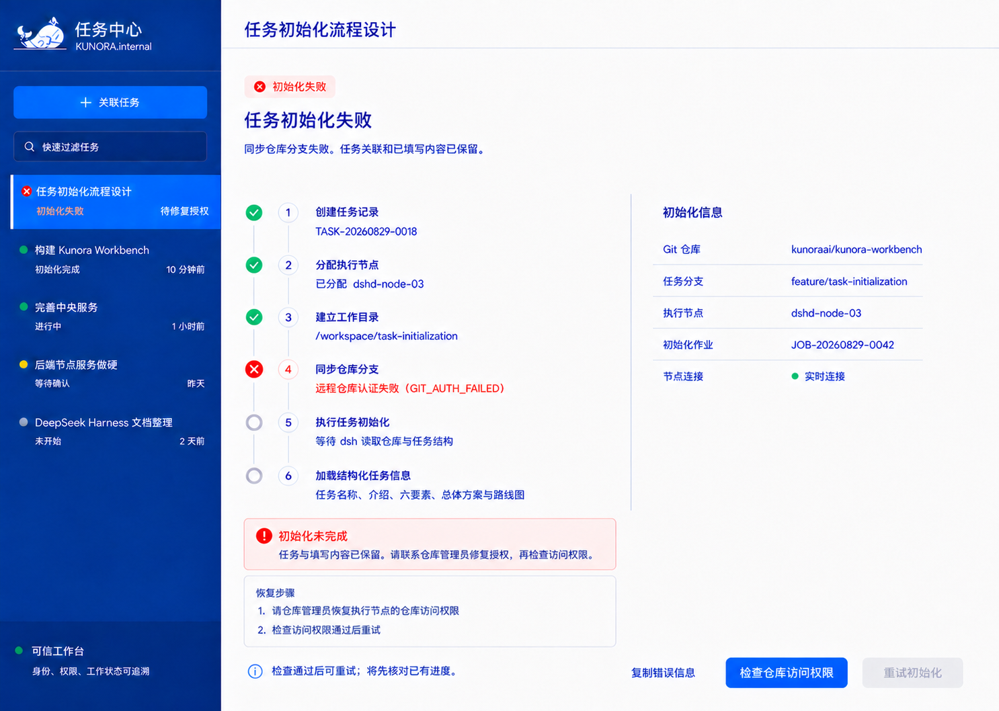

### 06 基本信息：完整度、六要素与里程碑入口
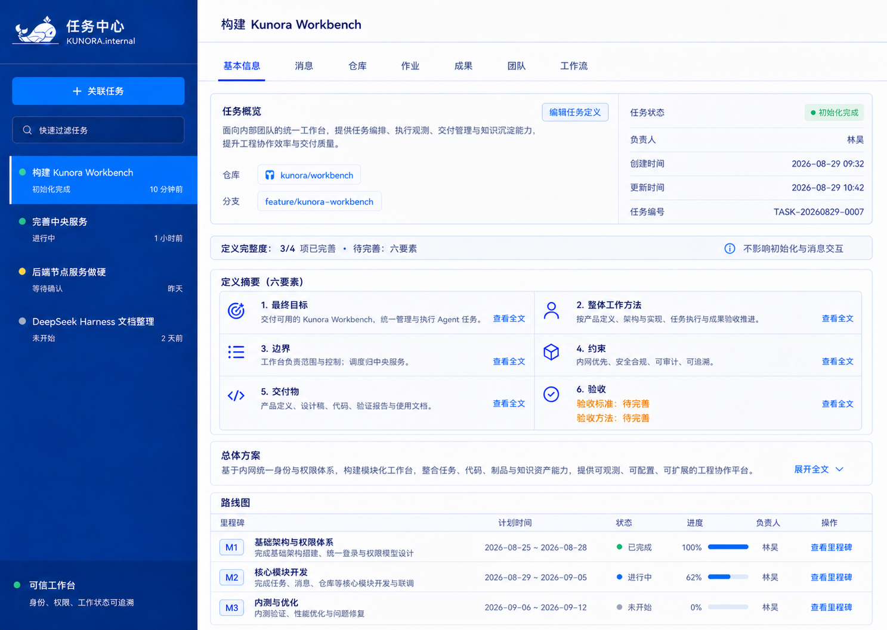

### 07 消息：任务上下文固定
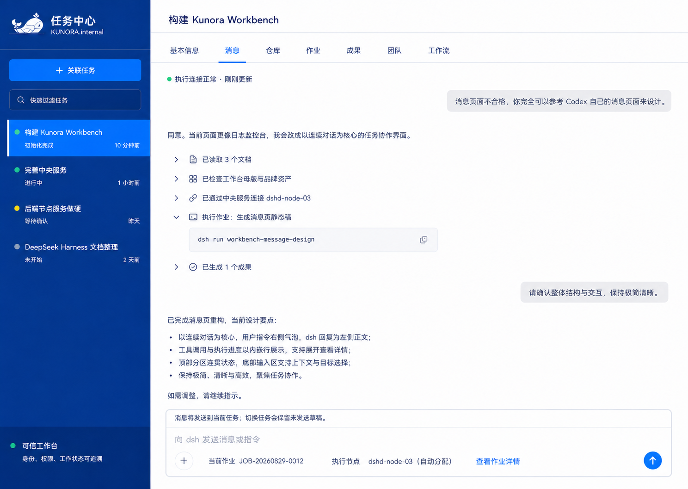

### 08 仓库：只读绑定与明确刷新
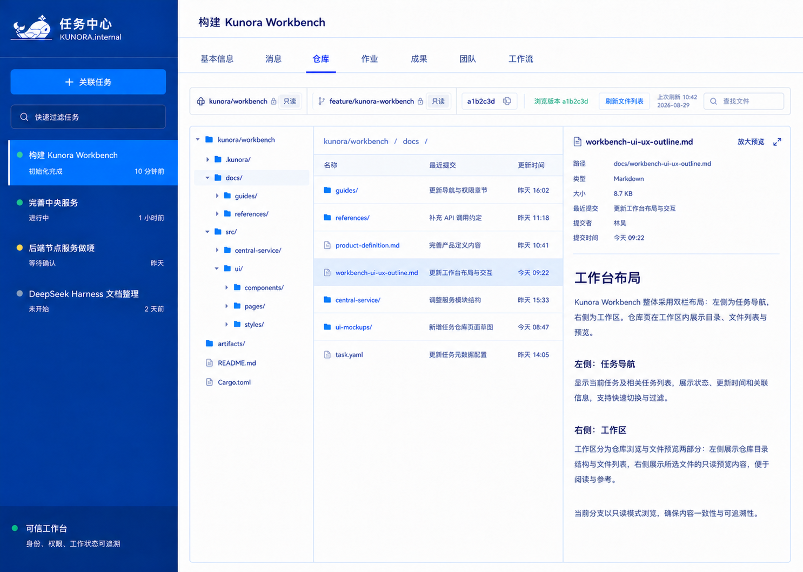

### 09 作业：阶段进度与停止入口
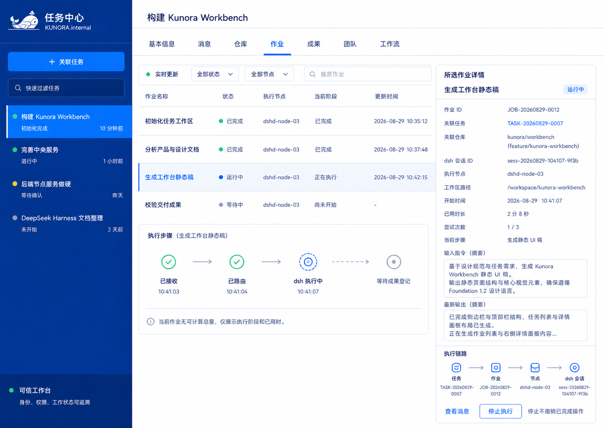

### 10 成果：双状态与版本验收
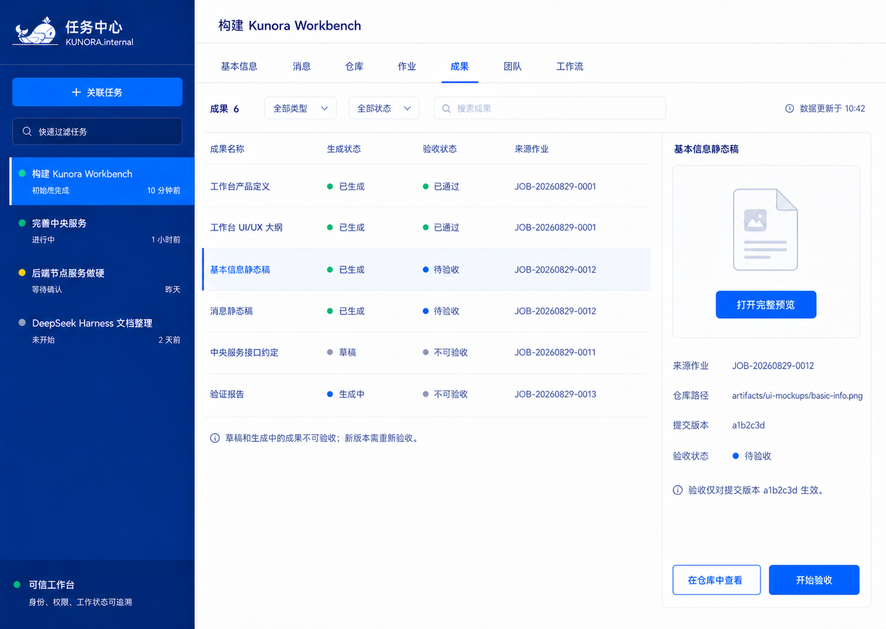

### 11 团队（沿用）

### 12 工作流（沿用）

### 13 任务定义：保存失败仍保留输入
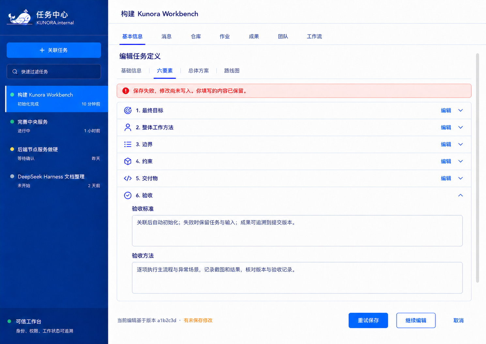

### 14 里程碑：独立定义及计划待完善
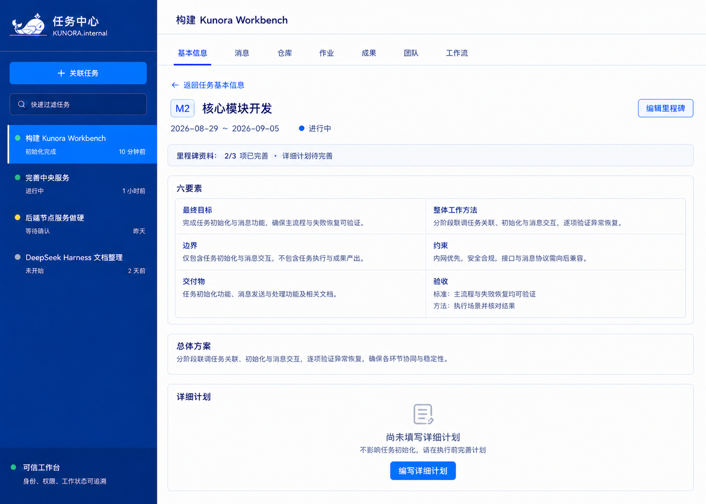

### 15 版本验收：选择结论前禁用提交
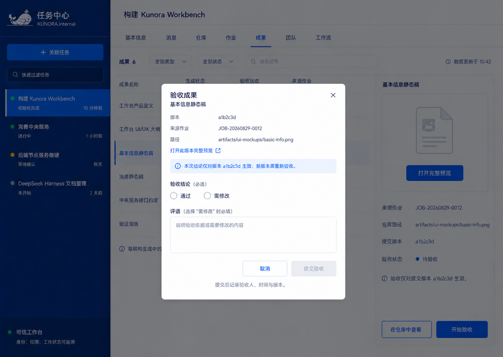

## 下一阶段验证

按 [交互规范](interaction-spec.md) 第 7 节建立可点击原型并逐项验证；优先空名称关联、授权恢复、保存冲突和版本验收，再验证键盘与窄窗口。不需要重新探索品牌或布局方向。
