# Kunora Workbench × DeepSeek Harness：UI 覆盖核查

日期：2026-08-31。结论：**未达到 DeepSeek Harness Web UI 全量覆盖，不能按“全部 UI 已完成”验收。**

当前成果是 Kunora 品牌下的会话与文件对照交互原型。主框架、会话管理、文件预览和部分设置已有可操作界面，但多个 Harness 必需流程没有对应界面。模型、插件、Agent 预设等同名页面也不能据此算作功能覆盖。

## 范围与判定方式

- 基准是此前提取并用于本次设计的 DeepSeek Harness 源码版本 `0a53fb55bea101816fa226bb964ae2bed71c343b`，不是 npm 发布包，也不是对不断更新的 master 的全量认证。
- 核查了该版本 `packages/client/` 的全部 **38 个 `ui-*` 包**，并补充语言、启动、连接、会话导出、Cordis 动态插件、实验性 Agent Teams 六项来源，共 44 条来源映射。包不是页面，数量不能换算成完成率。
- 需求依据为上游包文档、Web 组合清单及相关界面代码；没有另行提供的正式产品需求或验收规范。因此本文是源码行为覆盖清单，不是上游官方认证。
- 范围为 Web 工作台；不含 CLI/TUI、文档网站、任意第三方插件界面，也不把 Kunora 既有七标签业务草稿算成 Harness UI。
- 当前原型通过内置浏览器逐页核查；本轮新采集 12 张 1280×720 截图。上游未在本轮启动并逐个运行所有流程，源端要求来自固定版本的一手文档和代码。
- “部分覆盖”表示存在对应界面或局部交互，但缺少所列行为；“占位”表示仅有说明；“缺失”表示未发现入口及实现；“基础设施”不是独立页面；“条件项”须由部署或产品范围决定是否纳入。
- “已有”的结论仅指原型界面。模型执行、真实目录、权限决策、持久化和事件同步均未接入或验收。本轮没有修改 UI 实现、既有草稿或冻结的 `dsh/`，没有调用模型、提交或发布。

## 已有的可用界面

- Kunora Workbench 标题、机械鲸鱼标识、侧栏、会话区和文件对照区。
- 新会话、示例工作区添加/切换/改名、会话名称搜索、重命名、归档/恢复、独立本地副本。
- 示例读取与编辑记录、产出文件按钮、修改前后文本差异、会话文件搜索/分类/预览/引用。
- 输入、模拟发送、运行提示、停止、排队计数、发送失败提示与草稿恢复。
- 设置四个分类；会话字号、发送快捷键；模型与插件未连接说明；三种起步提示。

上述界面保留原有设计价值，但**工作区分组 ≠ 实际目录，独立副本 ≠ Harness 分叉，起步提示 ≠ Agent 组合预设，文件名追加 ≠ 完整引用系统，模拟回复 ≠ 真实执行**。

## 首要缺口与完成条件

优先级表示全量 UI 验收的重要性，不表示当前离线原型正在执行危险操作。

| 优先级 | 缺口 | 完成条件 |
|---|---|---|
| P1 | 授权与问答 | 允许一次/拒绝、权限范围、等待状态；单选/多选/自定义回答、跳过/取消/提交失败恢复；计划审核的讨论/拒绝/批准；切换会话保留未提交回答。 |
| P1 | 模型、权限及首次使用 | 初次说明、目录选择、无工作区/无可用模型时输入不可用；服务商和模型编辑、密钥状态、默认模型/推理强度；权限预设与完全权限风险确认。仅增加 API 输入框仍不算完成。 |
| P1 | 输入与执行控制 | 真正的 `/` 指令、`@` 文件/目录/会话候选和原子引用；技能；图片缩略图/拖放/预览/失败；可编辑、移除、插话的队列；完整运行、失败、中断、等待与重连状态。 |
| P1 | 执行过程与协作 | Chat/Trajectory 切换、事件账本和时间线、输入/输出/耗时/token；后台作业；子会话树及只读/可继续状态；工作流阶段、成员及结果。 |
| P1 | 插件与 Agent 预设 | 插件配置与清单分离，暂存/保存/放弃/重置/冲突；预设默认项、复制、删除、只读/损坏状态及文件入口；Cordis 全局批准/运行/停止/移除面板。 |
| P2 | 工作区与会话完整性 | 真实目录选择与失败/取消；移除工作区但保留会话；分组/平铺、排序/拖动、内容检索；按已完成轮次分叉、消息级分叉与复制；日志导出。 |
| P2 | 设置、呈现与可访问性 | 中英文、浅色/深色/系统、字号范围、正常/紧凑过程展示；可调侧栏/详情；各新状态的键盘、焦点、屏幕阅读器和窄屏验证。 |

## 逐项来源映射：38 个客户端 UI 包

每行对应固定版本同名包的 README；后附来源链接。截图编号见后面的本轮检查记录。没有界面的项目无法在原型中进入并截图，缺失判断同时依据入口与 `src/` 实现核查。

| 上游包 | 状态 | 当前结果与仍需覆盖的行为 | 证据 |
|---|---|---|---|
| ui-agent-preset | 部分覆盖，语义不同 | 目前是三段起步提示；缺新会话预设选择、会话固定预设标签、默认项、复制/删除、配置文件入口、内置只读与损坏状态。 | 07、08；WorkspaceSurfaces.jsx |
| ui-approval | 缺失 | 缺输入区接管、操作详情、允许一次/拒绝、请求失效及提交失败状态。 | App.jsx 无审批入口/分支；上游 ui-approval |
| ui-attachment | 部分覆盖 | 只保存附件名称；缺图片缩略图、拖放、历史图片、原图灯箱、限制提示、加载失败/重试和模型不支持状态。 | App.jsx 附件处理；01 |
| ui-brand-official | 已按要求替换视觉身份 | Kunora 标识与标题已应用；这是用户指定的品牌替换，无需复制 DeepSeek 名称或动画。尚未通过 Harness 品牌槽位接入。 | 01、08；App.jsx |
| ui-chat | 部分覆盖 | 基本文字与示例工具记录；缺系统提示行、思考/过程折叠、上下文与 token 用量、消息复制/分叉、历史分页、丰富 Markdown/数学/图片及相应错误状态。 | 01、12；App.jsx |
| ui-commands | 部分覆盖，语义不同 | “快捷指令”只追加三个自然语言提示；缺 `/` 命令解析、命令参数/选择器、命令生命周期及错误，不应将未知命令静默当普通提示发送。 | 11；App.jsx |
| ui-conversation | 部分覆盖 | 草稿、模拟发送/停止/排队/失败已有；缺无会话输入锁定、真实队列列表及编辑/移除/插话、繁忙 Enter 策略、输入区临时接管、上下文显示和视图切换。 | 01、08、11、12；App.jsx |
| ui-deliverables | 部分覆盖 | 示例产出与对照可打开；缺从成功修改记录提取产出、结尾文字内联文件链接、Host 打开文件及失败恢复。新加“会话文件”是原型扩展，不能代替上游语义。 | 01、10；sample-data.js、App.jsx |
| ui-directory-picker-browse | 缺失，部署二选一 | 缺应用内目录路径/面包屑、子目录浏览、新建文件夹、选择/取消/失败；当前工作区只接受分组名称。与 native 按运行环境选择，不要求同屏同时出现。 | 02；上游目录选择文档 |
| ui-directory-picker-native | 缺失，部署二选一 | 缺原生目录选择调用以及已选择/取消/失败的返回状态；本轮未验证系统选择器。 | 02；上游目录选择文档 |
| ui-goal | 缺失 | 缺会话目标条、编辑/暂停/恢复/清除、拒绝原因和 `/goal` 命令记录；目标入口是否出现取决于预设能力。 | App.jsx；上游 ui-goal |
| ui-input-trigger | 缺失 | 缺光标处 `/` 与 `@` 触发、候选分组、键盘选择、加载/空/失败与插入逻辑。工具栏提示按钮不等价。 | 11；App.jsx |
| ui-jobs | 缺失 | 缺会话页首后台作业按钮、运行/停止中计数、已结束项、状态及耗时。仅在有可见作业时出现，不使用虚构百分比。 | 01、09；App.jsx |
| ui-layout | 部分覆盖 | 三栏、详情开关/扩大和窄屏容器已有；缺拖动调宽、56px 收起侧栏及原版空间让步逻辑。 | 01、09；App.jsx、Workbench.module.css |
| ui-message-feedback | 缺失 | 缺最终助手消息的赞/踩、可选备注、读取/提交失败提示及独立反馈状态。 | 01、12；App.jsx |
| ui-model-selection | 缺失 | 缺输入区模型/推理强度两级选择、按服务商分组及 `/model`；无可用模型时输入锁定。标准/计划模式不是模型选择。 | 01、05、11 |
| ui-permission-presets | 缺失 | 缺新会话默认权限与当前会话 `/permission` 的区别、完全权限风险确认及提交失败反馈。 | 04；WorkspaceSurfaces.jsx |
| ui-plan | 部分覆盖，行为不同 | 仅标准/计划下拉及演示文案；缺会话计划状态条、退出/失败及计划审核。另已复现模式跨会话共享，未按会话隔离。 | 08→09；App.jsx 全局 mode |
| ui-primitives | 部分覆盖 | 常规按钮、原生弹窗和 diff 已有；缺上游所需 Markdown/数学、终端 ANSI、读取/搜索/网页结果、JSON 和通用工具详情等内容呈现。无需逐个复制无用原子组件，但必须支持产品会出现的内容。 | 01、10、12；src/ |
| ui-reference | 部分覆盖，语义不同 | 文件浏览可追加字面量 @文件名；缺目录钻取、跨会话候选、引用 chip、复制序列化、失败隔离与会话上下文关联。 | 10；WorkbenchTools.jsx、App.jsx |
| ui-renderer | 基础设施，未集成 | 当前用独立 React 应用；未集成 Harness 的槽位挂载及状态订阅。不是待补的一张页面。 | main.jsx、App.jsx |
| ui-schedule | 条件项，未设计 | 缺提醒目录、状态/时间和会话标记。固定版本 Web 组合中 disabled: true，仅 Schedule overlay 启用时纳入。 | Web 组合清单；上游 ui-schedule |
| ui-session | 基础设施，未集成 | 本地数组代替 Session Controller；缺权威状态、持久化、待处理交互和生命周期同步。不是独立页面。 | sample-data.js、App.jsx |
| ui-settings | 基础设施，未集成 | 已有本地弹窗壳，但没有 Host settings scope、版本冲突、校验与读写确认。功能页状态分别列出。 | WorkspaceSurfaces.jsx |
| ui-settings-general | 部分覆盖 | 设置分类可切换；缺按序 onboarding、打开配置文件、断线/重连/已恢复反馈、设置不可用及版本冲突状态。通用行由各功能提供。 | 04；WorkspaceSurfaces.jsx |
| ui-settings-models | 占位 | 只有未连接说明；缺提供商列表、密钥配置状态、端点/协议/模型编辑、发现模型选择、添加/删除确认、校验和失败恢复。 | 05；WorkspaceSurfaces.jsx |
| ui-settings-plugin-inventory | 缺失 | 缺只读“插件清单”标签、Agent 预设/全局分组、搜索、条件启用/失败/来源详情及重试。 | 06；WorkspaceSurfaces.jsx |
| ui-settings-plugins | 占位 | 两行说明不能代替插件配置。缺 shell、工具并行、子代理模型及搜索等已注册配置卡的编辑/保存/放弃/重置、密钥状态和并发更新拒绝。 | 06；WorkspaceSurfaces.jsx |
| ui-sidebar | 部分覆盖 | 标识、新会话、工作区、历史和设置已有；缺桌面收起控制轨、与完整工作区浏览器组合及对应状态。 | 01、02、03 |
| ui-skill | 缺失 | 缺 `/技能名` 候选与明确的技能调用、展开 Instructions 工具记录及失败状态。普通起步提示不算技能。 | 11；App.jsx |
| ui-slots | 基础设施，未集成 | 独立组件未接入 Harness 声明式槽位。产品集成时需映射，不能当作新增页面数量。 | src/；上游 ui-slots |
| ui-subagent | 缺失 | 缺子会话后代树、状态/耗时/token、父子导航、一次性只读和可继续状态、运行中 inbox 及 @子会话。 | 01、09；App.jsx |
| ui-theme | 部分覆盖 | Kunora 浅色与 14/16/17px 已有；缺浅色/深色/系统切换、12–17px 完整范围及相应持久化。 | 04；styles.css、WorkspaceSurfaces.jsx |
| ui-tool | 部分覆盖 | 仅读取名称列表和示例编辑 diff；缺通用输入输出、shell/pwsh 终端、grep/glob、web、todo、问答、Code Dispatch 子调用及运行/失败/中断显示。 | 01、10；App.jsx |
| ui-trajectory | 缺失 | 缺 Trajectory 标签、Turn/Step 账本、子工具、时间线选区/缩放、搜索、历史加载及 token/耗时/Input/Output/Timing 检查器。 | 01、09；App.jsx |
| ui-user-questions | 缺失 | 缺逐题导航、单选/多选/自定义、推荐项、跳过/取消/提交；缺讨论/拒绝/批准的计划审核专用卡与回答草稿恢复。 | App.jsx；上游 ui-user-questions |
| ui-workflow-run | 缺失 | 缺工作流运行/阶段/成员折叠节点、成功/失败/取消/中断及安全子会话跳转。 | 01；App.jsx |
| ui-workspace | 部分覆盖 | 示例分组与会话 CRUD 部分操作已有；缺真实路径身份、分组/平铺、手动/最近更新、拖动、折叠 Show more、内容搜索/片段、移除工作区并保留会话、完成轮次分叉、等待标记和路径悬浮信息。 | 02、03、09；WorkbenchTools.jsx、App.jsx |

## 不在上述 38 包内的界面

| 来源 | 状态 | 应覆盖的界面与边界 |
|---|---|---|
| client/locale | 缺失 | 通用设置中切换中英文，即时更新文字和文档语言；当前界面固定中文。 |
| client/web | 缺失 | 启动过程及逐插件加载/激活失败说明；当前直接挂载原型，无启动诊断页。 |
| client/connection + ui-settings-general | 缺失 | 断线、连接中、立即重连、恢复状态及认证/请求拒绝的可理解反馈；“尚未连接模型”不能代替应用与 Host 的连接状态。 |
| session-query/session-log-export | 缺失 | 页首 Session log 与 `/export`、准备中/已开始下载/失败；导出包括子会话和附件，受后端原始日志能力限制。Web 默认组合包含该包。 |
| extensions/ui-cordis | 缺失 | 跨会话可达的动态插件面板、批准/拒绝、运行/停止/移除、Host 与当前页面加载状态、工具卡、@pluginId。Web 默认组合包含该包。 |
| experimental/client-ui-agent-team | 条件项，未设计 | 实验性团队 roster、共享任务板与成员会话跳转；官方发布排除，只有选择实验性 Web profile 才纳入，不能与常规 subagent 功能混为一谈。 |

## 本轮发现的具体行为差异

1. **P2：计划模式跨会话共享。** 在新会话选“计划模式”，再打开原来的“优化任务关联表单”，其下拉仍为计划模式。源码 `App.jsx` 将 mode 存为全局状态，`selectSession` 不恢复会话值。Harness 使用会话投影。接入前应改为会话状态，避免误解执行方式。证据：08→09。
2. **P2：低高度桌面新会话需要额外滚动。** 1280×720 下，欢迎区的三张建议卡在首屏被固定输入区截断，需要滚动会话区才能读完。内容仍在页面中，没有认定为数据丢失；建议减少低高度窗口的欢迎区留白。证据：08。
3. **P1 验收风险：同名页面容易被误认为完成。** “Agent 预设”“插件”“快捷指令”目前语义显著简化，模型页没有配置表单。这些应继续标记为演示，不能进入完整 UI 验收的已完成项。证据：05、06、07、11。

## 本轮浏览器检查记录

下列截图均在本次核查中新采集并逐张查看；编号是检查顺序，不是单一任务的强制使用顺序。缺失流程没有可进入的原型界面，因此不伪造其截图。

### 01 · 会话与文件对照 — 部分覆盖

页面可用，标题、内容区、工具记录和 diff 层级清晰；窄列代码在内部水平滚动。缺 Chat/Trajectory 入口、模型/权限、作业、子会话与上下文信息。差异用 +/− 与颜色共同表示；未据此认定完整无障碍合规。

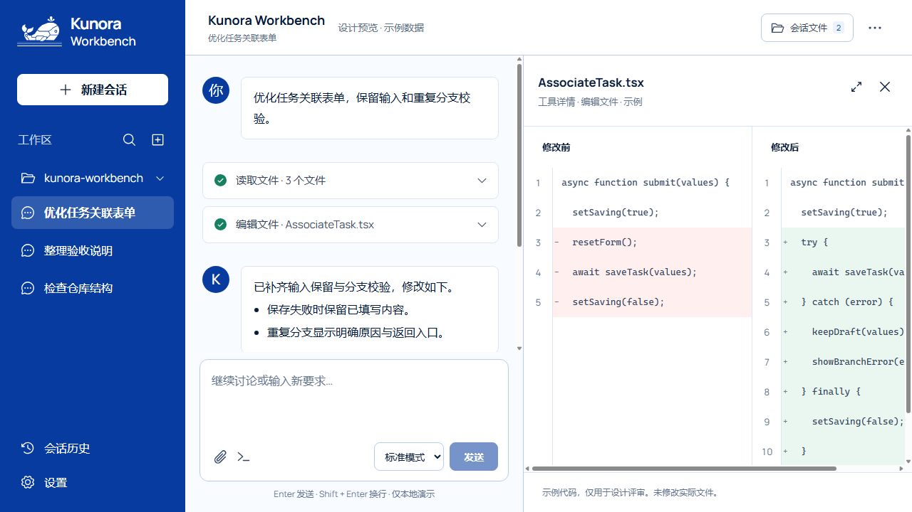

### 02 · 工作区管理 — 部分覆盖

可打开分组管理，当前项、会话/草稿/归档计数与“未连接目录”说明明确；原生弹窗提供可见关闭焦点。没有真实路径浏览、取消/失败或删除保留边界的流程。

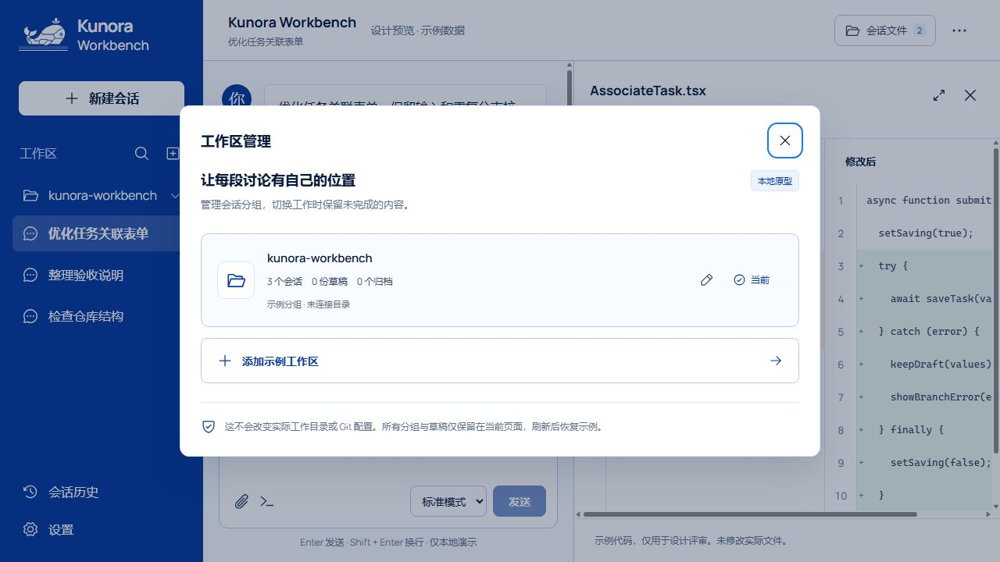

### 03 · 会话历史 — 部分覆盖

可打开历史，搜索与进行中/已归档筛选有明确标签，行内提供重命名和归档；与 Harness 的跨工作区内容检索、排序/拖动及真实分叉仍有差距。本轮未重复执行每一个归档写操作。

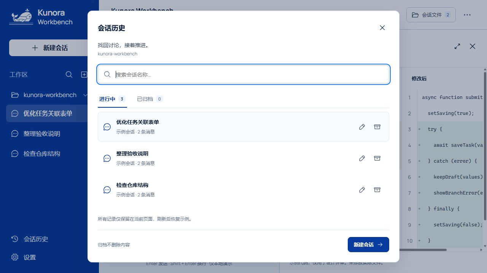

### 04 · 通用设置 — 部分覆盖

四个分类可切换，有字号与发送快捷键控件、可见焦点。语言、深色/系统、权限默认项、繁忙时 Enter 的排队/插话策略与正常/紧凑显示缺失。当前的发送快捷键不等于 Harness 的繁忙时策略。

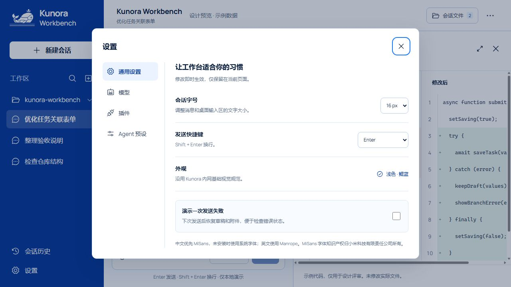

### 05 · 模型设置 — 占位

未连接、凭证和文件访问说明清楚，没有误称模型已连接；但是缺少提供商及模型的实际配置界面。无表单就无法核查校验、保存失败、密钥状态或删除确认。

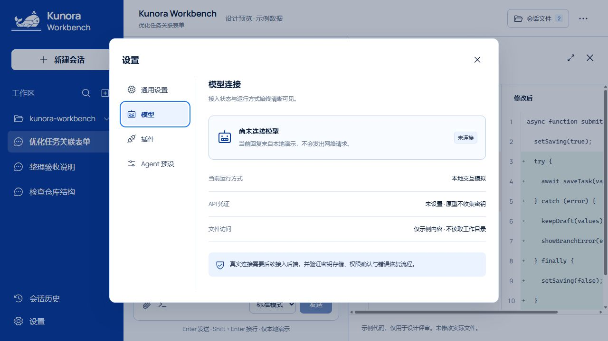

### 06 · 插件设置 — 占位

示例工具与外部插件分开标注；未提供插件配置/清单两类页面和加载、空、失败、重试、保存/放弃状态。设置标签具备可见焦点；未来复杂配置表单仍需单独做键盘和读屏验证。

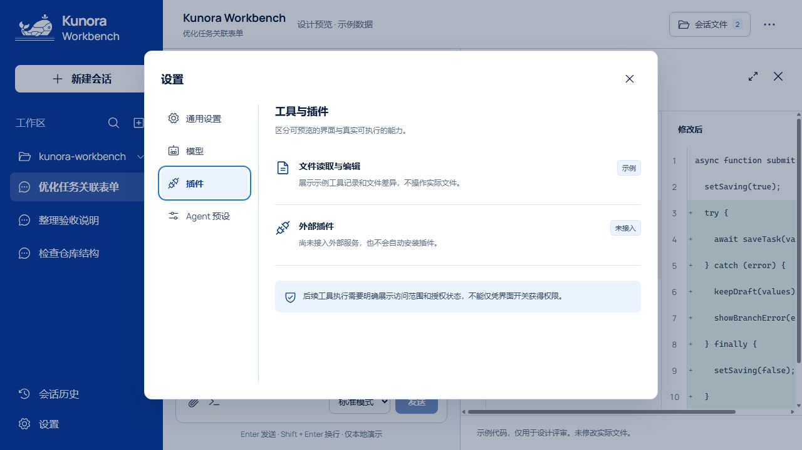

### 07 · Agent 预设 — 部分覆盖，语义不同

当前三张卡是起步建议，说明选择后创建会话且不自动发送。没有 Harness 的组合预设 roster、默认/复制/删除/损坏或配置文件界面，不可用相同名称替代需求。

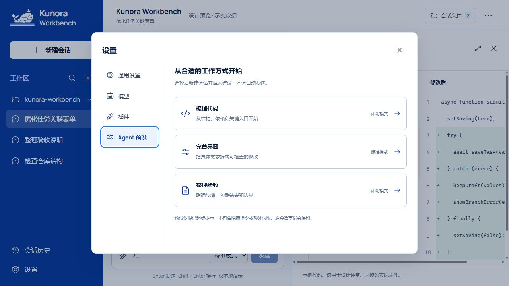

### 08 · 新会话 — 部分覆盖

已实际创建空白会话，输入为空时发送禁用，焦点进入输入区。已有示例工作区被默认选中；没有无工作区或无模型的输入锁定与 onboarding。低高度首屏建议卡被截断，需要滚动查看。

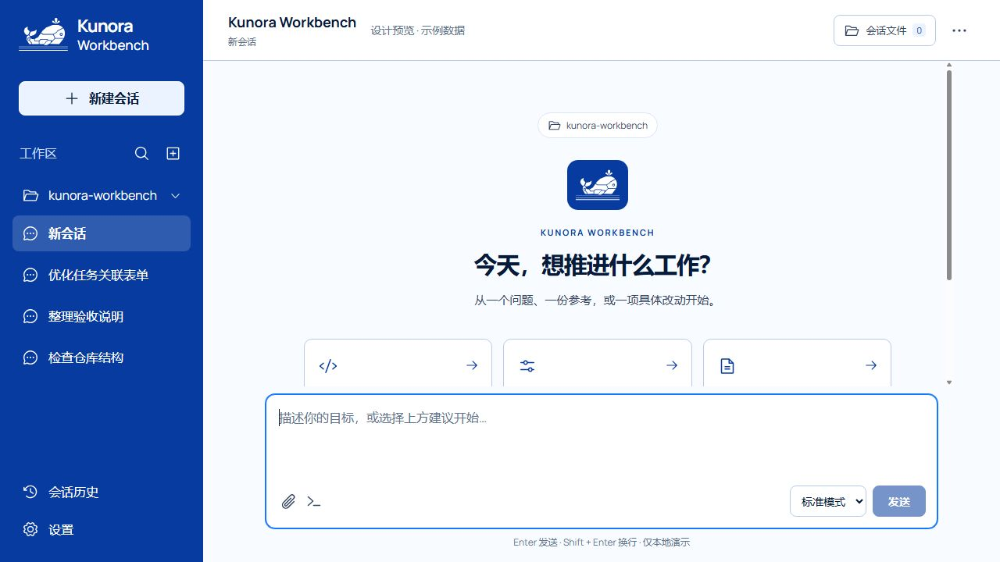

### 09 · 会话操作 — 部分覆盖

菜单包含重命名、本地副本、归档；Esc 关闭菜单并将焦点返回触发器。缺 Harness 的完成轮次分叉和消息级分叉。此步骤同时复现从新会话切回已有会话后计划模式沿用的问题。

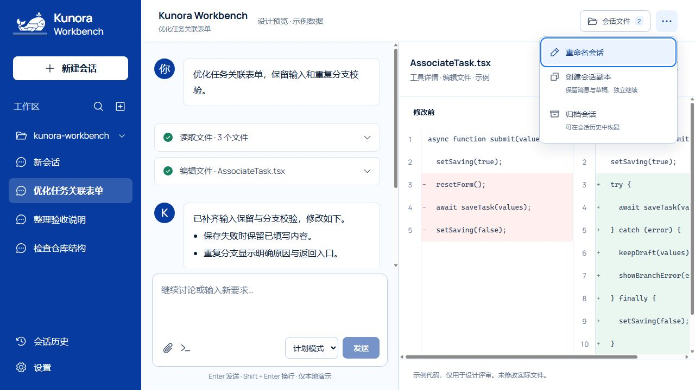

### 10 · 会话文件 — 部分覆盖

列表、分类、修改前后预览、对照与引用入口清楚，搜索输入有焦点，代码内部滚动而操作区保持可达。只列示例产出，不是工作目录，也不是完整 @ 文件/目录/会话引用系统。

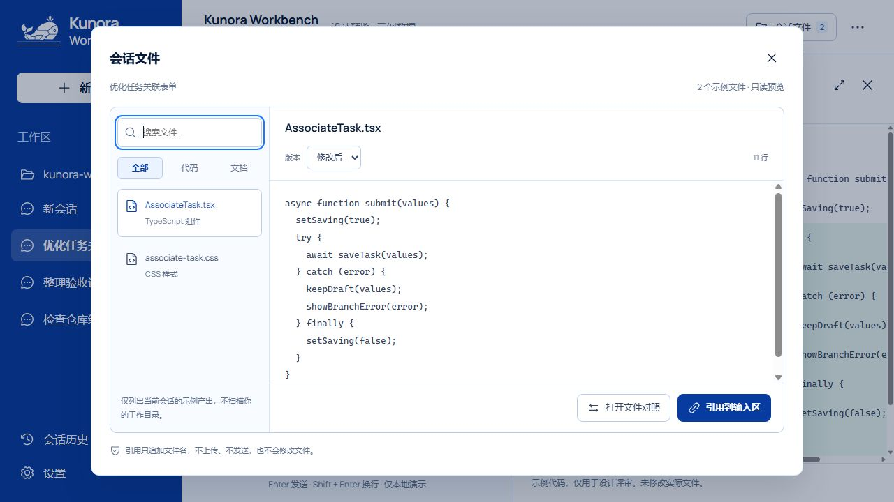

### 11 · 快捷指令 — 部分覆盖，语义不同

点击可见三个自然语言提示；没有 Harness 命令目录、参数/选择器或键入 / 的候选机制。未来需要候选菜单键盘和辅助技术语义验证，本轮不将它认定为完整命令系统。

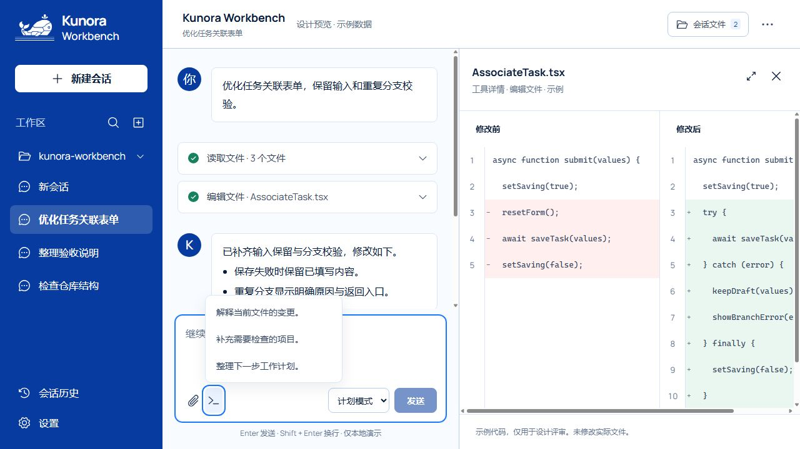

### 12 · 发送失败恢复 — 已验证这一局部模拟路径

在设置启用一次失败演示后发送“审查样例：失败后保留这份草稿。”。观察到运行提示和停止按钮，随后显示持久错误，原文恢复到输入区，发送重新可用。错误有图标、文字及 alert 语义。该结果不能证明真实网络故障、并发队列、附件或权限拒绝的恢复能力。

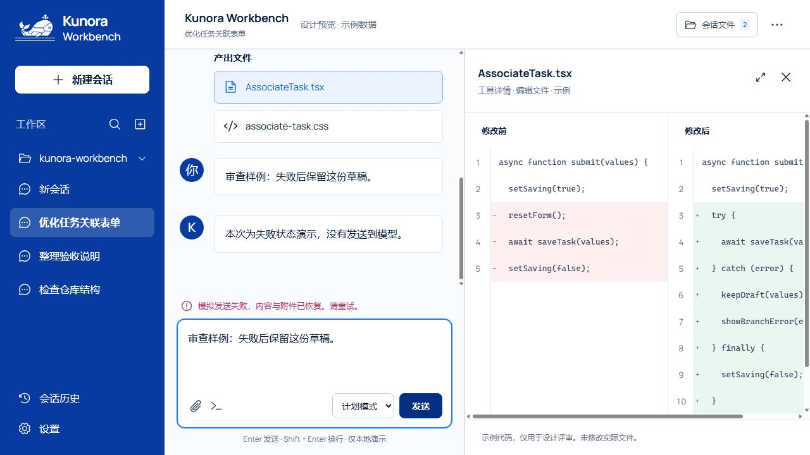

## 验证边界与下一轮验收门槛

- 本轮检查浏览器页面、DOM、部分键盘操作、模式切换与一次模拟失败；浏览器 error/warn 记录为空。没有重跑生产构建，因为没有改 UI 代码。此前构建/打包通过不代表 Harness UI 覆盖通过。
- 不以旧截图或先前测试替代本轮证据。本轮没有完成屏幕阅读器、所有键盘路径、移动端、深色模式、真实图片/文件选择器或生产服务端验收。
- 首先完成 P1 的界面与所有异常/等待状态；然后核对状态归属、刷新/切换恢复、输入不丢失和无障碍；最后用真实 Harness 服务验证完整流程。
- 条件功能应先明确部署范围：目录选择按环境二选一；Schedule 默认禁用；Agent Teams 是实验性功能。没有能力时不显示入口，不用无效按钮充数。
- 本轮只出具差距清单，**未修复上述缺口，也未宣布全量验收通过**。

## 一手来源

- [本次固定源码版本](https://github.com/deepseek-ai/deepseek-harness/tree/0a53fb55bea101816fa226bb964ae2bed71c343b)
- [全部客户端 UI 包](https://github.com/deepseek-ai/deepseek-harness/tree/0a53fb55bea101816fa226bb964ae2bed71c343b/packages/client)：上表包名对应目录中的 README.md，并结合相关 client 源码。
- [Web 组合清单](https://github.com/deepseek-ai/deepseek-harness/blob/0a53fb55bea101816fa226bb964ae2bed71c343b/packages/bundle/web-app/cordis.patch.yml)
- [授权审批](https://github.com/deepseek-ai/deepseek-harness/blob/0a53fb55bea101816fa226bb964ae2bed71c343b/packages/client/ui-approval/README.md)
- [用户问答与计划审核](https://github.com/deepseek-ai/deepseek-harness/blob/0a53fb55bea101816fa226bb964ae2bed71c343b/packages/client/ui-user-questions/README.md)
- [模型配置](https://github.com/deepseek-ai/deepseek-harness/blob/0a53fb55bea101816fa226bb964ae2bed71c343b/packages/client/ui-settings-models/README.md)
- [Agent 预设](https://github.com/deepseek-ai/deepseek-harness/blob/0a53fb55bea101816fa226bb964ae2bed71c343b/packages/client/ui-agent-preset/README.md)
- [会话导出](https://github.com/deepseek-ai/deepseek-harness/blob/0a53fb55bea101816fa226bb964ae2bed71c343b/packages/session-query/session-log-export/README.md)
- [Cordis 动态插件](https://github.com/deepseek-ai/deepseek-harness/blob/0a53fb55bea101816fa226bb964ae2bed71c343b/packages/extensions/ui-cordis/README.md)
- [实验性 Agent Teams](https://github.com/deepseek-ai/deepseek-harness/blob/0a53fb55bea101816fa226bb964ae2bed71c343b/packages/experimental/client-ui-agent-team/README.md)
- [在线 Web UI 指南](https://github.com/deepseek-ai/deepseek-harness/blob/master/docs/user/guide/index.md)：仅交叉检查“配置模型 → 选择工作区 → 运行任务 → 授权”的入口原则；在线 master 不替代本次固定版本基准。
